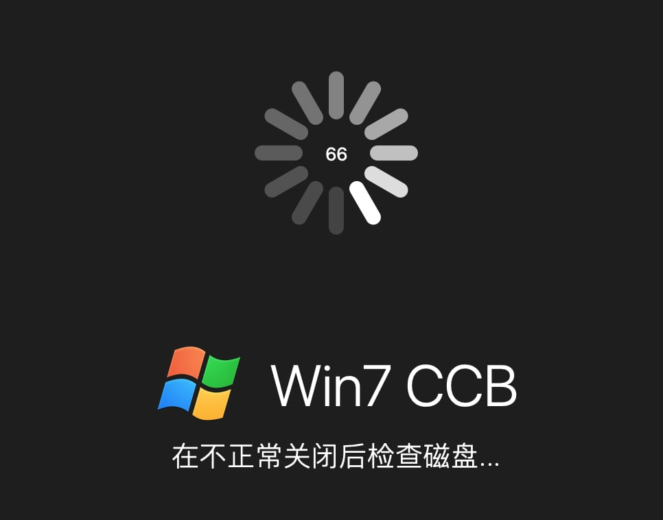
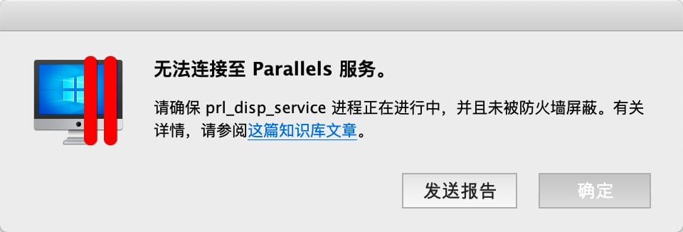
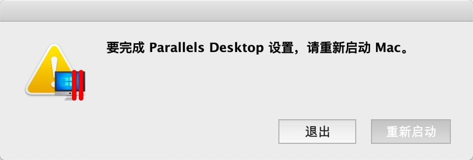

Parallels Desktop 是MacOS上的商用虚拟机管理软件，同类软件还有VMWare旗下的商用软件VMWare Fusion，以及Oracle旗下的开源软件VirtualBox。

对比另外两款虚拟机管理软件，Parallels Desktop最大的特点是操作简单、功能强大、体验优秀。支持鼠标无缝在 macOS 和虚拟机之间切换，支持文件的拖拽共享，支持剪切板共享等等功能，能够大大提高使用虚拟机的工作效率。

因为工作需要，我从 Parallels Desktop 13 版本就开始使用它作为 macOS 上主力的虚拟机管理软件（还会使用VirtualBox 作为一些测试用虚拟机的管理软件，对于测试用的Linux，完全不需要界面体验），目前使用的版本是 Parallels Desktop 15.1.2。

之前在使用过程中，因为几乎不会关闭虚拟机，从来都是采用暂停方式来提高关闭和打开的速度。时间久了以后，就会出现虚拟机没有响应的情况。此时一般采用 macOS 自带的「强制退出」功能将 Parallels Desktop 退出重启后，就能打开虚拟机。但是今天遇到了一个比较奇怪的现象，Parallels Desktop 应用强制退出重启后，再打开虚拟机，看到如下提示信息「在不正常关闭后检查磁盘」。我承认确实没有正常关闭虚拟机，但是没想到打开后是这种报错。

于是尝试通过 Terminal 将所有 prl_ 开头的进程全部杀掉，然后重启 Parallels Desktop 应用，却遇到了更诡异的报错。

看到这个报错，猜测 prl_disp_service 是与服务端通信用来校验 Parallels Desktop 版本的程序。按照第二个报错的提示，我重启了 macOS ，然后再打开 Parallels Desktop 时，我的购买居然失效了，要求我重新登录账号。

我也尝试从百度上查询是否有人遇到了同样的问题并提供解决方案，可是没有获得太多有用的信息。经过分析后，我认为这可能是因为 prl_disp_service 程序状态异常导致无法识别购买状态，如果重新安装 Parallels Desktop 可能可以解决这个问题。

于是尝试着重新安装激活了 Parallels Desktop，果然问题解决了，又可以欢快的工作了，555555

## 参考资料

1. [Parallels Desktop 中文站](https://www.parallels.cn/pd/general/?utm_source=baidu&utm_medium=ppc#c10820)
2. [macbox.app](https://macbox.app)
3. [mac软件盒子](https://www.macappbox.com)
4. [Mac软件之家](https://www.macapp.so)

