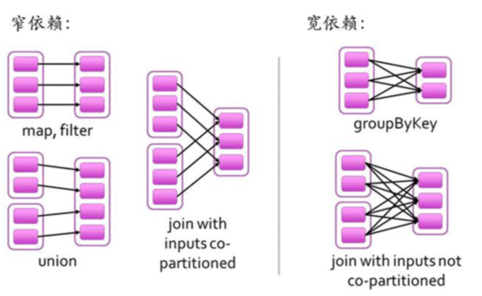

## 快速示例

> 本文基于Spark 2.4.1

### python 交互式分析
Spark支持交互式分析数据，但是仅支持`scala`和`python`语言。
下面是使用python来分析一段莎士比亚小说文字的示例。
```python
$ ./bin/pyspark 
>>> textFile = spark.read.text("/Users/shiqiang/Desktop/shakespeare.txt")
>>> textFile.count()
1995                                                                            
>>> textFile.first()
Row(value=u"Scanner's Notes: What this is and isn't. This was taken from")
>>> lineWithNo = textFile.filter(textFile.value.contains("no"))
>>> lineWithNo.count()
331
```

### Java示例程序
一个简单的在本地运行的处理本地文件的演示程序。
```java
import org.apache.spark.sql.SparkSession;
import org.apache.spark.api.java.function.FilterFunction;
import org.apache.spark.sql.Dataset;

public class SimpleApp {
    public static void main(String[] args){
        String logFile = "/Users/shiqiang/Desktop/shakespeare.txt";

        SparkSession spark = SparkSession.builder().appName("Simple Application").getOrCreate();
        Dataset<String> logData = spark.read().textFile(logFile).cache();

        long numNos = logData.filter((FilterFunction<String>) x -> x.contains("no")).count();   

        long numYes = logData.filter((FilterFunction<String>) s->s.contains("yes")).count();
        System.out.println("Lines with no : " + numNos + ", with yes : " + numYes);


        spark.stop();
    }
}
```

具体代码可以参考我的[Github]()

### Maser日志
Spark启动后，默认会在程序的`logs`目录下产生名为`spark-{username}-org.apache-spark.deploy.master.Master-1-{hostname}.out`的日志。

日志中可以看到spark master的启动命令。
```sh
$ java -cp /Users/rousseau/Projects/tools/spark-2.4.1-bin-hadoop2.7/conf/:/Users/rousseau/Projects/tools/spark-2.4.1-bin-hadoop2.7/jars/* -Xmx1g org.apache.spark.deploy.master.Master --host bogon --port 7077 --webui-port 8080
```

### Worker日志
Spark启动后，默认会在程序的`logs`目录下产生名为`spark-{username}-org.apache-spark.deploy.master.Worker-1-{hostname}.out`的日志。

日志中可以看到spark worker的启动命令。
```sh
$ java -cp /Users/rousseau/Projects/tools/spark-2.4.1-bin-hadoop2.7/conf/:/Users/rousseau/Projects/tools/spark-2.4.1-bin-hadoop2.7/jars/* -Xmx1g org.apache.spark.deploy.worker.Worker --webui-port 8081 spark://bogon:7077
```

## Spark 模型

Spark模型包含了几个重要概念。
> * **Application**: 是我们编写的程序，用于生成SparkContext。
> * **Job**: 所谓 job，就是由一个 rdd 的 action算子触发的动作，可以简单的理解为，当你需要执行一个 rdd 的 action 的时候，会生成一个 job。
> * **Satge**: stage 是一个 job 的组成单位，就是说，一个 job 会被切分成 1 个或多个 stage，然后各个 stage 会按照执行顺序依次执行。
> * **Task**: stage 下的一个任务执行单元，一般来说，一个 rdd 有多少个 partition，就会有多少个 task，因为每一个 task 只是处理一个 partition 上的数据。

简单来说就是以RDD为基准，每触发一个action操作，就会生成一个job。job内部有一个或多个stage顺序执行，组成stage的是一系列task，即任务执行单元。

## RDD
RDD（Resilient Distributed Datasets，弹性分布式数据集），是Spark最为核心的概念，自然也是理解Apache Spark 工作原理的最佳入口之一。

RDD是一个只读的有属性的数据集，属性用来描述当前数据集的状态，数据集是由数据的分区（partition）组成，并（由block）映射成真实数据。

RDD 内部的数据集合在逻辑上和物理上被划分成多个小子集合，这样的每一个子集合我们将其称为分区（partitions），分区的个数会决定并行计算的粒度，而每一个分区数值的计算都是在一个单独的任务中进行，因此并行任务的个数，也是由 RDD分区的个数决定的。 

### RDD依赖关系

一个作业从开始到结束的计算过程中产生了多个RDD，RDD之间是彼此相互依赖的，我们把这种父子依赖的关系，称之为“血统”。如果父RDD的每个分区最多只能被子RDD的一个分区使用，我们称之为（narrow dependency）窄依赖；若一个父RDD的每个分区可以被子RDD的多个分区使用，我们称之为（wide dependency）宽依赖。简单来讲窄依赖就是父子RDD分区间”一对一“的关系，宽依赖就是”一对多“关系，具体理解可参考下图：



### RDD属性
RDD属性包括名称、分区类型、父RDD指针、数据本地化、数据依赖关系等，主要属性可以分为3类：
* 与其它RDD的关系（parents）
* 数据(partitioner，checkpoint，sotragelevel，iterator）
* RDD自身属性（rddname，sparkcontext，sparkconf，parent、dependency、partitioner、checkpoint、storageLevel）

* rddname 
* sparkcontext SparkContext为Spark job的入口，由Spark driver创建在client端，包括集群连接，RddID，创建抽样，累加器，广播变量等信息。
* sparkconf 配置信息，即sc.conf
> Spark参数配置信息
> 提供三个位置用来配置系统：
> Spark api：控制大部分的应用程序参数，可以用SparkConf对象或者Java系统属性设置
> 环境变量：可以通过每个节点的conf/spark-env.sh脚本设置。例如IP地址、端口等信息
> 日志配置：可以通过log4j.properties配置
* parent
* iterator
* prisist

### RDD操作算子
RDD有两种操作算子`Transfromation`和`Action`。

* Transformation。即一个rdd数据集经过数据转换变成一个新的rdd数据集。常用的Transformation操作有：map、filter、union、distinct、groupByKey 等。Transformation 属于延迟计算，当触发Transformation算子时rdd并没有立即进行转换，仅仅是记住了数据集的逻辑操作。
* Action。触发Spark作业的运行，真正触发转换算子的计算。常用的操作有：reduce、collect、count、countByKey、reduceByKey等等。


### 创建RDD的几种方式
* sc.parallelize(data)
* sc.textfile

### RDD cache 的几种情况
* using an RDD many times
* performing multiple actions on the same RDD
* for long chains of (or very expensive) transformations
* for debug memory issues

## 广播变量
> Broadcast variables allow the programmer to keep a read-only variable cached on each machine rather than shipping a copy of it with tasks. They can be used, for example, to give every node a copy of a large input dataset in an efficient manner. Spark also attempts to distribute broadcast variables using efficient broadcast algorithms to reduce communication cost.

广播变量是Spark中另一种共享变量，允许程序将一个只读的变量发送到Executor，一个Executor只需要在第一个Task启动时，获得一份Broadcast数据，之后的Task都从本节点的BlockManager中获取相关数据。

## 参考资料
1. [Spark之深入理解RDD结构](https://blog.csdn.net/u011094454/article/details/78992293)
2. [Spark盖中盖（一篇顶五篇）-1 RDD的数据结构模型](https://www.jianshu.com/p/dd7c7243e7f9?from=singlemessage)
3. [初识Apache Spark](https://www.jianshu.com/p/59b0601d7ad2)
4. [Java Spark 简单示例（一）](https://www.jianshu.com/p/71556ae22508)
5. [Java Spark 简单示例（二）累加器 广播变量](https://www.jianshu.com/p/73b39f423a8b)
6. [](https://stackoverflow.com/questions/28981359/why-do-we-need-to-call-cache-or-persist-on-a-rdd)