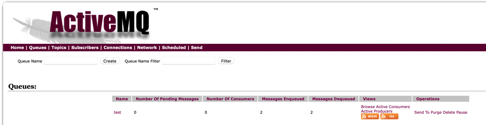
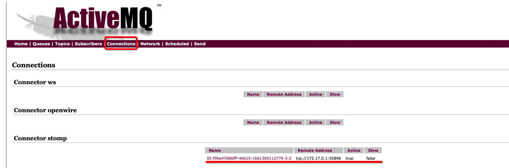

> 本文基于 ActiveMQ 5.14.3 

## ActiveMQ 介绍

Apache ActiveMQ是Apache软件基金会所研发的开放源代码消息中间件；由于ActiveMQ是一个纯Java程序，因此只需要操作系统支持Java虚拟机，ActiveMQ便可执行。

## 构建ActiveMQ镜像

镜像构建的总体思路是首先引入一个基础的Linux环境，然后添加 jdk 运行环境，继续添加 activemq 软件，最后做一些目录、环境变量、端口的配置，在最后启动应用，具体的 Dockerfile 如下。

```dockerfile
FROM centos

MAINTAINER cocowool@qq.com

ADD jdk-8u144-linux-x64.tar.gz /usr/local
ADD apache-activemq-5.16.3-bin.tar.gz /usr/local
ADD jetty.xml /usr/local/apache-activemq-5.16.3/conf/jetty.xml
# ADD start.sh /usr/local

WORKDIR /usr/local

# ENV ACTIVEMQ_CONFIG_DIR=/opt/activemq/conf.tmp
# ENV ACTIVEMQ_DATA_DIR=/data/activemq
ENV JAVA_HOME /usr/local/jdk1.8.0_144
ENV ACTIVEMQ_HOME /usr/local/apache-activemq-5.16.3
ENV PATH $JAVA_HOME/bin:$PATH:$ACTIVEMQ_HOME/bin
ENV CLASSPATH .:$JAVA_HOME/lib

EXPOSE 8161/tcp
EXPOSE 61616/tcp
EXPOSE 5672/tcp
EXPOSE 61613/tcp
EXPOSE 1883/tcp
EXPOSE 61614/tcp

# ENTRYPOINT ["sh","/usr/local/apache-activemq-5.16.3/bin/activemq start"]
CMD [ "/usr/local/apache-activemq-5.16.3/bin/activemq", "" ]
```

Dockerfile 编写好之后，放到 activemq 文件夹中，同时将 jdk-8u144-linux-x64.tar.gz \ apache-activemq-5.16.3-bin.tar.gz \ jetty.xml 也放在同一文件夹下。

```sh
$ ll
total 489384
drwxr-xr-x  5 shiqiang  staff   160B 10 24 11:26 .
drwxr-xr-x  4 shiqiang  staff   128B 10 21 14:21 ..
-rw-r--r--  1 shiqiang  staff   673B 11  6 20:21 Dockerfile
-rwxr-xr-x@ 1 shiqiang  staff    62M 10 24 11:26 apache-activemq-5.16.3-bin.tar.gz
-rw-r--r--@ 1 shiqiang  staff   177M 10 24 11:24 jdk-8u144-linux-x64.tar.gz
$ docker build -t cocowool/activemq:5.16.3 .
```

最后执行 docker build 命令可以生成镜像。

## 在容器中运行ActiveMQ

可以通过下面的命令在当前窗口，以前台的形式运行 activemq。

```
$ docker run --name='activemq' -it -p 8161:8161 --rm cocowool/activemq:5.16.3
```

> 本文构建的 ActiveMQ 在 macOS 系统中无法通过宿主机访问，但是 webcenter/activemq 支持在 macOS 下的宿主机访问，尝试与 webcenter/activemq 的 Dockerfile 和启动参数，还没有找到原因，留到以后解决吧。

通过容器镜像反向生成 Dockerfile ，可以通过 `docker history` 命令来实现

```sh
$ docker history webcenter/activemq --format {{.CreatedBy}} --no-trunc
```

> 2022-07-12 补充，ActiveMQ 的 WebConsole 监听默认使用的本机地址，作为容器运行时，需要修改 Jetty.xml 监听地址为 0.0.0.0 ，否则会出现启动容器后，无法从本机访问的情况。

## 界面操作

启动 ActiveMQ 服务后，在浏览器通过 http://127.0.0.1:8161 打开管理界面。

默认的用户名口令是 admin 。

## 命令行管理

activemq 提供命令行下管理 ActiveMQ 服务的能力：

* browse 显示选中的消息
* bstat 查看指定 broker 的统计信息
* consumer 从 broker 接收消息
* create 创建 broker 实例
* decrypt 解密文本
* dstat 展示统计信息
* encrypt 加密文本
* export 导出停止的 broker 数据
* list 展示所有可用的 broker
* producer 创建消息队列
* purge 清空队列里的消息，并把消息放到出队里 `bin/activemq purge queuename`
* start 
* stop

可以进入到 ActiveMQ 容器中使用相关命令行工具。

```sh
# 查询对应容器的 ID
$ docker ps -a
# 进入容器环境
$ docker exec -it 74541aaf314f /bin/bash

# 向队列中插入数据
$ bin/activemq producer --message 123123 --messageCount 1 --destination queue://queuename
INFO: Loading '/opt/activemq//bin/env'
INFO: Using java '/usr/bin/java'
Java Runtime: Oracle Corporation 1.8.0_91 /usr/lib/jvm/java-8-openjdk-amd64/jre
  Heap sizes: current=62976k  free=62320k  max=932352k
    JVM args: -Xms64M -Xmx1G -Djava.util.logging.config.file=logging.properties -Djava.security.auth.login.config=/opt/activemq/conf.tmp/login.config -Dactivemq.classpath=/opt/activemq/conf.tmp:/opt/activemq//../lib/: -Dactivemq.home=/opt/activemq/ -Dactivemq.base=/opt/activemq/ -Dactivemq.conf=/opt/activemq/conf.tmp -Dactivemq.data=/data/activemq
Extensions classpath:
  [/opt/activemq/lib,/opt/activemq/lib/camel,/opt/activemq/lib/optional,/opt/activemq/lib/web,/opt/activemq/lib/extra]
ACTIVEMQ_HOME: /opt/activemq
ACTIVEMQ_BASE: /opt/activemq
ACTIVEMQ_CONF: /opt/activemq/conf.tmp
ACTIVEMQ_DATA: /data/activemq
INFO: Unrecognized option: --mesage
 INFO | Connecting to URL: failover://tcp://localhost:61616 (null:null)
 INFO | Producing messages to queue://testqueue
 INFO | Using persistent messages
 INFO | Sleeping between sends 0 ms
 INFO | Running 1 parallel threads
 INFO | Successfully connected to tcp://localhost:61616
 INFO | producer-1 Started to calculate elapsed time ...

 INFO | producer-1 Produced: 1 messages
 INFO | producer-1 Elapsed time in second : 0 s
 INFO | producer-1 Elapsed time in milli second : 15 milli seconds

# 查询队列中的数据
$ bin/activemq browse --amqurl tcp://localhost:61616 queue:queuename
INFO: Loading '/opt/activemq//bin/env'
INFO: Using java '/usr/bin/java'
Java Runtime: Oracle Corporation 1.8.0_91 /usr/lib/jvm/java-8-openjdk-amd64/jre
  Heap sizes: current=62976k  free=62320k  max=932352k
    JVM args: -Xms64M -Xmx1G -Djava.util.logging.config.file=logging.properties -Djava.security.auth.login.config=/opt/activemq/conf.tmp/login.config -Dactivemq.classpath=/opt/activemq/conf.tmp:/opt/activemq//../lib/: -Dactivemq.home=/opt/activemq/ -Dactivemq.base=/opt/activemq/ -Dactivemq.conf=/opt/activemq/conf.tmp -Dactivemq.data=/data/activemq
Extensions classpath:
  [/opt/activemq/lib,/opt/activemq/lib/camel,/opt/activemq/lib/optional,/opt/activemq/lib/web,/opt/activemq/lib/extra]
ACTIVEMQ_HOME: /opt/activemq
ACTIVEMQ_BASE: /opt/activemq
ACTIVEMQ_CONF: /opt/activemq/conf.tmp
ACTIVEMQ_DATA: /data/activemq
JMS_BODY_FIELD:JMSText = test message: 0
JMS_HEADER_FIELD:JMSExpiration = 0
JMS_HEADER_FIELD:JMSMessageID = ID:74541aaf314f-40403-1650513379296-1:1:1:1:1
JMS_HEADER_FIELD:JMSPriority = 4
JMS_HEADER_FIELD:JMSDestination = testqueue
JMS_HEADER_FIELD:JMSTimestamp = 1650513379547
JMS_HEADER_FIELD:JMSRedelivered = false
JMS_HEADER_FIELD:JMSDeliveryMode = persistent

# 删除队列中的所有消息
$ bin/activemq purge queuename
```


## Python 生产与消费

Python 提供了基于 [STOMP](https://stomp.github.io/) 协议的库，需要首先安装依赖。

```shell
$ pip3 install -i https://pypi.tuna.tsinghua.edu.cn/simple stomp.py
Looking in indexes: https://pypi.tuna.tsinghua.edu.cn/simple
Collecting stomp.py
  Downloading https://pypi.tuna.tsinghua.edu.cn/packages/83/07/d53fe1c223afb394dd35d6e1e90756ce5e1ae888748b111a51115c912dd6/stomp.py-8.0.1-py3-none-any.whl (37 kB)
Collecting docopt<0.7.0,>=0.6.2
  Downloading https://pypi.tuna.tsinghua.edu.cn/packages/a2/55/8f8cab2afd404cf578136ef2cc5dfb50baa1761b68c9da1fb1e4eed343c9/docopt-0.6.2.tar.gz (25 kB)
  Preparing metadata (setup.py) ... done
Building wheels for collected packages: docopt
  Building wheel for docopt (setup.py) ... done
  Created wheel for docopt: filename=docopt-0.6.2-py2.py3-none-any.whl size=13706 sha256=081d78fb542b23e5c30b8784262ea77c58c1ca5ce2de747aef3faead64cfa376
  Stored in directory: /Users/shiqiang/Library/Caches/pip/wheels/6b/88/e3/8c9b3f2ede2bf8f1c163dc9f03b8f090828552f510e06a3c3f
Successfully built docopt
Installing collected packages: docopt, stomp.py
Successfully installed docopt-0.6.2 stomp.py-8.0.1
```

使用 STOMP 协议连接ActiveMQ，容器启动时需要把端口映射到本地。

```sh
$ docker run --name='activemq' -it -p 8161:8161 -p 61613:61613 --rm cocowool/activemq:5.16.3 
```

编写一个测试脚本，保存为 stomp_test.py

```python
import time
import sys

import stomp

class MyListener(stomp.ConnectionListener):
    def on_error(self, frame):
        print('received an error "%s"' % frame.body)

    def on_message(self, frame):
        print('received a message "%s"' % frame.body)

conn = stomp.Connection()
conn.set_listener('', MyListener())
conn.connect('admin', 'admin', wait=True)
conn.subscribe(destination='/queue/test', id=1, ack='auto')
conn.send(body=' '.join(sys.argv[1:]), destination='/queue/test')
time.sleep(2)
conn.disconnect()
```

执行看一下结果。

```sh
$ python3 stomp_test.py this is a test xxx xxx
received a message "this is a test xxx xxx"
```

可以在 ActiveMQ 的控制台上看到发送的消息数和连接数量。






## 参考资料

1. [制作activemq镜像](https://blog.csdn.net/kq1983/article/details/102793679)
2. [如何制作Docker镜像](https://zhuanlan.zhihu.com/p/122380334)
3. [消息中间件ActiveMQ使用详解](https://www.cnblogs.com/yanfei1819/p/10615605.html)
4. [Building An ActiveMQ Docker Image on Kubernetes](https://dzone.com/articles/building-active-mq-docker-image-on-k8s)
5. [Docker 的(Linux/Mac OS)网络配置问题](https://yuanmomo.net/2019/06/13/docker-network/)
5. [反推Dockerfile](http://pointborn.com/article/2021/3/31/1327.html)
5. [CentOS7 安装 ActiveMQ 并利用命令行工具进行管理](https://blog.csdn.net/renxwhi/article/details/100116377)
5. [Broker not available at: service:jmx:rmi](https://blog.csdn.net/kakalairen/article/details/119606152)
5. [ActiveMQ 消息清理](https://blog.csdn.net/jimo_lonely/article/details/105374062)

