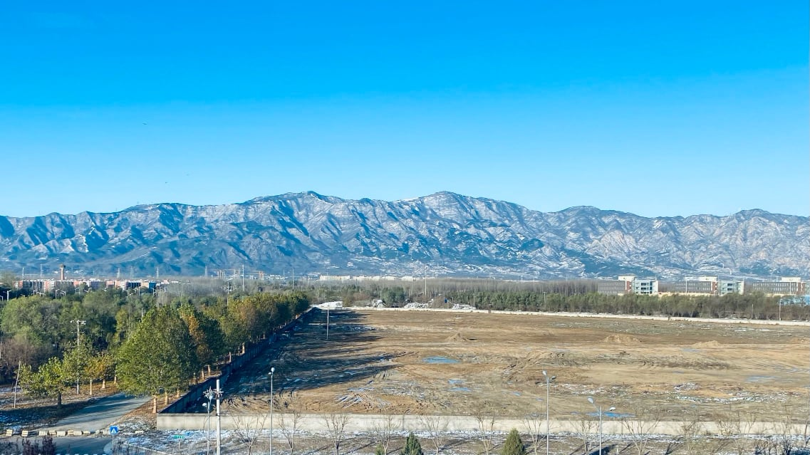

## 缘起

因为家中只有一台车，领导单位公共交通不方便，基本上只能给领导开。我家到单位有10公里，虽然有地铁，但是门对门的时间还要计算两边走到地铁站的时间，走路的时间基本上就要花去20分钟。10公里说远不远，之前考虑电动车，之前看到街上有一个叫小牛的牌子，外形还颇讨人喜欢。看了下具体的商品详情，电动自行车大概也要2000多块，理论里程是60公里，按照这个来通勤基本上两天就要充一次电。碰巧看到周围同事也有增驾摩托驾照，然后购买摩托车来通勤的。考察了下摩托车的价格，一般的踏板车价格在5000-10000之间，加满一箱油大概能跑200公里。相比电动自行车，省去了频繁充电的麻烦，而且近期经常发生的电动车充电事故，各个小区对于电动车进房间、进电梯都做了严格的限制。

考察结束，就打定了购买摩托车通勤的想法，那就必须要有摩托驾照喽。

> 虽然年轻在乡下时骑过摩托车，但是人到中年，无照驾驶的事是再也干不出来了。

## 报名

我是在海淀驾校学习的汽车驾驶并拿到驾照的，虽然海驾的老师说话声音比较大，因为总体体验还不错，这次也毫不犹豫的选择了海淀驾校。

报名是在9月19日的下午，当天下起了小雨，我驾车赶到报名大厅进行了现场报名，除了交费以外，还做了体检和照相。一寸白底照片后面在换驾驶证的时候还是需要的。

我报考的是二轮摩托车，准驾车型为「E」，费用总计1300。

> 报名几天后接到海驾电话，通知因为我驾照上的地址和报名时用的身份证地址不一样，无法通过交管单位审核。后来又专门去京海车管所换了一下身份证，并重新提交了报名材料。

## 科目一

科目一是纯理论，整个过程比较简单。遥记当年学习汽车时，大家都要在教学楼一起完整的听两天现场授课。随着时代和技术的发展，现在只要下载海淀驾校APP，通过手机就能够随时随地学习理论课程的内容。

视频看完之后就可以约考试，考试之前建议花一点时间在APP上把考试题全都刷一遍。

科目一考试约的是下午。一点钟到6号楼报道，科目一和科目四在不同的教室，一定不要走错教室了。

一点半开始考试，考试之前需要把手机和包存放起来，不让带入考场。

考试是一人一桌，电脑作答，有鼠标和键盘。我当时用的数据感觉不太灵敏，全程选择了用键盘作答。因为不是全尺寸键盘，操作之前一定要看好按钮的位置。整个过程错了一道题，顺利的通过了科目一的考试。

## 科目二/三

科目一考完之后就能约练车了，本来约了11月6日、7日两天的练车。提前看到了这两天北京下雨、降温、降雪，所以提前取消了。看看这雪后北京的西山，后来练车过程中和其他学员聊这两天的练车经历，庆幸没有在这么恶劣的天气来练车。

第一次练车是11月14日上午，8点钟就到了8号楼摩托车训练场，教练先让每个人签了一份安全协议，因为摩托车驾驶是自己一个人掌握，存在一定的危险性。

因为是第一次来，教练先给讲解了一遍科目三的过程，从上车、点火、起步，到人行横道、调头、加档、靠边停车，整个过程非常详细耐心。然后就开始上车熟悉科目三的流程。第一次上车还是有些紧张，第一圈的时候熄火好多次。走了一圈之后，熟悉了车的怠速，慢慢的开始有感觉了。

科目三熟悉两圈之后，教练带着到了科目二的训练场地。科目二包括坡起、单边桥、绕桩三个项目，是最容易挂科的一门，因此就重点练习科目二。二轮摩托车最大的难点就是平衡，平衡掌握不好很容易脚占地，这样就会导致直接不合格。教练在训练之前告诉了一个诀窍，「训练期间，不管能不能顺利的过桩，脚都不要下车」，一定要让自己养成习惯，后来练习中我也是一直遵循了这个要求。即便个别时候无法完成绕桩动作，我就直接开了出去，开会来之后再做一次。

科目一练了半天，心里对于考试就有了一些底气。想着不如趁热打铁，连续把科目二/三拿下。随后我就约了11月16日下午的第二次练习，在这期间把科目四的视频看完，看完之后就约了11月18日的考试。这期间还参加了11月17日的夜间集训。集训建议大家一定要参加，因为集训的场地就是考试场地，提前熟悉场地，对于缓解考试紧张情绪有很大的作用。

考试是在10号楼集合，大概12个人一组分别带到考场。等待期间，看到有几个一起的学员在绕桩过程中撞杆或者脚占地，心里不免有些紧张。轮到我的时候，按照规定程序，刷卡开始考试。换挡、起步很顺利，到坡起停好后，启动的时候突然熄火了。可能是因为紧张，离合松的太快，赶快重新打着火。按照教练教的，先加油门停住，慢慢松离合，听到发动机声音变低停住，慢慢松脚刹。用左脚带着起步后，顺利的完成了坡起。单边桥和绕桩后来也顺利通过了。

科目三考试起初比较顺利，到回来靠边停车时，过了黄线我的脚就下来了，因为前面没有考试车辆，悠了很长一段距离才到停住。这时就听教练说脚下早了，让重新跑一圈。稳住情绪，第二圈靠边停车就看好了距离，也一把通过了。

## 科目四

科目四和科目一的流程差不多，只是多了十道多选题。科目四通过后，在教室等待大概两个小时，就可以拿到新的驾驶证了。

## 后记

从报名到拿证，整个过程历时2个月，其中练车到拿证用了一周时间，可以说是非常快了。后续开始考虑买什么车，初步打算买一辆踏板车，主要是上下班通勤用，如果大家有觉得不错的车型，欢迎推荐给我。

