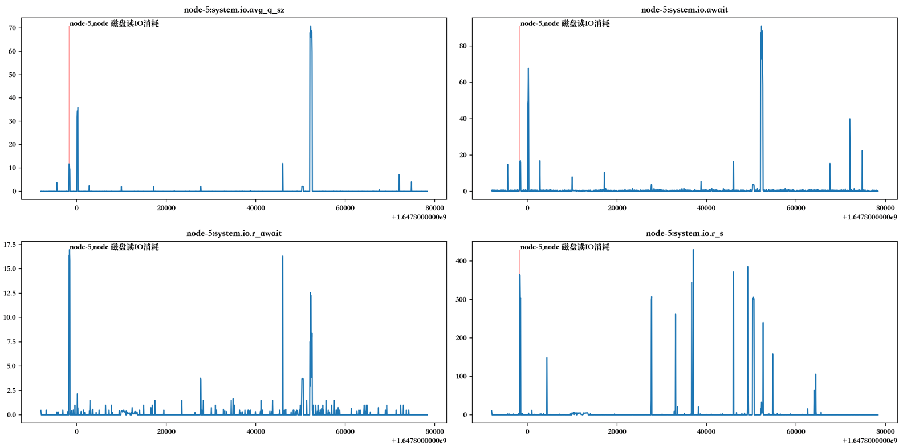

> 本文在 Python 3 的环境下运行相关代码

2022年 CCF 国际 AIOPS 挑战赛由清华大学联合中国计算机学会（CCF）共同发起，自2018年迄今已经举办四届，今年是第五届。今年首次引入故障分类赛题，以「微服务架构电商系统下故障识别和分类」为赛题，挖掘故障模式、构建分类模型以作用于故障止损场景。参赛选手需自行设计「异常检测算法」和「故障分类算法」，实现准确高效的故障检测和故障分类。

通过 [赛题与赛制解读](https://mp.weixin.qq.com/s/CIP_4qV2NCkjSNHH9MkNGA) 熟悉了比赛的题目和目的，了解了数据结构。

## 历程

组队参加比赛之后，从熟悉数据结构、熟悉比赛数据获取和提交方式、熟悉比赛规则花了好长时间，毕竟是利用工作之余的时间来参赛，而这个比赛数据、内容对于初次参加的人来说，还是有些广度和难度的。

真正开始提交数据，是在比赛正式开始之后，从5月1日到5月9日，我们组完成了5个比赛日的数据提交，一共获得了大概100多分。

对于比赛的分析是从故障类型 failure_type 着手的，一共 15 种故障类型。从总体上看 node 级别的故障类似于操作系统故障，而且所有指标数据都集中在 kpi_cloudbed1_metric_03xx.csv 这个文件中，便于分析，便选择了以此作为突破口。

对于 Node 类型的故障，主办方也给了大概几十个指标，通过作图或者根据经验，能够找到几个比较关键的指标。

* system.cpu.pct_usage 系统 CPU 使用率
* system.io.rkb_s 设备每秒读的 kibibytes 的数量
* system.io.await 服务向设备发送 IO 请求平均数，包括花在队列中的时间 （millisecond）
* system.disk.pct_usage 系统磁盘使用率

因为对于异常检测的算法不是很熟悉，我基于经验判断设定了一些阈值，并且增加了不要重复报障，限制提交次数等方法，终于实现了提交得分。但这种方案还是太简单粗暴了，实际上对于无监督的模型，应该能够支持自动识别出异常点。通过学习主办方提供的历届获奖队的方案，我对于如何使用算法来构建自己的检测体系、自动检测异常点有了更深入的认识。

通过参加本次比赛，最大的收获是画图的能力提高了不少，看看下面这两张典型的图，是不是很容易发现故障的特征。



## 必备技能

* Pandas 操作
  * 读 csv 文件
  * 各种删除数据，可参考我之前的文章 [Pandas删除数据的几种情况](http://www.edulinks.cn/2018/02/06/20180206-pandas-delete-data/)
  * 求最大值、最小值、平均值、方差，找到对应的索引
  * 数据排序

* 使用 python 画图
  * 画单个指标的折线图
  * 画多个指标的折线图
  * 在折线图上增加额外的点

* Python 时间戳转换
  * 时间戳转换成正常日期
  * 正常日期转换成时间戳

* Python 字符操作
  * 字符分隔
  * 字符查找
  * 字符正则匹配替换


## 主要算法

* 突变点检测，即 Spike And Level Shift。
  * ADTK / PersistAD，PersistAD 是根据四分位数作为阈值的，没有完全弄清楚它的算法逻辑
  * Z-score 
  * 核密度估计（Kernel density estimation）
  * 一阶差分
  * 二阶差分

## 窍门

关注「智能运维前沿」这个公众号，会有意想不到的收获。

## 吐槽点

* 主办方给的离线时序数据，部分文件中时间戳不是顺序的，这个给画图造成了很大困扰

## adtk 安装失败的解决

安装 adtk 的时候报错退出，报错信息 `failed with error code `。

```sh
# 按照以下步骤解决的
$ yum install python3-devel gcc # 不确定是否有用，可先跳过试试
$ pip3 install --upgrade pip setuptools wheel
$ pip3 install adtk
```

## 参考资料

1. [蚂蚁智能运维: 单指标异常检测算法初探](https://segmentfault.com/a/1190000023696934)
2. [使用 Python 进行异常检测](https://www.cnblogs.com/panchuangai/p/13817905.html?ivk_sa=1024320u)
1. [Python 时间戳转换](https://blog.csdn.net/weixin_39524425/article/details/110538364)
1. [Python时间序列异常检测ADTK](https://developer.51cto.com/article/654753.html)
1. [Index of time series must be a pandas DatetimeIndex object.](https://blog.csdn.net/chenxy_bwave/article/details/122327441)
1. [时间序列预测从入门到精通](https://zhuanlan.zhihu.com/p/393594761)
1. [Python 命令行参数详解](https://blog.csdn.net/LOVEmy134611/article/details/119656854)
1. [python3 : failed with error code](https://blog.csdn.net/qq_41221841/article/details/123114200)
1. [Python中getopt()函数的使用](https://blog.csdn.net/aotaji4750/article/details/102441357)
1. [macos或windows中 matplotlib中文显示(matplotlib字体常见使用)](https://blog.csdn.net/Castlehe/article/details/122171783)
1. [python清除字符串里非字母字符的方法](http://www.zzvips.com/article/86185.html)
1. [Pandas 数据排序](https://blog.csdn.net/weixin_38753213/article/details/120278815)
1. [scipy 计算数据的相对极值](https://vimsky.com/examples/usage/python-scipy.signal.argrelextrema.html)
1. [Pandas](https://pandas.pydata.org/)
1. [机器学习数据分析之异常值检测](https://blog.csdn.net/weixin_36488653/article/details/118931340)
