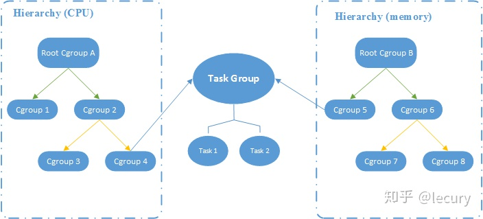

* namespace 的介绍、示例
* cgroups 的介绍、示例

## namespace

Linux namespace 是容器技术的底层支撑，是 Linux 内核位了限制系统资源提供的功能特性。


cgroups 的全称是 control groups，是 Linux 内核（自2.6版本之后）提供的物理资源隔离机制，从而实现对 Linux 进程或者进程组的资源限制、隔离和统计功能。cgroups 引入了 任务 Task、控制组 control group、层级 hierachy、子系统 subsystem 几个概念。引用知乎 lecury 的一张图来快速了解这几个概念之间的关系。



得益于 Linux 的虚拟文件系统（VFS），Linux 为用户提供了一个统一的文件系统 API 接口，将 cgroups 的功能和配置暴露给用户。

```sh
# 查看系统的 cgroup 目录
$ ls /sys/fs/cgroup
blkio  cpu  cpuacct  cpu,cpuacct  cpuset  devices  freezer  hugetlb  memory  net_cls  net_cls,net_prio  net_prio  perf_event  pids  systemd

# 查看 subsystem
$ cat /proc/cgroups 
#subsys_name	hierarchy	num_cgroups	enabled
cpuset	7	1	1
cpu	11	1	1
cpuacct	11	1	1
memory	4	1	1
devices	10	20	1
freezer	8	1	1
net_cls	5	1	1
blkio	6	1	1
perf_event	2	1	1
hugetlb	9	1	1
pids	3	1	1
net_prio	5	1	1
```

可以使用 cgexec 命令，在程序运行时指定使用的资源组，来限制程序的资源使用。

> 要使用 cgexec 命令，需要在 Cent OS 7 中安装 `libcgroup-tools` 工具，在 Ubuntu 中安装 `cgroup-tools` 工具。

nice、cpulimit、pstree、nsenter

## 参考资料

1. [Control Group v2](https://www.kernel.org/doc/html/latest/admin-guide/cgroup-v2.html)
1. [Linux资源管理之 cgroups 简介](https://tech.meituan.com/2015/03/31/cgroups.html)
1. [浅谈 linux cgroups 机制](https://zhuanlan.zhihu.com/p/81668069)
1. [nsenter 命令简单介绍](https://blog.csdn.net/qq_35745940/article/details/119900634)
