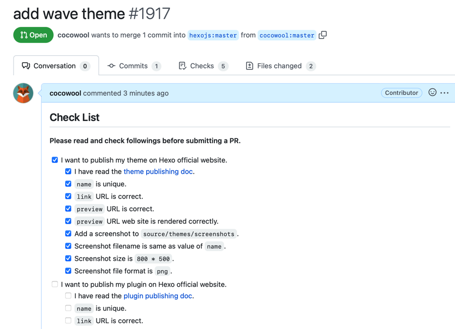
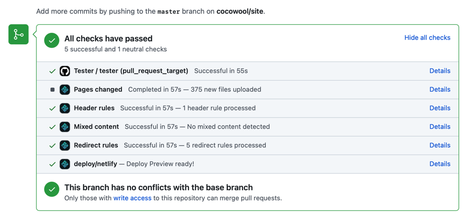
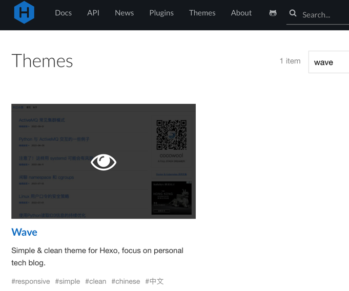

使用关键词 Hexo + 主题 能够搜索到很多如何配置使用 Hexo 主题的文章，也有一些介绍如何制作自己主题的文章，我也曾经写过一篇 [Hexo 主题开发准备工作](http://edulinks.cn/2020/12/23/20201223-develop-hexo-theme/)，但是很少有介绍如何将自己制作的主题发布到 Hexo 官网的中文文章。

[Hexo官网](https://hexo.io/docs/themes) 提供了一段简要的描述，本文在此基础上，以我自己开发的主题为例，详细介绍下如何将自己开发的 Hexo 主题发布到官方主题列表。

## 通过测试

官方文档建议主题发布之前需要通过单元测试，这个非常有必要，能帮我们发现一些开发过程中考虑不到的异常情况。测试的步骤是将 [hexo-theme-unit-test](https://github.com/hexojs/hexo-theme-unit-test) 工程下载到本地，然后安装配置需要测试的主题，根据检查列表检查各个测试文章是否能够正常显示。这是一个手工的测试过程，和我原来想象的自动化测试流程差别比较大。

这个测试框架默认仅支持 `stylus` 渲染器，如果使用 scss 方式开发的样式表，则推荐安装 `hexo-renderer-dartsass` 插件。

```sh
$ npm install hexo-renderer-dartsass
```

我尝试了一个已经发布在官方主题列表页的主题 hexo-theme-yuzu，发现并不能通过测试，可以推断主题发布时对于测试是否通过并不是强制要求。

```sh
$ hexo s
INFO  Validating config
INFO  Start processing
INFO  Hexo is running at http://localhost:4000/ . Press Ctrl+C to stop.
ERROR Render HTML failed: index.html
TypeError: /Users/shiqiang/Projects/hexo-project/hexo-theme-unit-test/themes/hexo-theme-yuzu/layout/layout.ejs:3
    1| <!DOCTYPE html>
    2| <html lang="en">
 >> 3| <%- partial('_partial/head', null, {cache: false}) %>

```

## 发布主题

首先需要在 Github 页面上 Fork 一个 [hexojs/site](https://github.com/hexojs/site) 工程。

将代码克隆到本地，并安装相关依赖。

```sh
# cocowool 部分替换为自己的 github 用户名
$ git clone https://github.com/cocowool/site.git
$ cd site
$ npm install
```

> 在尝试的过程中，因为本地 node / npm 版本比较高，npm install 过程总是失败，尝试了网上推荐的 macOS 下安装多个 node 版本的方法，在 node 8.10.0 / npm 5.6.0 的环境下验证安装成功了。

 本地环境配置好之后，编辑 `source/_data/themes.yml` 文件，按照固定的格式增加自定义主题的相关信息，例如：

```yml
- name: Wave 
  description: Simple & clean theme for Hexo, focus on personal tech blog.
  link: https://github.com/cocowool/wave
  preview: http://www.edulinks.cn
  tags:
    - responsive
    - simple
    - clean
    - chinese
    - 中文
```

同时在 `source/themes/screenshots` 目录下将主题的截图保存为与主题同名的 PNG文件。官方文档中要求图片大小必须为 800*500 。



创建 pull request 后，需要在 check list 中勾选自己做过的检查，同时 Github 会触发一些自动检查，这些检查通过后，就等待官方通过即可。



耐心的等待官方审核，通过后就可以在 [Hexo官方主题页面](https://hexo.io/themes/) 看到发布的主题啦。



## 参考资料

1. [Hexo themes](https://hexo.io/docs/themes)
2. [Mac安装多个版本Node.js](https://blog.csdn.net/weixin_45895753/article/details/126101874)
