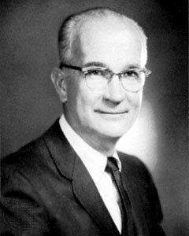

威廉·肖克利（1910年2月13日 - 1989年8月12日）是晶体管的发明人，和另外两位同事（约翰·巴丁 John Bardeen 和 沃尔特·豪泽·布拉顿 Walter Houser Brattain）获得1956年度「诺贝尔」物理学奖，他率先引导「硅谷」走向电子产业新时代，我们之前介绍过的 [戈登·摩尔](http://www.edulinks.cn/2021/01/29/20210131-gordon-moore/) 曾在他的公司工作，而后者正是摩尔定律的提出者。

肖克利在加州理工学院（[California Institute of Technology](https://www.caltech.edu)）获得物理学学士学位，1936年在麻省理工学院（Massachusetts Institute of Technology）获得博士学位。博士毕业后进入贝尔实验室开始半导体的研究。第二次世界大战期间，曾参加美国海军反潜挺研究组的相关工作。

## 参考资料

1. [百度百科-威廉·肖克利](https://baike.baidu.com/item/威廉·肖克利/10940765?fromtitle=William%20Shockley&fromid=11319354&fr=aladdin)
1. [Britannica - William B. Shockley](https://www.britannica.com/biography/William-Shockley)
