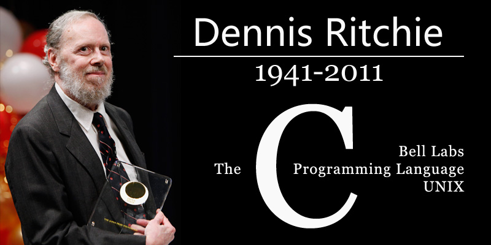

丹尼斯·里奇（Dennis M. Ritchie 1941年9月9日 - 2011年10月12日），美国计算机科学家，C 语言之父，Unix 之父。1978年与布莱恩·科尔尼干（Brain W.Kernighan）一起出版了著名的《C程序设计语言》。1983年他与 [肯·汤普森](http://www.edulinks.cn/2021/11/20/20211122-ken-thompson/) 因为在 Unix 操作系统方面的成就，一起获得了图灵奖。

> 图片引用自 [丝路博傲](http://blog.dvxj.com) ，如有侵权，请联系删除。

## 生平

里奇的父亲也是在贝尔实验室工作，他1941年9月9日出生于纽约 Bronxville，在 New Jersey 长大。

里奇本科和研究生都毕业于哈佛大学，1963年获得物理学学士学位，1968年获得数学博士学位。他于1967年进入贝尔实验室从事 Multics 操作系统相关工作。

> Multics 是一个分时操作系统，刚开始这是一个合资项目，1964年由贝尔实验室、麻省理工学院以及美国通用电气公司共同参与研发，其目的是为了开发出一套安装在大型主机上多人分时操作系统。

Multics 项目最早基于通用公司的大型机 GE-645，目的是连接1000部终端，支持300用户同时在线。由于项目工作进度过于缓慢，1969年，AT&T（当时贝尔实验室的母公司）决定退出该计划。

当时 [汤普森](http://www.edulinks.cn/2021/11/20/20211122-ken-thompson/) 为 Multics 开发了一款名为「Space Travel」的电子游戏，他想将游戏移植到实验室的 PDP-7 型计算机上。因此他开始开发一个更灵活的操作系统，里奇也加入了开发，没过几个月，他们就一起创造了 UNIX 操作系统。

除了一同开发 UNIX，里奇还协助汤普森在1970年开发了B语言。1971年，他们在把操作系统移植到 PDP-11 的过程中，发现很多B语言的缺点，里奇在B语言的基础上扩展发明了C语言。1973年里奇和汤普森基于C语言重写了UNIX操作系统。

1983年，里奇被提名为贝尔实验室 Fellow，1988年当选为美国工程院院士。1990年后，他在贝尔实验室带领了 Plan 9 操作系统和 Inferno 操作系统的开发。

2007年，里奇从朗讯科技（Lucent Technologies）的系统软件研究部门退休，2011年10月去世。

## 参考资料

1. [百度百科-丹尼斯·里奇](https://baike.baidu.com/link?url=sxsYHRIUiraeNV6bnXzmB7ChNberwDxZNivrn9Y8WYeuCmBEWKk7SczSy9o82EtSicooyW-yRQ6wZP3qN_iAmzNx2jQrPTNL1EfF1H-_WMPC4FoyzIyWC0HsM7wJ6pxKvbC_EZ2ycCvLYZa7yA-pmNUwkX1Fv9JZojxYuokfkg79ZWQ6r50ZlMDSfzbX-hR9jV-4_6fnrMM_nTR3iMmbI0bbNI2QeI2YKOCzTaoyBgC)
1. [Dennis M. Ritchie](https://www.britannica.com/biography/Dennis-M-Ritchie)
1. [百度百科-multics](https://baike.baidu.com/item/multics/10409946)
1. [DENNIS M. RITCHIE](https://amturing.acm.org/award_winners/ritchie_1506389.cfm)
