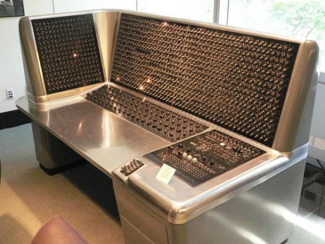

约翰·巴克斯（John Warner Bacus ，1924年12月3日 - 2007年3月17日），美国计算机科学家，带领团队发明了全世界第一套高阶语言（High Level Language），被誉为「Fortan 语言之父」。

## 生平

约翰·巴克斯于1924年12月3日出生于美国宾夕法尼亚州的费城，他的父亲是一名富有的股票经纪人。经过高中的学习后，1942年他来到弗吉尼亚大学学习化学，但是他对实验室工作不感兴趣，因此被迫退学。

退学后他选择了参军，因为在「Military Aptitude Tests」中成绩优异，巴克斯先是被派到 「University of Pittsburgh」参与一个工程项目，随后又派到「Haverford College」参与一个医学项目，但是他并不喜欢医院，他说。

> because all you had to do was memorize stuff

1946年，巴克斯从军队回来，并在纽约定居下来。他对自己的未来不是十分确定，他进入一个无线电技术学校来学习制造「Radio Receiver」。在这个过程中，他不断的学习到数学知识，因此进入了哥伦比亚大学的一个数学项目。1949年在哥伦比亚大学获得学士学位，1950年获得硕士学位。

## 神奇加入IBM

1949年，巴克斯去位于麦迪逊大道的IBM计算中心「IBM Computing Center」参观 「Selective Sequence Electronic Calculator」即 IBM SSEC，一台由哥伦比亚大学「Watson Scientific Computing Laboratory」发明的真空二极管计算机。他非常想与这台计算机一起工作，便以极大的热情劝说他的导游，随后被带上楼去找当时的负责人，并成功应聘为这里的一名程序猿。

进入 IBM 公司后，巴克斯最初三年的任务主要是计算星历表。他这段时间的工作成果后来还被 NASA 用在阿波罗登月计划上。

当时的编程需要编写机器码，为了提高处理速度，巴克斯发明了一种称为 「Speedcoding」的语言，允许人们以一种符号化的形式来处理浮点运算。随后 IBM 推出了 IBM 704 ，一种基于真空管技术研制的科学计算机，随后巴克斯把 「Speedcoding」移植到了 IBM 704。

通过这些工作，巴克斯争取到在 IBM 内部组建一个10人左右的团队来研究改进工作。一年之后，他和他的团队就发布了一份报告「Preliminary Report，Specifications for the IBM Mathematical FORmula TRANslating System，FORTRAN」，FORTRAN 主要用于数学计算，这让人们可以用接近自然语言的方式来编程。

巴克斯首次在 ALGOL 58 中提出「巴克斯范式」，巴克斯范式是一种形式化的语法表示方法，用拉描述语法的一种形式体系，是一种典型的元语言，简称 BNF。

BNF 表示语法规则的方式为：

* 非终结符用括号括起
* 每条规则的左部是一个非终结符，右部是由非终结符和终结符组成的一个符号串，中间一般以 `::=` 分开
* 具有相同左部的规则可以共用一个左部，各右部之间以直竖 `|` 分开

1991年，巴克斯从 IBM 退休，回顾他的一生，他在 1975 年获得了国家科学奖章，1977 年获得了图灵奖，并且荣获了工程院院士称号。

## 参考资料

1. [百度百科-约翰·巴克斯](https://baike.baidu.com/item/约翰·巴克斯/3510474?fr=aladdin)
1. [Britannica - John Backus](https://www.britannica.com/biography/John-Warner-Backus)
1. [正则表达式的BNF范式](https://zhuanlan.zhihu.com/p/33038004)
1. [图灵奖12 —— 约翰·巴克斯，Fortran和BNF的发明人，却有着不幸的童年](https://cloud.tencent.com/developer/article/2057559)
