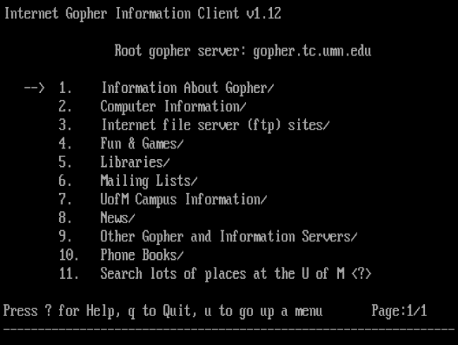

## Gopher 协议

Gopher 协议俗称万能协议，是1991年发布的一个C/S结构的文件服务系统，它允许人们在 Internet 上快速的浏览文件等资源。当你使用一个 Gopher 客户端时，可以快速的浏览一个网站的文档、基于Telnet的应用、FTP网站结构或者其他的 Gopher 服务器。

> A group of programmers—led by Mark P. McCahill, and including Farhad Anklesaria, Paul Lindner, Daniel Torrey, and Bob Alberti—created Gopher while working for the [University of Minnesota’s](https://twin-cities.umn.edu/) microcomputer support department.

## Gopher 协议

| 端口              | 默认为70端口，可自定义           |
| ----------------- | -------------------------------- |
| 协议格式          | gopher://127.0.0.1:70/_          |
| 支持的应用/中间件 | 服务端：Nginx 支持，Apache不支持 |
| 客户端支持        | curl、libcurl 支持该协议         |

## Gopherus

Gopherus 是用来专门生成 gopher 协议的 payload 工具，通过 gopher 协议的特点和各种被攻击应用的 tcp 包特点来构造 payload。

目前支持生成payload应用有：

* MySQL (Port:3306)
* FastCGI (Port:9000)
* Memcached (Port:11211)
* Redis (Port:6379)
* Zabbix (Port:10050)
* SMTP (Port:25)

## 参考资料

1. [Gopherus Author Website](https://spyclub.tech/)
2. [Gopherus Github](https://github.com/tarunkant/Gopherus)
3. [gopher协议利用](https://blog.csdn.net/qq_45089570/article/details/109643457)
4. [关于gopher协议的ssrf攻击](https://blog.csdn.net/qq_69775412/article/details/124420486)
5. [[The Web Before the Web: A Look Back at Gopher](https://www.howtogeek.com/661871/the-web-before-the-web-a-look-back-at-gopher/)](https://www.howtogeek.com/661871/the-web-before-the-web-a-look-back-at-gopher/)
