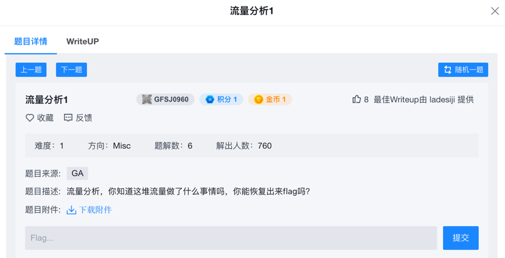
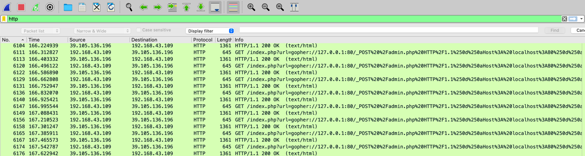
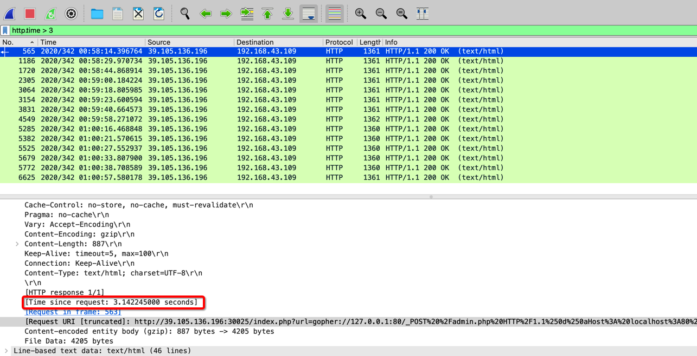

> 本文是小浪的第2篇 CTF Write Up。

## 题目介绍

这是攻防世界的一道 Misc 题目，题目比较简单，直接给出了流量包文件让大家分析提取 flag。



## WriteUp

先盲猜看看 http 相关的流量，使用 `http` 过滤器筛选出来结果看到很多 http 请求，请求看起来很相似。



选中其中一条记录，使用 Follow -> HTTP Stream 功能，可以看到详细的请求内容。

请求的内容像是做过编码，利用在线URL解码工作做了一次解码。

```http
/index.php?url=gopher://127.0.0.1:80/_POST%20%2Fadmin.php%20HTTP%2F1.1%250d%250aHost%3A%20localhost%3A80%250d%250aConnection%3A%20close%250d%250aContent-Type%3A%20application%2Fx-www-form-urlencoded%250d%250aContent-Length%3A%2079%250d%250a%250d%250aid%253D1%2529%2520and%2520if%2528%2528ascii%2528substr%2528%2528select%2520flag%2520from%2520flag%2529%252C14%252C1%2529%2529%253D%252790%2527%2529%252Csleep%25283%2529%252C0%2529%2520--%2520

#第一次解码
/index.php?url=gopher://127.0.0.1:80/_POST /admin.php HTTP/1.1%0d%0aHost: localhost:80%0d%0aConnection: close%0d%0aContent-Type: application/x-www-form-urlencoded%0d%0aContent-Length: 79%0d%0a%0d%0aid%3D1%29%20and%20if%28%28ascii%28substr%28%28select%20flag%20from%20flag%29%2C14%2C1%29%29%3D%2790%27%29%2Csleep%283%29%2C0%29%20--%20

#第二次解码
/index.php?url=gopher://127.0.0.1:80/_POST /admin.php HTTP/1.1
Host: localhost:80
Connection: close
Content-Type: application/x-www-form-urlencoded
Content-Length: 79

id=1) and if((ascii(substr((select flag from flag),14,1))='90'),sleep(3),0) -- 
```

原来是做了两次编码，解码两次后能看出来是在做 SQL 注入的尝试，如果成功会 sleep 三秒。

根据这个信息筛选超过3秒的请求，`http.time > 3` 一共14条。



再从请求的内容中拼出 flag，ASCII码依次是 102、108、97、103、123、49、113、119、121、50、55、56、49、125

最后解码得到正确答案 flag{1qwy2781}

## 背景知识

流量分析最重要的是对于网络协议的掌握，当然熟练使用 Wireshark 工具也是必不可少的技能。

在 CTF 比赛中流量分析一般是在获得一些基本流量数据的情况下，通过对有关数据进行统计分析，从而发现规律、特征，根据流量信息找出 flag 的过程。

Wireshark 是一款免费的图形化抓包工具，可以捕获并描述网络数据包。流量包是指捕获到的流量文件，一般为 pcap、pcapng 格式。

## 参考资料

1. 