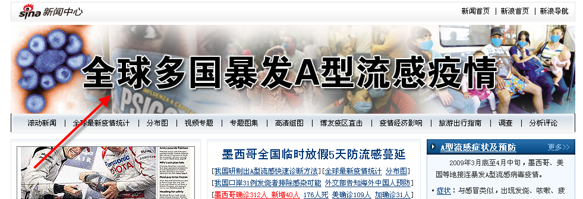
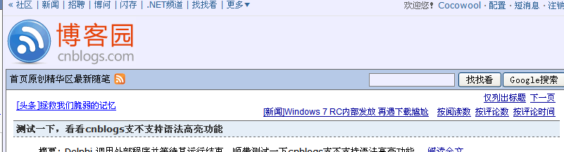
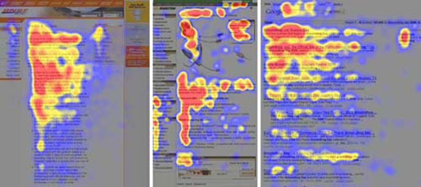

## 易用性是什么？

易用性就是是你的网站对用户来说使用更简单，能够让用户在他需要的地方很快找到需要的信息。类比于Google所提倡的”让用户呆在Google的时间不短缩短“，对于网站来说，我们不是减少用户在网站的停留时间，而是缩短用户寻找关键信息和向导的时间。

很多人认为要实现网站的易用性需要耗费大量的人力、财力和物力，确实有很多的大网站他们投入了很多的钱和设备去做网站的易用性的研究和测试，但是对于我们日常的小网站来说，我们仍有方法在没有专家和专业设备的基础上改进网站的易用性。

### 一、包含宣传词（Tagline)。

宣传词是一个用来表明公司理念、目标或者网站愿景的地方。这一部分应该是网站最引人瞩目的部分，应该用简短的语言概括站点。统计结果表明，一个页面只有8秒钟的时间来吸引一个用户继续他的浏览，所以如果不能用醒目的焦点吸引用户，那这个页面就是失败的。

国外的站点很多使用Tagline或者醒目的Flash，国内的站点也可以 这么用，有的时候内容多的时候，还可以是Banner+焦点图，这个要区分不同的网站类型来对待。例如对于产品型的网站，完全可以只使用一个焦点图或者醒目的有特色的Flash来吸引注意，如果是资讯类的或者专题类的页面，则可能既要有Banner，来突出这个页面的主题，也要有焦点图，来显示最近的一些动态。这个需要在制作的过程中不断地体会积累。

### 二、提供站内搜索。

站内搜索对于用户来说也是非常重要的，特别是当站点的内容量开始逐渐增多以至于用户不能很轻易的找到他想要的东西时，用户往往会想到搜索。 你能想象到，要在博客园里通过连接一个一个查找你之前看到过的某一篇文章的痛苦吧。

搜索框的长度和位置也需要加一点注意，不能太小，位置最好放在右上区域，因为根据用户的浏览习惯呈现出”F“的趋势（F Pattern），提交按钮的文字最好能够明确的告诉用户，接下来将要发生的动作是搜索。

### 三、不能滥用图片。

从易用性的角度来看，Less Is Always More。

### 四、使用站点地图。

站点地图是一项能够改进站内导航和搜索引擎优化（SEO）的特性。典型的站点地图提供了站点的结构和各个页面的导航。站点地图可以是任何形式的，可以是一个网页、一些页面的列表，只要他们是按照层级关系组织起来的就行。

最近，Google、Yahoo、MSN开始提供Sitemap Protocol的服务，同站点地图非常相近，但是数据是以XML的形式组织的。

### 五、不要破坏工作流。

工作流是指用户在网站上所进行的操作，比如填写表单、注册用户、浏览目录、档案等，要允许用户撤销操作，如果没有提供后退或者返回的选项，用户就被逼着做他们不想做的动作，或者他们会干脆关掉浏览器来图个清净。

有些站点上的操作顺序并不是那么的明显，这个时候就需要有提示来指导用户。比如Yahoo Music当第一次进入的时候，会有一个向导来指导你一步一步的熟悉页面上各个功能区。玩游戏的时候也会有游戏教学这个环节，如果网站上也提供了，会带来很好的用户体验。

还有一个误区是改变超链接的样式。传统的门户往往让超链接停留在他原始的样子，这样能够给用户明确的指示，这是一个超链接，通过点击，我可以进入一个新的页面。当然，我并不赞成超链接的样式一定不能改变，但是如果发生了改变，我们一定需要通过图示或者文字来表明，用户可以通过点击这个链接到达另外一个页面。

### 六、让网站更容易被”扫描“。

内容的可读性能够提高用户的忠诚度，让用户停留在站点上获得他们需要的内容。但是研究表明，很多用户并不是在读页面，而是在”扫描“，通过扫描标题、着重文字、强调的列表来获得信息。

Jacbo Nilsen通过视觉追踪发现用户的浏览很像一个F型，他们从左到用从上到下的”扫描“页面。

他的实验同时也得出了一下结论：

用户不是一个字一个字的去阅读，而是从段落、着重文字中提取信息。

文章的前两段非常的重要，这两段必须包括这篇文章的大部分内容。
副标题和列表能够重新引起用户的注意，注意用这些元素来强调重要的内容。
从传统的纸质媒体上得来的经验也告诉我们，将内容组织成一个倒金字塔型。关键问题是，我们如何才能知道什么信息对用户来说是重要的，那些信息对用户来说又是不重要的，作者推荐了一个工具：News Values。

### 七、不要设计容易误导的界面元素。

千万不要设计那种看上去像是一个按钮实际上不是的内容，我们也经常被那些带下划线的文字误导，当我们点击时，发现他们根本不是链接！
Yahoo是一个很好的正面的例子。

### 八、给出用户有意义的提示。

这一点大家应该都有共识了，不要将出错信息直接输出到页面上，要给出用户经过处理的、用户能够理解的信息。

### 九、不要过度使用Javascript。

过度的使用Javascript和Ajax技术，我们需要小心的避免出现浏览器兼容性问题，我们要很好的衡量这个代价。

### 十、避免验证符。

验证符的使用在必须的地方添加，如果不是那么必要，还是要符合人类懒惰的本性，去掉那些验证符吧。

总结：提升网站的易用性并不一定需要墨守成规，但是在没有足够的功力之前，这些规则能够为我们提供一个很好的方向指向。对于这些规则的争论也很多，比如避免验证符的使用，在很多情况下，我们必须使用验证符来避免垃圾信息的产生，就像坐飞机时的安检，虽然是一件让人不舒服的事情，可是他有他的目的。

网站的易用性也不是网站的全部，我们必须在易用性、页面设计、站点的可维护性和安全性之间权衡，对不同类型的项目采取不同的处理策略。

