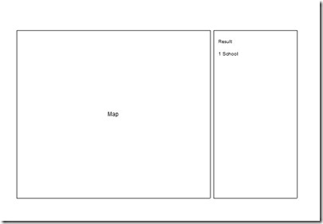
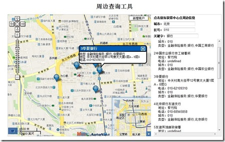

现在，越来越多的 Location Based 应用，或者Geolocation的应用出现在网络、手机等各种各样的终端上，为人们的日常生活、出行和工作都提供了不少的便利。最常见的就是出门前，利用地图工具，看看合适的公共交通路线，寻找一个自己最满意的方案，既方便有低碳环保。有时候，对周边环境不熟悉，想要找到周边的医院、银行、学校等一些单位的时候，地图同样可以帮上我们的大忙。

今天，我就做了一个基于Mapabc地图API的周边查询工具，利用Mapabc详尽的基础地物信息，为我查找周边的便民信息提供了有利的帮助。

开始之前，我大概需要知道最后的结果是什么样子的，可以借助传统的纸和笔，也可以用现代的原型工具，当然PS这样的重量级工具就不太需要了。下面是效果图：

有了效果图，接下来需要稍微规划一下代码。Mapabc的API在页面加载完成后，需要初始化地图，所以初始化的操作放在一个函数 pageInit() 中。周边查询的操作，希望通过用户输入一个关键词，然后通过点选地图设置中心点的方式实现。那么就需要一个函数来监听鼠标在地图上的单击事件，然后一个负责查询的函数和一个负责显示结果的函数。程序的结构大致如此，接下来就进入实质的编码过程。

编码的重点函数有以下几个：

> mapObj.addEventListener(mapObj, MOUSE_CLICK, searchAround);

对地图添加监听事件。
> mls.poiSearchByCenterXY(new MLngLat(cordx, cordy),keyword,citycode,mlsp);

利用中心点坐标查询查找周边信息
利用这两个函数，加上参考Mapabc官方的示例，我们就可以完成这个应用。

通过修改区号和关键字，可以在不同城市之间切换，怎么样，简单吧。

