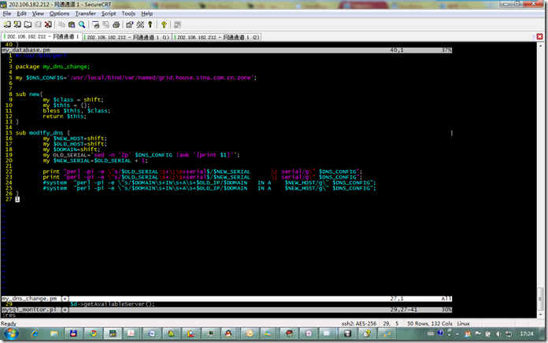

使用VI提供的多窗口编辑在项目文件比较多的情况下非常方便。今天总结了几个比较好用的快捷键。

最基本的是打开分割窗口 :sp a.pl

切换窗口 Ctrl + w 按一次加上下键可以自己选择切换方向，按两次则从上到下自动遍历窗口

扩大窗口 Ctrl-w + 扩大窗口

缩小窗口 Ctrl-w - 缩小当前编辑窗口

在vim中执行shell命令 :! ls 这样可以执行shell命令，或者也可以 :shell top

放大当前窗口，缩小其他窗口 :res ，后面可以设置行数，比如 :res 10 则将当前窗口设置为10行

有了这几个功能，在vim中编辑复杂的项目也变得非常简单了

