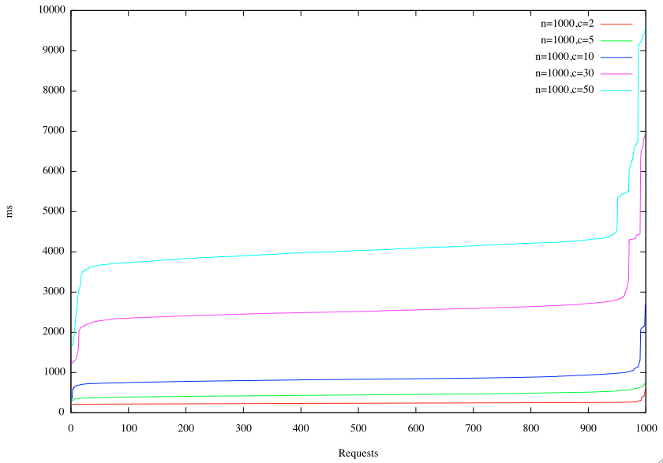
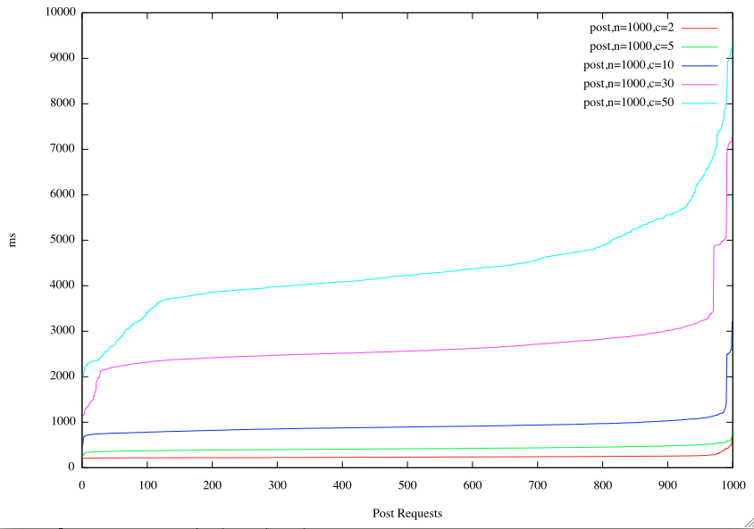
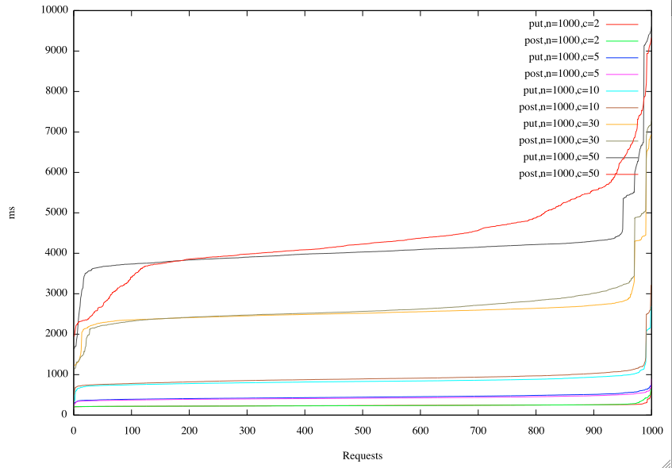
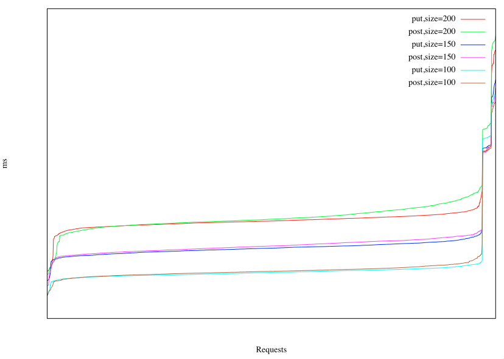

最近写了几个测试脚本，希望要观察使用[PUT方式上传文件](http://www.cnblogs.com/cocowool/archive/2010/05/31/1748180.html)和使用POST方式上传文件，两者效率的差别。

分别是：
put_client.php          模拟客户端发送PUT请求
put_server.php          接收客户端的PUT请求，并保存文件
post_client.php          模拟客户端发送的POST请求
post_server.php          接收客户端的POST请求，并保存文件

[/Files/cocowool/code.zip](http://files.cnblogs.com/cocowool/code.zip)

然后利用ab（ab是apache自带的一个性能测试工具）对客户端文件发起请求，来测试处理所消耗的时间。具体的测试场景设计了以下四组
1、使用PUT请求，改变并发的请求数。其中请求数设置为1000，并发数分别设置为2、5、10、30、50
2、使用POST请求，改变并发的请求数。其中请求数设置为1000，并发数分别设置为2、5、10、30、50
3、使用PUT请求，改变发送的文件大小。其中请求数设置为1000，并发数设置为30，文件大小分别为100、150、200
4、使用POST请求，改变发送文件大小。其中请求数设置为1000，并发数设置为30，文件大小分别为100、150、200。

每次实验前，关闭系统的其他程序，清空数据文件夹内的数据，重新启动Lamp。
实验环境：Mac MC700、Apache2.2.6、PHP5.3.1

实验的结果：
测试结果：
1、不同并发状况下PUT的处理情况测试

结论：并发越大处理时间越长，个别请求因为负载问题造成处理时间超长。

2、不同并发状况下POST的处理情况测试

结论：并发越大处理时间越长.

3、PUT方式和POST方式对比。

结论：PUT方式优于POST方式，在并发较少情况下，这种差别不太明显，但是随着并发数的加大，差别开始显现。

4、根据上述结果，选定c=30时，测试不同文件尺寸下两中方式的差异。以下是100k、150k、200k文件大小时的结果图。

以上结果只是在本地环境测试，相信如果是服务器环境，PUT和POST方式的差异会更明显。

参考资料：
1、[ab性能测试与Gnuplot绘制](http://cryolite.iteye.com/blog/351245)
2、[httpperf+AutoBench+Gnuplot构建Web Server压力测试系统](http://www.inanu.net/post/381.html)