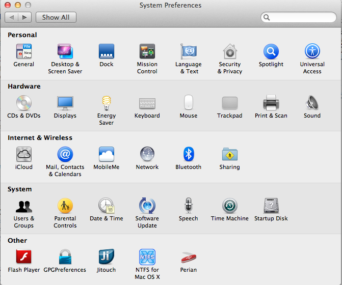
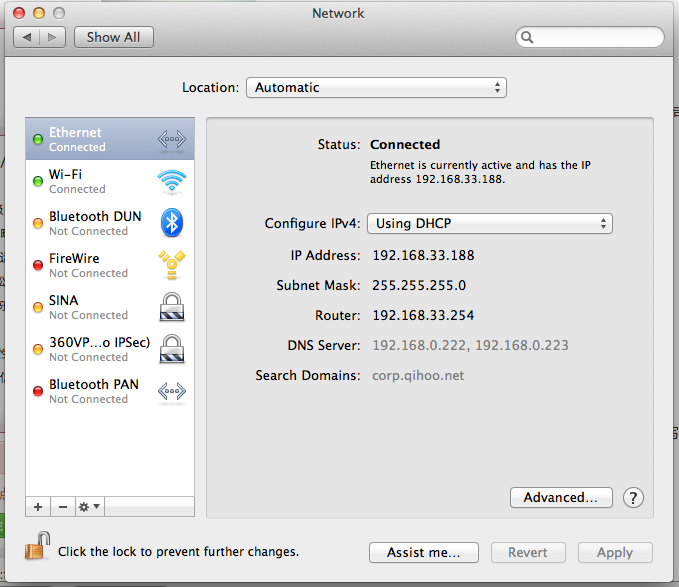
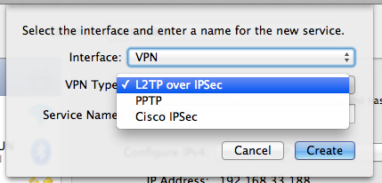
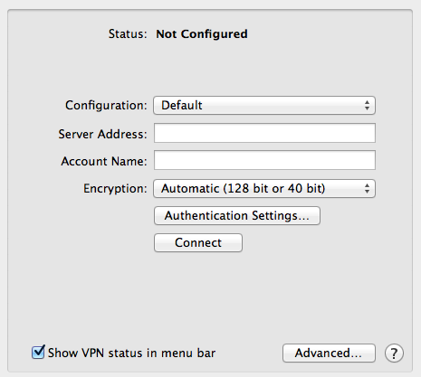
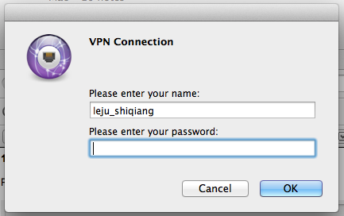
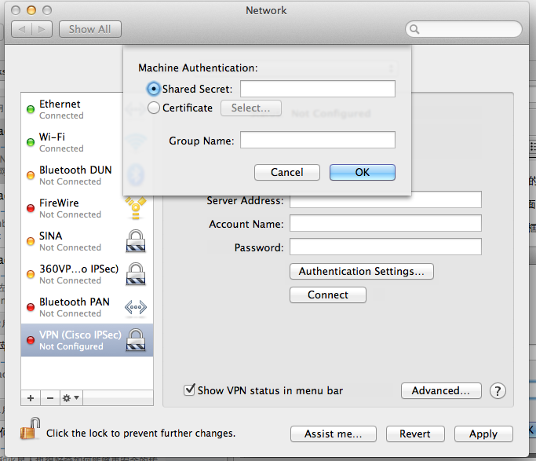

很多IT公司都会给员工申请VPN，方便大家不在公司的时候访问公司的网络资源。同样是使用SecurID卡，之前的东家使用的PPTP的方式，当时买了Mac之后，很轻松的就能够配置VPN的连接。现在换了东家，他们使用的是Cisco IPSec的方式进行的VPN连接，配置的时候花了一点功夫，相信很多朋友都有配置VPN的问题，记下来供有需要朋友使用。

**VPN知识科普**

关于VPN，我之前的理解为就是通过一个加密可靠的信道访问一个对公网不可见的网络资源。看了下百度百科才了解VPN的隧道协议主要有三种：PPTP、L2TP和IPSec。其中PPTP和L2TP协议工作在OSI模型的二层，IPSec是第三层隧道协议，也是最常用的协议。L2TP和IPSec配合使用是目前性能最好，应用最广泛的一种，只是可惜还没有遇到过这样的VPN。

**Mac下的VPN连接的创建**

不得不说Mac下VPN连接的创建和管理非常方便、简单。记得之前在Fedora下为了配置一个能够使用PPTP的VPN连接，费了九牛二虎之力，Mac下，很轻松的就搞定了。言归正传，首先进入Mac的“网络配置” Network Preferences。可以通过状态栏的网络图表进入，也可以从系统配置中选择网络 Network进入，如下图：

进入网络后，看到列表下方有个加减号，用来添加和删除网络连接。

点击加号后可以创建一个新的连接，选择VPN，VPN下有三种类型，分别是：PPTP、Cisco IPSec、L2TP Over IPSec。可以根据自己的情况选择适用的类型，并且可以为每一个连接起一个名字，方便记忆。

下面就是具体每种类型的配置方法：

**1、使用PPTP的方式**

PPTP的连接方式比较简单，界面如下图：

其中服务器地址 Server Address这一栏填写从公司网管那里获得的VPN地址
用户名 Account Name 这一栏填写自己的用户名
因为是动态密码，所以每次连接的时候会提示输入密码，配置界面就没有密码的输入框了。

配制完成后点击状态栏的VPN连接图标，会弹出输入密码的对话框。

验证成功后，就可以在状态栏看到VPN的连接了，会显示连接的时长。

**2、使用Cisco IPSec方式**

适用Cisco IPSec的方式创建过程和PPTP大同小异，也是在网络配置面板中点击加号进行创建。在配置的时候与PPTP有些不同，先看截图：

在服务器地址 Server Address中填写公司VPN的地址；
在用户名 Account Name 中填写用户名；
在密码 Password 这一栏中留空，因为每次需要输入SecurID的动态密码；
然后点击授权设置 Authentication Settings
在 共享密钥 Shared Secret 中填入从公司网管那里得到的共享密钥（）；
在 组名 Group Name 中填写 自己VPN所属的组名；

关于共享密钥，有些公司会以明文的形式告知，有的会用PGP的方式发送一个加密的密码，需要使用自己的私钥解密后使用。这个过程大多数都会有文档说明，这里就不过多阐述了。流程也可以参考之前的一篇文章：

SecurID卡小贴士：SecurID卡坚固小巧，用起来也很方便，只是千万要小心别丢失了，因为可以是要花大洋赔偿的。

参考资料：
1、[Mac下配置基于SecureID的Cisco IPSec VPN全攻略](http://kerneltravel.eefocus.com/Kevin/blog/11-09/230878_53c71.html)
2、[百度百科VPN](http://baike.baidu.com/view/19735.htm)
3、[Mac使用VPNC连接Cisco IPSec](http://www.iteye.com/topic/593613)
4、[Cisco anyconnect 配置手册](https://www.macsetupvpn.com/macnn/88.html)
