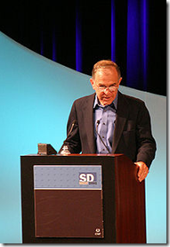
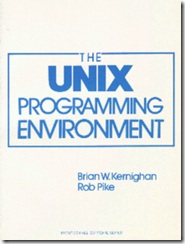

浏览了一下Wiki，把shell的历史简要摘抄了一下，整个发展过程还是很有趣，csh贡献了很多的想法和特性，但是最后却没有流行起来。sh虽然刚开始功能比较简单，但是后续也一直在完善。bash我觉得目前对于使用linux的朋友来说是最常见的，但是这位Fox兄弟在Wiki上的评价只是Computer Programmer，远远不及Bourne老爷子呢。

Bourne Shell     是1977年发布的Unix Version 7 中的默认Shell。目前大多数Unix系统仍保留着原始的 /bin/sh，或者保留一个软连接到其他Shell上 。该程序由 Stephen Bourne 在贝尔实验室工作期间开发，它的开发是做为 Thompson Shell 的一个替代。随着《The UNIX Programming Environment》（作者Brain W. Kernighan、Rob Pike）一书的出版，Bourne Shell开始变得流行起来。

随着时间的发展，伴随着不断更新的系统（Version 7、SystemIII、SVR2、SVR3、SVR4），AT&T不断地增强shell的功能，但是因为shell一直没有版本号，所以我们只能依靠其支持的特性来区分SHELL的版本。

对于SHELL的一些批评：交互式的使用不够友好（当时C Shell提供了history、aliases、job control等命令）；Unix系统使用C写成，但是shell的语法缺不像C，倒是有点像ALGOL；缺少正则表达式支持。

后续的故事

C Shell （csh）在1970年代，由当时还是加州大学伯克利分校的学生Bill Joy编写。在1978年，随着BSD Unix系统的第二个版本广泛发布。早期贡献代码的成员还包括：Michael Ubell, Eric Allman, Mike O'Brien and Jim Kulp。在一些系统如Mac OS X和Red Hat Linux上，csh实际上是tchsh，一种增强型的shell。csh包含了当今shell的绝大多数特性，包括filename wildcarding, piping, here documents, command substitution, variables and control structures for condition-testing and iteration。

虽然csh有着众多的交互特性以及快速的执行速度，但是最终未能流行起来。整个80年代，csh不能够确保出现在所有的Unix系统上，但是sh可以，这也是造成csh不够流行的主要因素。90年代中期，csh的分发开始广泛起来，这时又遭受了POSIX委员会的质疑，指出语法不够完善、特性缺失、扩展性差等问题[[8](http://en.wikipedia.org/wiki/C_shell)]。

Korn Shell （ksh）由 David Korn 编写，1983年在USENIX上宣布。它向后兼容Bourne Shell，同时吸取了C Shell中的一些优点（job control）。代码贡献者还包括当时在Bell Labs的Mike Veach和Pat Sullivan。目前为开源软件：[http://www.kornshell.org/](http://www.kornshell.org/)。ksh的早期版本为 ksh88，是AIX4上的默认shell。后来又发布了ksh93版本。

Bash （the Bourne-Agian shell）由 Brian Fox 为GNU项目编写，目的是代替sh。首次发布于1989年，作为GNU项目的一个程序广泛分布在Linux、Mac OS X、Cygwin上。Brain Fox作为FSF的员工，首次开始工作是在1988年的1月10号，一年之后，发布了.99的测试版本。

参考资料：
1、The Linux Command Line: A Complete Introduction
2、[umask 百度百科](http://baike.baidu.com/view/1867757.html?fromTaglist)
3、[关于setuid和setgid的讨论](http://bbs.chinaunix.net/thread-451969-1-1.html)
4、[Wiki Bash Unix Shell](http://en.wikipedia.org/wiki/Bash_(Unix_shell))
5、[Bourne Shell](http://en.wikipedia.org/wiki/Bourne_shell)
6、[The Unix Programming Environment](http://en.wikipedia.org/wiki/The_UNIX_Programming_Environment)
7、[Wiki Korn Shell](http://en.wikipedia.org/wiki/Korn_shell)
8、[Wiki C Shell](http://en.wikipedia.org/wiki/C_shell)
9、[Wiki Bash （Unix Shell）](http://en.wikipedia.org/wiki/Bash_(Unix_shell))
