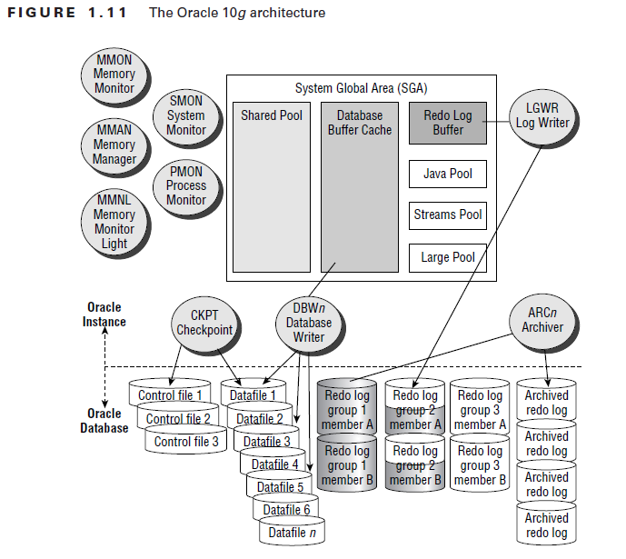
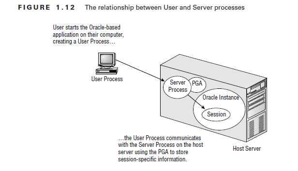
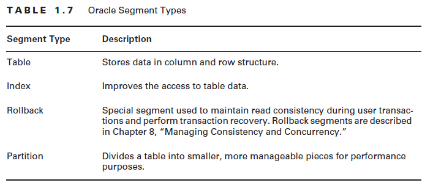
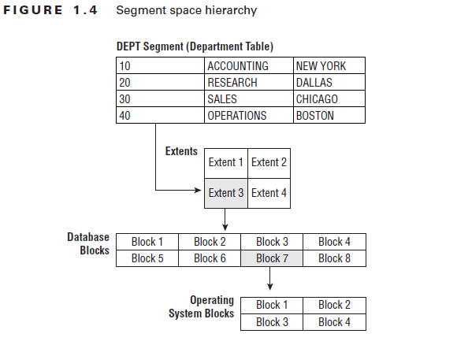
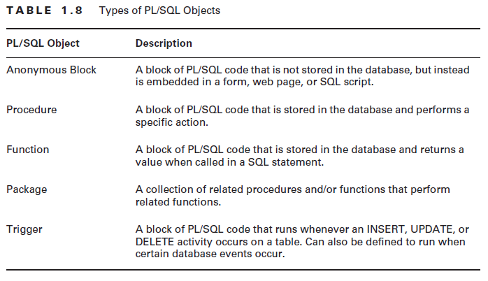

> 这是2012年刚进入银行IT系统工作时整理的Oracle学习笔记，时光划过了将近10年，Oracle在使用率上仍占有很大的比重，不过Mysql、国产数据库也开始逐步引入了。
>
> 重新整理记录于2021年6月19日

## Oracle数据库的历史

Oracle 10g发布于2004年，第一个版本是10.2.0.1。目前最新的Oracle版本是 Oracle 11g。

## Oracle 产品家族

Oracle 10g发行有五个版本：Enterprise、Standard、Standard Edition One、Personal、Lite。

## Oracle架构

Oracle的架构可以总结为下面三点：

* 用户相关的进程，User-related processes；
* Oracle 实例（Oracle Instance）所使用的逻辑内存结构；
* 物理文件结构，我们称之为 database；



### 用户进程与服务进程

用户想要连接Oracle数据库，必须通过User Process才能连接。User Process可以存在于客户端或者中间层上，对应User Process连接请求的是Server Process。用户进程与服务器进程建立连接（Connection）后，服务器上会有一个专门的Server Process来响应用户的请求。连接建立后，用户就创建了一个 Session。同时，会在内存区域创建一个PGA（Program Global Area）区域，存储一些用户相关的会话变量和信息。具体的结构如下图所示。



### Oracle Instance

Oracle Instance由SGA以及一些后台进程组成。SGA是Oracle的主要内存结构，全称为System Global Area。

### 物理文件结构

Oracle中的MetaData以及数据字典视图（Data Dictionary View）：除了用户的数据表之外，Oracle中包含了大量的系统表，这些表的名字多数为OBJ$、FILE$、X$KSMSP等难以记忆的名字。为了便于使用，Oracle中还包含很多视图，具体信息如下：

动态的性能视图，与Oracle安装的特性有关系，包括：V$DATABASE、V$VERSION、V$OPTION、V$SQL、V$SGA、V$SGA_DYNAMIC_COMPONENTS。

Oracle中Segment的类型：



Oracle中Segment、Extent、Blocks和System Blocks之间的关系。



## PL/SQL

PL/SQL是Oracle Procedural Language for SQL的缩写，是Oracle提供的一个SQL的变种，针对SQL的缺点，提供了循环、判断等众多的功能。



## 表空间及数据文件管理

### 查看表空间信息

我们可以通过 DBA_TABLESPACES、DBA_DATA_FILES、DBA_TEMP_FILES、V$TABLESPACE几个视图查看数据库的表空间。

### 表空间的管理

索引（Indexes）、约束（Constrains）、触发器（Triggers）和Tables使用不同的命名空间，Tables和Views、Sequences、functions等共用命名空间。在同一个命名空间下，名字不能够重复。

1、新建表空间

2、移除表空间

3、修改表空间

使用 ALTER TABLESPACE 命令来修改表空间的属性，可以进行包括： 修改表空间名称、向表空间中增加数据文件、下线一个表空间、改变表空间的读写状态等。

```sql
ALTER TABLESPACE  xxx  RENAME TO yyy;
ALTER TABLESPACE xxx OFFLINE;
ALTER TABLESPACE xxx READ ONLY;
ALTER TABLESPACE xxx READ WRITE;
```

### **数据文件管理（Datafile Management）**

如果没有使用OMF，我们就需要手工对数据文件进行管理，一个数据文件在某一时间只能属于一个数据库、一个表空间。对于数据文件，常见的操作包括：调整大小（Resize）、上线或下线、移动（重命名）、恢复。

```sql
ALTER DATABASE DATAFILE '/xxx/yyy/ddd.dbf' RESIZE 2000M;
ALTER DATABASE DATAFILE '/xxx/yyy/ddd.dbf' AUTOEXTEND ON NEXT 100M MAXSIZE 8000M;
ALTER DATABASE DATAFILE '/xxx/yyy/ddd.dbf' OFFLINE;
ALTER DATABASE RENAME FILE '/xxx/yyy/ddd.dbf' TO '/xxx/yyy/aaa.dbf'
ALTER DATABASE DATAFILE '/xxx/yyy/ddd.dbf' ONLINE;
```

### Schema Objects

Schema是数据库中归属于某个特定用户的所有数据库对象的集合，包括 Tables、Indexes、Views、Constrains等等。

4.1 Oracle数据库中的数据类型。Oracle 10g提供了六种主要的数据类型，分别是：Character、Numeric、Datetime、LOB（Large Object）、ROWID、Binary。

4.2 创建表格

```sql
CREATE TABLE (
id   NUMBER,
who   VARCHAR(20),
WHEN   timestamp DEFAULT SYSTIMESTAMP
) TABLESPACE xxx;
```

4.3 修改表定义

```sql
ALTER TABLE xxx MODIFY who VARCHAR(64) DEFAULT USER;
```

4.4 给表重命名

```sql
RENAME xxx TO yyy;
```

4.5 增加修改列

```sql
ALTER TABLE xxx ADD how VARCHAR(64);
ALTER TABLE xxx DROP how;
```

4.6 修改列定义

```sql
ALTER TABLE xxx MODIFY how VARCHAR(100);
```

4.7 查看表信息

DESCRIBE xxx;

### 表约束 Constrains

Oracle 10g提供了以下几种约束方式：NOT NULL、UNIQUE、PRIMARY KEY、REFERENTRIAL、CHECK。

### 索引

BTREE索引是Oracle 10g中的默认索引，适用于那些存在很多不同值的列上。BTREE支持行级锁，
```sql
CREATE INDEX index_name on table_name ( column_name ) TABLESPACE idx;
CREATE BITMAP INDEX index_name on table_name ( column_name ) TABLESPACE idx;
```