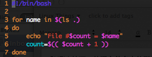
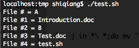
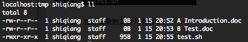
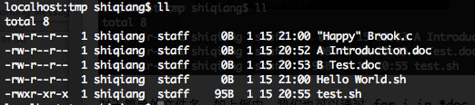
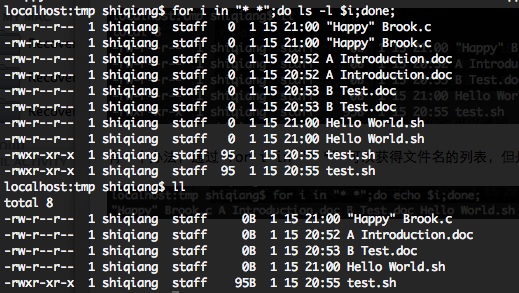
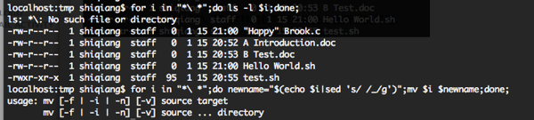
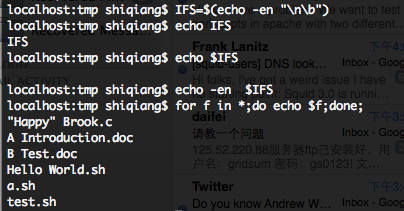
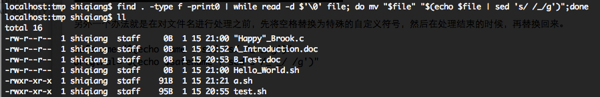

现在很多人命名的时候都喜欢用空格，例如“An Introduction.doc”。但是这种命名方式给Linux命令行工具和Shell带来了困扰，因为大多数命令中，都是默认以空格做为值与值之间的分隔符，而不是做为文件名的一部分。

看下面的脚本，我们可以了解的更清楚，这个脚本的目的是列出文件夹下的所有文件：



执行的结果如下：



实际上，当前目录的文件只有两个：



本文整理了几个避免出现这种问题的方法。

## 方法一：通过后缀获取文件列表

对于简单的文件名，如上例中，我们也可以通过 `for i in *doc` 这样简单的方法来获得文件列表。这个方法非常简便，但是适用的场景有限，并且文件类型做为硬编码写到代码中不是很理想。

```sh
#!/bin/bash

# 统计文件夹下文件的个数
# 支持处理文件名中带空格的文件

count=1
for name in *doc
do
    echo "File #$count = $name"
    count=$(( $count + 1))
done

echo "There are $(($count-1)) files under this folder"
```

## 方法二

但是对于复杂的环境，如下图，我们如何获得这些列表呢？



有一个办法，通过 `for i in "* *"` 可以获得文件名的列表，但是一个很糟糕的列表，因为这个结果是一个两个文件名在一起的列表，我们完全无法拿来做后续的操作，如下图所示。



通过 "*\ *" 这样的技巧可以避免上面所说的问题，但是在应用mv或其他操作时，还是会出现问题。



上面的问题，可以通过将变量放入引号中（"$i"）解决，通常情况下，引号中的空格可以被正确的处理。但这并不是一个恒久的解决办法，因为我们无法处理管道、子Shell等复杂的情况。

## 方法三：IFS

一个终极的解决办法就是设置IFS（the Internal Field Separator），不要用空格做为IFS，选择其他的符号。先来看看man page：

> IFS: The Internal Field Separator that is used for word splitting after expansion and to split lines into words with the read built-in command. The default value is “<space><tab><new-line>”.




```sh
#!/bin/bash

# 统计文件夹下文件的个数
# 支持处理文件名中带空格的文件

# 推荐的方法，这个改动只在当前脚本生效，确保脚本正常执行，但是 local 只能用在函数中
function file_count {
    local IFS=$'\n'

    count=1
    # 使用文件后缀，只能处理固定类型的场景
    # for name in *doc
    # 只能找到带空格的文件的写法
    # for name in *\ *
    # 通用的写法，遇到文件名中有空格的场景会发生异常
    for name in $(ls .)
    do
        echo "File #$count = $name"
        count=$(( $count + 1))
    done

    echo "There are $(($count-1)) files under this folder"
}

count=1
# 使用文件后缀，只能处理固定类型的场景
# for name in *doc
# 只能找到带空格的文件的写法
# for name in *\ *
# 通用的写法，遇到文件名中有空格的场景会发生异常
for name in $(ls .)
do
    echo "File #$count = $name"
    count=$(( $count + 1))
done

echo "There are $(($count-1)) files under this folder"

file_count
```

看一下执行的效果。

```sh
$ sh file_counter.sh
File #1 = a
File #2 = b
File #3 = c.doc
File #4 = awk.sh
File #5 = count_file.sh
File #6 = cpu_chaos.sh
File #7 = dennis-ritchie.txt
File #8 = file_compare.sh
File #9 = file_counter.sh
File #10 = get_ping_result.sh
File #11 = kafka_offset_count.sh
File #12 = math.sh
File #13 = movetofolder.sh
File #14 = namespace
File #15 = shell_variables.sh
File #16 = text-template.txt
File #17 = zshrc-template
There are 17 files under this folder
File #1 = a b c.doc
File #2 = awk.sh
File #3 = count_file.sh
File #4 = cpu_chaos.sh
File #5 = dennis-ritchie.txt
File #6 = file_compare.sh
File #7 = file_counter.sh
File #8 = get_ping_result.sh
File #9 = kafka_offset_count.sh
File #10 = math.sh
File #11 = movetofolder.sh
File #12 = namespace
File #13 = shell_variables.sh
File #14 = text-template.txt
File #15 = zshrc-template
There are 15 files under this folder
```

## 方法四

另外一个办法就是在对文件名进行处理之前，先将空格替换为特殊的自定义符号，然后在处理结束的时候，再替换回来。

```sh
safename="$(echo name | sed 's/ /_-_/g')"
original="$(echo $safename | sed s'/_-_/ /g')"
```
其他还有一些方法，例如利用find命令。



参考资料：
1. [Work the shell － Dealing with Spaces in Filenames](http://www.linuxjournal.com/article/10954)
2. [BASH SHELL：For Loop File Names With Spaces](http://www.cyberciti.biz/tips/handling-filenames-with-spaces-in-bash.html)
3. [Shell 命令之IFS详解](https://www.cnblogs.com/weq0805/p/15027357.html)