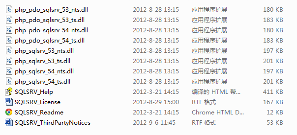

最近在Windows Server 2008配置了PHP环境，想要连接SQL Server 2008，但是悲催的发现，从5.3开始，PHP自带的dll不再支持2000以后的MS SQL Server了。

没办法，只能求助于百度了。看到网上的攻略，按照以下的步骤配置，可以成功连接SQL Server。

一、首先需要下载、安装最新版的PHP Driver。我下载的时候，有两个版本，分别是SQLSRV20、SQLSRV30对应PHP 5.2和PHP 5.3以上的版本。从微软官方下载的是两个exe文件，实际上是一个可以自解压的压缩包。

双击运行后，会提示你将文件保存到什么位置。选择对应的位置后，就能够看到众多的dll文件了。

二、之后根据自己的需要，选择对应的dll，拷贝到php安装路径的ext目录下。完成后，记得修改php.ini中的配置，然后重启Web服务器使配置生效。

[PHP_PDO_SQLSRV]
extension=php_pdo_sqlsrv_53_ts.dll
[PHP_SQLSRV]
extension=php_sqlsrv_53_ts.dll

其中，ts表示线程安全，nts表示非线程安全。根据你的需要选择就可以了。

这个时候，如果遇到要求安装“SQL Server Native Client”的错误，这说明本地没有安装客户端。这种情况，可以通过在本地安装SQL Server的时候选择安装Client，或者单独下载安装Client解决。在参考资料2的[链接](http://msdn.microsoft.com/en-us/library/cc296170(SQL.90).aspx)中，可以找到Client的下载地址。

这些问题排除后，就可以使用PDO函数，链接SQL Server数据库了。

参考资料：
1、[http://msdn.microsoft.com/en-us/sqlserver/ff657782.aspx](http://msdn.microsoft.com/en-us/sqlserver/ff657782.aspx)
2、[System Requirements (Microsoft Drivers for PHP for SQL Server)](http://msdn.microsoft.com/en-us/library/cc296170(SQL.90).aspx)
3、[Introducing the Microsoft Drivers for PHP for SQL Server](http://msdn.microsoft.com/en-us/library/cc296170(SQL.90).aspx)
4、[PHP 5.3如何连接MSSql Server](http://blog.csdn.net/sptoor/article/details/7704991)
5、[安装SQL Server native client](http://msdn.microsoft.com/zh-cn/library/ms131321.aspx)
6、[SQLServer 2012的问题](http://social.msdn.microsoft.com/Forums/ie/zh-CN/2e950ea0-0f1d-411b-99f6-e48d26269214/sqlserver2012?forum=sqlserverzhchs)
