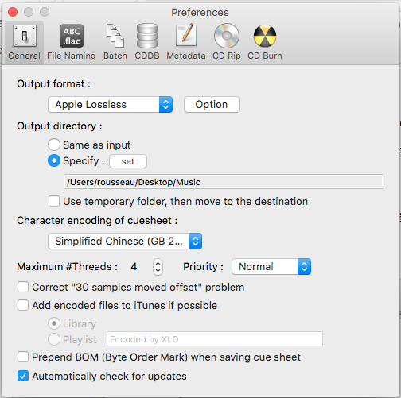
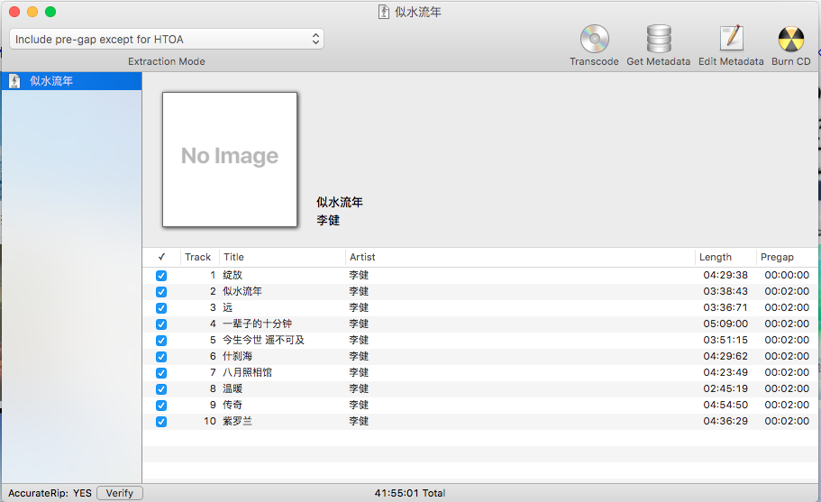
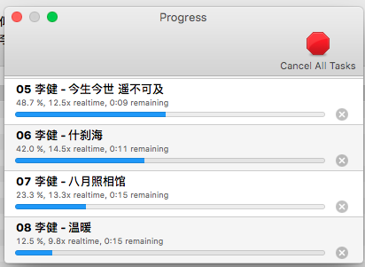
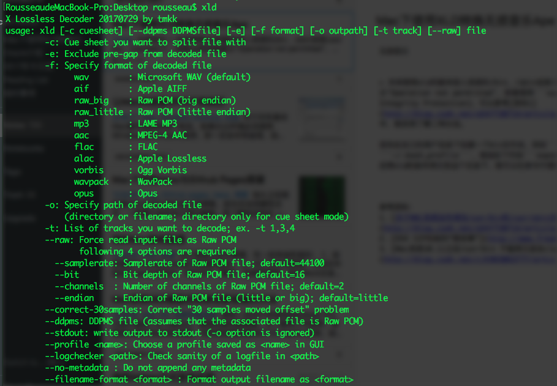

最近想要给音乐库增加一些音乐，下载了一些Ape格式的无损音乐，但是无法直接导入到iTunes中，必须经过其他工具转换成苹果的无损格式，XLD就是这样一款工具。XLD的[下载](http://tmkk.undo.jp/xld/index_e.html)和安装非常方便，直接将APP拖入到/Application文件夹下就可以。

### XLD图形界面转换方法
打开XLD后，并不能看到任何窗口，我们可以先通过```⌘+,```调出配置窗口，修改一些参数，包括输出的目录、输出的格式、转换前修改Metadata等。

然后就可以通过File->Open打开Ape的cue文件，来按照专辑模式进行转换。如下图，补充专辑图片和其他信息后，点击```Transcode```就可以看到转换界面。如果打开cue的时候报错，一般是编码不正确，修改为GB2312或者UTF8就能够解决。


XLD的安装包中通时提供了一个命令行脚本，对于Ape文件较多时通过脚本批量转换还是非常方便的。

> 本来想将xld的脚本放入系统的/bin、/sbin或者/usr/bin、/usr/sbin下，但是cp的时候提示"Operation not permitted"，即便使用```sudo```也是如此。原来是因为系统启动了SIP(System Integrity Protection)，可以参考[资料1](http://blog.csdn.net/a547720714/article/details/52678643)屏蔽，也可以放在用户目录中，我采用了第二种办法。

首先在自己的用户目录下创建一个bin文件夹，例如```~/bin```。修改用户的profile，位置```~/.bash_profile```，增加如下代码```export PATH=$HOME/bin/:$PATH```然后保存退出。然后将xld的脚本拷贝到这个目录下，就可以在命令行使用xld了。

**本文为作者原创，如果您觉得本文对您有帮助，请随意打赏，您的支持将鼓励我继续创作。**

参考资料：
1、[关于MAC系统没有修改/usr/bin和/usr/sbin文件夹权限问题](http://blog.csdn.net/a547720714/article/details/52678643)
2、[OSX SIP机制的“那些事”](http://www.freebuf.com/articles/system/97411.html)
3、[Mac系统10.11之后/usr/bin 不能拷贝进去class-dump该怎么办](http://blog.csdn.net/cjh965063777/article/details/53196388)
4、[XLD实用教程](http://tieba.baidu.com/p/3015601318)
5、[XLD Download](http://tmkk.undo.jp/xld/index_e.html)