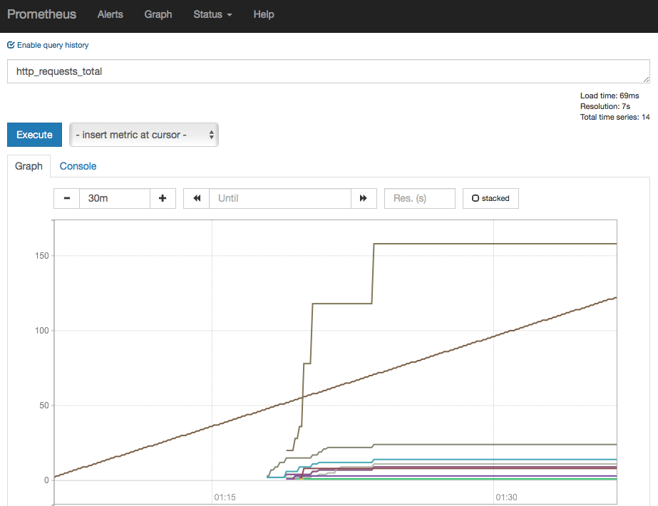
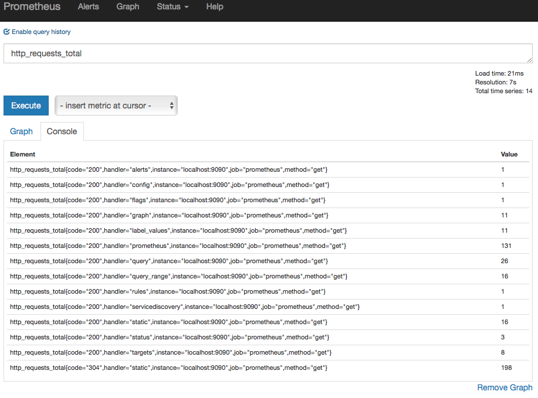
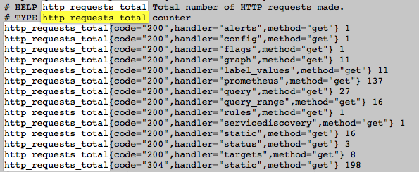
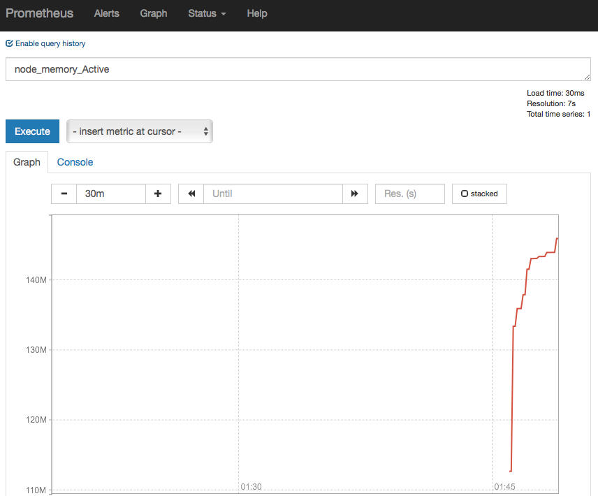

> 本文环境 Redhat Linux 6.7, Prometheus 2.2.1，node_exporter 1.5.2

### 介绍

Prometheus 是2012年由 SoundCloud 开源的系统监控和报警工具集，在 《Google SRE 运维解密》一书中也提到与Google内部的Borgmon思想一致。使用 Go 语言开发，适用于各个平台。

### 安装

```bash
[root@bj1eccap01 ~]# tar -xvzf prometheus-2.2.1.linux-amd64.tar.gz 
[root@bj1eccap01 ~]# cd prometheus-2.2.1.linux-amd64
[root@bj1eccap01 prometheus-2.2.1.linux-amd64]# ./prometheus --help
usage: prometheus [<flags>]
```

### 配置

安装包下有一个默认的配置文件，是 YAML 格式，默认配置文件包括三个分区：```global```、```rule_files```、```scrape_configs```。
```global```控制 Prometheus 服务器的全局配置。```scrape_interval```决定数据抓取的间隔。```evaluation_interval```决定数据计算的间隔，Prometheus会根据rule_file来产生新的时间序列值。
```rule_files```决定规则文件的保存路径。
```scrape_config```决定Prometheus监控的资源。Prometheus通过HTTP暴露自己的数据，因此也可以监控自己的健康状况。

### 启动

启动非常简单
```bash
[root@bj1eccap01 prometheus-2.2.1.linux-amd64]# ./prometheus --config.file=prometheus.yml
```
这之后就可以通过浏览查看服务的运行状况了，打开浏览器输入[http://localhost:9090/graph](http://localhost:9090/graph)

Prometheus 提供了两种方式查看指标 graph 模式可以直接看到指标曲线，metrics 则看到原始的监控数据。通过切换到 console 界面可以看到。



### node_exporter 安装

node_exporter 用来收集服务器的监控信息，目前稳定版本为1.15.2。node_exporter 默认使用 9100 端口监听，Prometheus 会从 node_exporter 中获取信息。
```bash
[root@bj1eccap01 ~]# tar -xzvf node_exporter-0.15.2.linux-amd64.tar.gz
[root@bj1eccap01 ~]# cd node_exporter-0.15.2.linux-amd64
[root@bj1eccap01 node_exporter-0.15.2.linux-amd64]# ./node_exporter
```


### 运算与统计

Prometheus 提供了一套查询语言，支持运算以及一些常用的统计运算。

#### 运算符号

Prometheus 支持如下运算符。

#### 统计函数


参考资料：
1、[Prometheus](https://prometheus.io/)
2、[Prometheus First Step](https://prometheus.io/docs/introduction/first_steps/)
3、[Prometheus 入门尝试](https://www.cnblogs.com/biglittleant/p/8034027.html)


