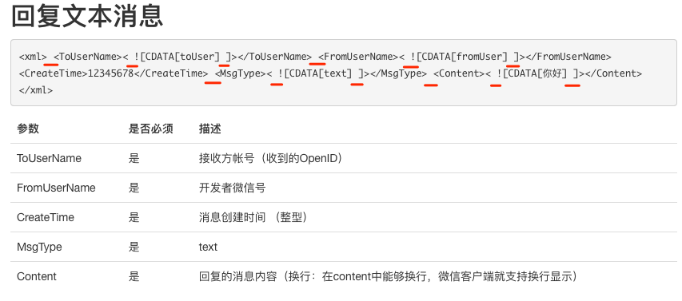
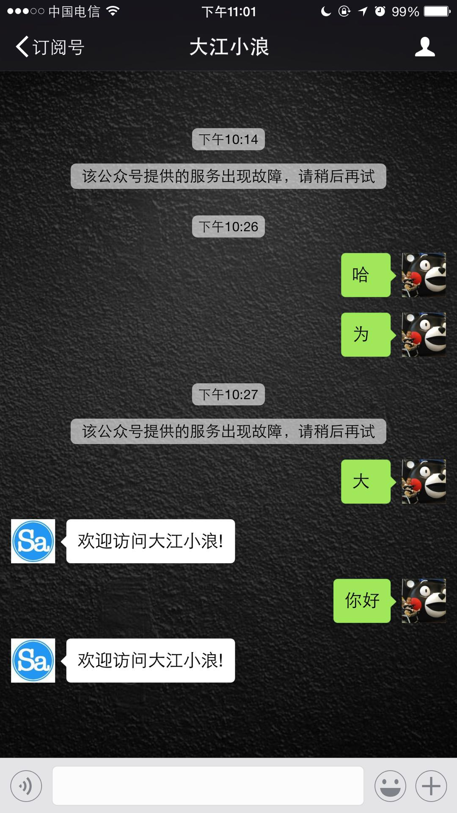

最近开始做CMS后台与微信公众号的整合，在做被动回复消息时，按照官方文档的XML格式回复消息，总是提示“该公众号提供的服务出现故障，请稍后再试”。但是通过微信提供的[接口调试工具](https://mp.weixin.qq.com/debug/)看我的接口貌似也没什么问题，给出的提示也是请求成功。

最后认真学习了其它网友的方案，才发现官方文档上提供的XML格式有问题，稍微修改后就可以正常的收到自定义的被动消息回复了，如果有和我类似情况的朋友，一定要注意下面XML格式啊。


我的后台是PHP，核心代码很简单。

```php
$HTTP_RAW_POST_DATA = isset($GLOBALS['HTTP_RAW_POST_DATA']) ? $GLOBALS['HTTP_RAW_POST_DATA'] : file_get_contents("php://input");
    $post_obj = simplexml_load_string($HTTP_RAW_POST_DATA, 'SimpleXMLElement', LIBXML_NOCDATA);

    $msg_type = $post_obj->MsgType;

    switch ($msg_type) {
        case 'text':
            $keyword = trim($post_obj->Content);
            $msg_tpl = '<xml><ToUserName><![CDATA[%s]]></ToUserName><FromUserName><![CDATA[%s]]></FromUserName><CreateTime>%s</CreateTime><MsgType><![CDATA[text]]></MsgType><Content><![CDATA[%s]]></Content></xml>';
            $result =  sprintf($msg_tpl,$post_obj->FromUserName, $post_obj->ToUserName, time(), '欢迎访问大江小浪!');
            echo $result;
            return;
            break;
        
        default:
            # code...
            break;
    }
```
下面是能够正常回复的效果。



### 参考资料：
1、[微信公众平台 被动回复消息](https://mp.weixin.qq.com/wiki?t=resource/res_main&id=mp1421140543)
2、[php版微信开发之接收消息,自动判断及回复相应消息的方法](http://www.jb51.net/article/93341.htm)
3、[微信开发被动回复消息：该公众号暂时无法提供服务，请稍后再试](http://www.cnblogs.com/Cwj-XFH/p/5772229.html)
4、[微信被动回复用户消息](http://www.cnblogs.com/zhouqi666/p/6781206.html)

