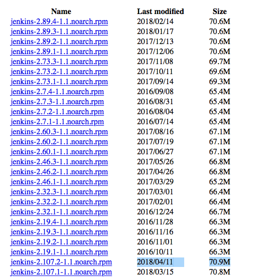
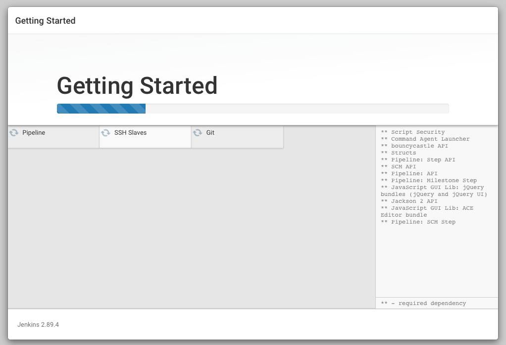
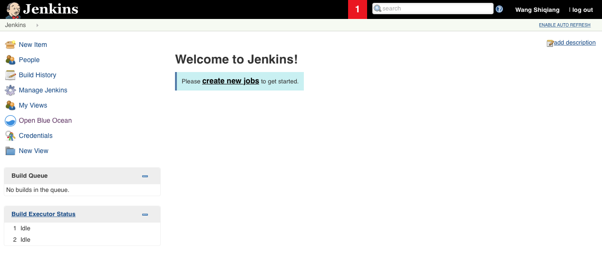

### Jenkins 介绍

Jenkins 作为持续集成的重要工具，在DevOps整个工具链中有重要的地位。Jenkins 一般作为独立的应用运行在Java Servlet容器中如Jetty，也可以运行在其它容器如Apache Tomcat 或者 GlassFish 中。

### 安装 Jenkins
Jenkins可以被安装在多种环境中，可以跑在Tomcat容器、Docker中、也可以本地运行，本文介绍本地运行的情况，如果需要了解更多安装方式，访问[Install Jenkins](https://jenkins.io/doc/book/installing)

#### 环境要求
Jenkins安装的最小环境要求为：
1 256MB 内存
2 1G的磁盘空间（如果在容器中运行Jenkins，则推荐至少有10G空间）
3 Java 8 的运行环境

#### 快速搭建方式一：RPM安装
Jenkins提供可以独立安装运行的RPM包，从[这里](https://pkg.jenkins.io/redhat-stable/)下载。我在这个页面下载的时候发现一个问题，rpm包并不完全是按照时间排序的，希望官方能够解决这个问题。


> RPM安装方法采用的环境是
Redhat Linux 7.3
Jenkins-2.89.4-1.1.noarch.rpm
jdk-8u171-linux-x64.rpm

安装过程：
```bash
# 首先将安装文件拷贝到虚拟机的用户目录下
bogon:Downloads rousseau$ scp jenkins-2.89.4-1.1.noarch.rpm root@192.168.0.101:~
# 检查主机的Java版本是否满足要求，如果不满足则需要安装对应版本的JDK
[root@bogon ~]# java -version
java version "1.8.0_171"
Java(TM) SE Runtime Environment (build 1.8.0_171-b11)
Java HotSpot(TM) 64-Bit Server VM (build 25.171-b11, mixed mode)
# 登录到虚拟机主机中，进行安装
[root@bogon ~]# rpm -ivh jenkins-2.89.4-1.1.noarch.rpm
# 启动 Jenkins
[root@bogon ~]# systemctl start jenkins 
[root@bogon ~]# ps -ef | grep jenkins-2.89.4-1.1.noarch.rpm 
root      2829  2392  0 17:05 pts/0    00:00:00 grep --color=auto jenkins-2.89.4-1.1.noarch.rpm
# 此时应该可以正常访问了，如果没办法访问，可能是防火墙的问题。Redhat 7之后关闭防火墙的命令有所变化，需要注意
[root@bogon ~]# systemctl status firewalld
● firewalld.service - firewalld - dynamic firewall daemon
   Loaded: loaded (/usr/lib/systemd/system/firewalld.service; enabled; vendor preset: enabled)
   Active: active (running) since Mon 2018-05-07 16:53:24 CST; 14min ago
     Docs: man:firewalld(1)
 Main PID: 753 (firewalld)
   CGroup: /system.slice/firewalld.service
           └─753 /usr/bin/python -Es /usr/sbin/firewalld --nofork --nopid

May 07 16:53:23 localhost.localdomain systemd[1]: Starting firewalld - dynamic firewall daemon...
May 07 16:53:24 localhost.localdomain systemd[1]: Started firewalld - dynamic firewall daemon.
[root@bogon ~]# systemctl stop firewalld
```

插件安装的过程。

#### 快速搭建方式二：Docker运行

本文是在Mac环境下运行的，首先需要确保你的Mac上安装了 Virtualbox 以及 Docker。
> 我的环境版本如下：
Mac OS X EI Caption 10.11.6
Virtualbox 5.1.26
Docker 18.03.1-ce

使用Docker来运行 Jenkins 真的是太方便了，不用准备虚拟机节省了很多时间，具体步骤如下。昨天参加的DevOps大会上，JFrog的中国区负责人给出的Jenkins使用建议也是跑在容器中。
```bash
bogon:docker rousseau$ docker pull jenkinsci/blueocean
bogon:docker rousseau$ docker run -p 8080:8080 jenkinsci/blueocean
```
首先从docker hub上请求 jenkinsci/blueocean 的镜像，这一步骤会花一点时间，全部请求完成后，就可以执行第二步。
第一次启动 jenkins 的时候，会将初始密码以 log 的形式输出到终端上，要注意观察。后续的界面上也有密码存放文件位置的提示。
根据界面操作，我们就能到Jenkins的欢迎界面了。

参考资料：
1、[Install Jenkins](https://jenkins.io/doc/book/installing)


