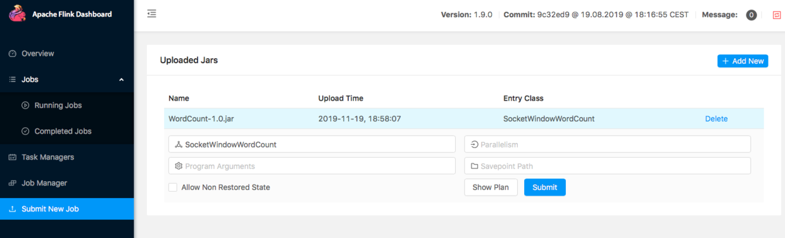
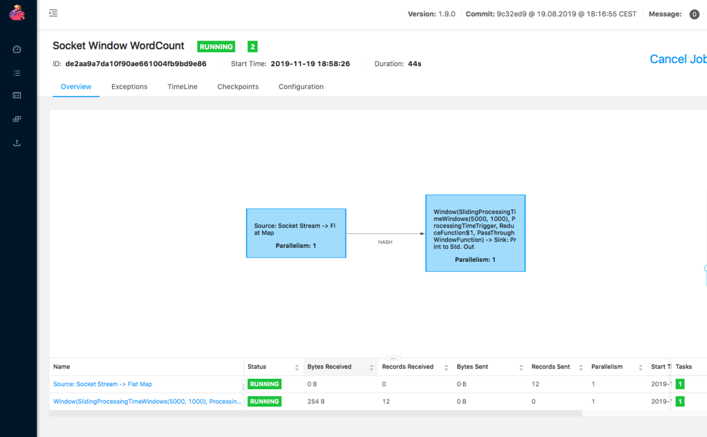
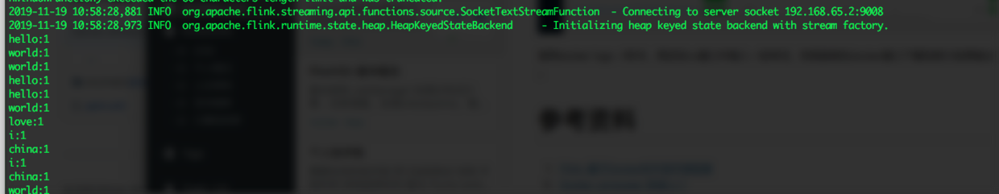

> 验证本文需要具备Docker及Docker-composer，作者使用的环境为Mac + Docker


## Docker启动Flink集群
首先下载Flink的镜像```docker pull flink```，我下载的是1.9.0版本。
然后编写 docker-composer.yml

```yaml
version: "2.1"
services:
  jobmanager:
    image: flink
    expose:
      - "6123"
    ports:
      - "8081:8081"
    command: jobmanager
    environment:
      - JOB_MANAGER_RPC_ADDRESS=jobmanager

  taskmanager:
    image: flink
    expose:
      - "6121"
      - "6122"
    depends_on:
      - jobmanager
    command: taskmanager
    links:
      - "jobmanager:jobmanager"
    environment:
      - JOB_MANAGER_RPC_ADDRESS=jobmanager
```

## 示例代码
本代码完成的功能是从SOCKET端口中读取文本信息，分词后在统计周期内计算每个单词出现的次数。这里只是列出关键代码，全部工程代码可以参考我的 [Github](https://github.com/cocowool/code-space/tree/master/java/flink-1-wordcount)
```java
public class SocketWindowWordCount {
    public static void main(String[] args) throws Exception {
        final int port;
        final String host;
        port = 9008;
        host = "192.168.65.2";

        final StreamExecutionEnvironment env = StreamExecutionEnvironment.getExecutionEnvironment();

        DataStream<String> text = env.socketTextStream(host, port, "\n");

        DataStream<WordWithCount> windowCounts = text
            .flatMap(new FlatMapFunction<String, WordWithCount>(){
                @Override
                public void flatMap(String value, Collector<WordWithCount> out){
                    for(String word : value.split("\\s")){
                        out.collect(new WordWithCount(word, 1L));
                    }
                }
            })
            .keyBy("word")
            .timeWindow(Time.seconds(5), Time.seconds(1))
            .reduce(new ReduceFunction<WordWithCount>(){
                @Override
                public WordWithCount reduce(WordWithCount a, WordWithCount b){
                    return new WordWithCount(a.word, a.count+b.count);
                }
            });

        windowCounts.print().setParallelism(1);
        env.execute("Socket Window WordCount");
    }

    public static class WordWithCount {
        public String word;
        public long count;

        public WordWithCount(){}

        public WordWithCount(String word, long count){
            this.word = word;
            this.count = count;
        }

        @Override
        public String toString(){
            return word + ":" + count;
        }
    }
```

## 运行示例
首先将flink运行起来，在docker-compose.yml所在目录下执行
```bash
$ docker-compose up -d
$ docker ps
CONTAINER ID        IMAGE               COMMAND                  CREATED             STATUS              PORTS                              NAMES
dc54c9cf6304        flink               "/docker-entrypoint.…"   3 days ago          Up 4 seconds        6121-6123/tcp, 8081/tcp            flink_taskmanager_1
2eab6b0fd0f1        flink               "/docker-entrypoint.…"   3 days ago          Up 3 seconds        6123/tcp, 0.0.0.0:8081->8081/tcp   flink_jobmanager_1
```
可以看到两个实例已经启动了，然后新开一个终端窗口，运行nc监听程序。
```bash
$ nc -l 9008
```
打开Flink界面，选择Submit New Job，上传编译好的jar包。

提交后可以看到运行的app已经收到了数据

使用docker logs -f命令，然后在nc窗口中输入一些单词，你就能够在docker窗口下看到统计结果输出了。


## 参考资料

1. [Flink-基于Docker的开发环境搭建](https://www.iamle.com/archives/2572.html)
2. [Docker composer 快速入门](https://www.cnblogs.com/phpk/p/11205467.html%20)


