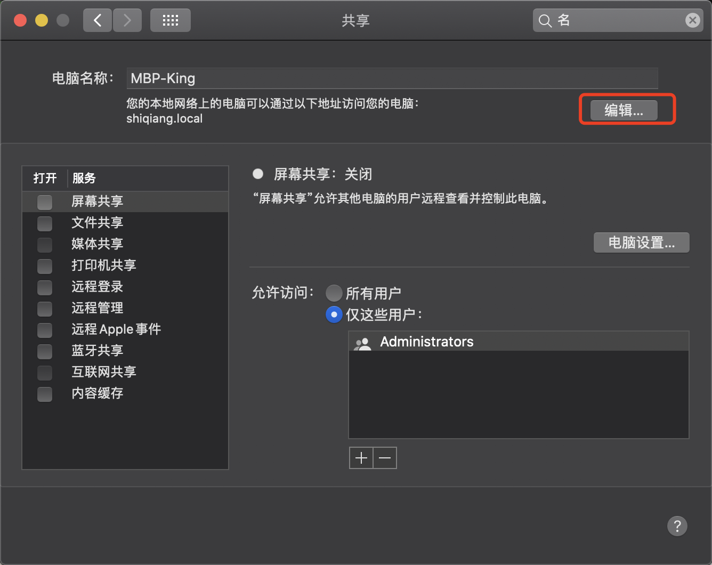

> 最早开始使用Mac电脑是从2011年开始，从Leopard一直到现在的Catalina，macOS系统经历了非常重大的变化，但是自己的一些使用习惯一直延续下来。从2011年到今天，大概发生了三四次系统故障不得不重新安装或者因为跟换硬盘造成的系统重装，为了方便每次系统安装后的配置工作，整理了一份自己系统配置的清单，一方面便于自己回顾查看，另一方面也送给有需要的朋友。

## 系统配置

* 快捷键的调整：互换了Spotlight和输入法切换的快捷键

* 手势的调整：单指双按手势、三指拖拽的支持。其中三指拖拽的配置据我所知从EI Caption开始就转移到了辅助功能里面，如下图

  

* 设置桌面图片定时随机切换，曾经从Bing上下载了很多美丽的图片，因此习惯了背景图片定时的切换一下

* 安装`Command Line Tools`，一般打开Termianl，然后在命令行中输入一些诸如`git`之类的命令，就会弹出安装的提示框，或者也可以安装Xcode后在菜单中选择安装

## 浏览器配置

* 打开开发菜单，在`偏好设置`的`高级`标签中，最下方那个复选框钩上就可以了

## Terminal 配置

对于Linux和Unix系统来说，用户配置文件一般有以下几个：

* /etc/profile 全局profile文件，对所有用户生效

* ~/.bash_profile 或 ~/.profile。.bash_profile 是Linux下的，.profile是Unix中有的。

* ~/.bashrc 。这个文件保存用户的一些个性化配置。

Bash登陆的时候，首先加载全局的 profile，接着判断用户目录下的 .bash_profile，最后可以在 .bash_profile 中调用 .bashrc。根据这个关系，我选在在自己的用户目录下创建`.bash_profile`用来保存自己常用的配置信息。

```sh
#设置历史命令记录数
export HISTSIZE=1000

#记录历史文件大小
export HISTFILESIZE=450

#设置终端颜色
export PS1="\[\033[36m\]\u\[\033[m\]@\[\033[32m\]\h:\[\033[33;1m\]\w\[\033[m\]\$ "
export CLICOLOR=1
export LSCOLORS=ExFxBxDxCxegedabagacad

#为ls命令定制别名
alias ls='ls -lGFh'
```

我一般使用Homebrew主题，然后再调整一个等宽字体和字号基本上就可以开工了。

## 必备软件-办公

* `Homebrew` 类似于Linux中的apt-get或者yum，提供了macOS下的包管理功能，方便我们安装各类开源软件，具体的安装步骤可以参考 [Homebrew介绍与上手指南](https://www.edulinks.cn/2020/06/23/20200623-homebrew-introduction/)
* 微信 WeChat，国民级的软件，现在工作很多也要依靠微信不装不行，建议刚开始工作的同学，有条件还是为工作专门申请一个微信
* 印象笔记，之前用的是Evernote，因为国内版本支持Markdown切换过来了，还是用Evernote账号登陆
* WPS Office，这次远程办公期间，发现WPS Office已经足够满足日常的办公需要，关键还是免费的
* The Unarchiver，在App Store中解压缩的软件非常多，不知道是不是因为这类工具开发容易的原因，但是最好用、最好看的我觉得非The Unarchiver莫属了，关键还免费
* Google Chrome，虽然Safari已经足够好用了，但某些时候还是要看齐下Chrome
* Thunder 迅雷，有时候下载一些软件还是有个工具比较好
* Typora，自从博客开始使用Markdown作为原始格式后，试过使用Sublime或VS Code，但最好用的还属Typora，它在处理博客中的图片时有非常好用的功能，具体可以参考我的文章
* Filezilla，著名的FTP开源软件，注意一点从App Store下载的是Pro版本需要付费。对于日常使用免费版就足够，只是需要手工到 [Filezilla 官方网站](https://www.filezilla.cn/download/client) 下载
* XMind，思维导图工具，能够帮助我们快速的制作出非常漂亮的思维导图，更能帮助我们梳理思路，提高工作的效率
* Omnigraffle，在Mac下非常好用的流程图绘制软件，可以视为Visio的替代品，在我的《[为自己构建写作的敏捷发布流程](https://www.edulinks.cn/2020/06/04/20200604-build-my-writing-devops/)》也是制作素材的常用工具
* Prallels Desktop，对于平滑使用 Windows 需求比较多的同学来说，最好搞一个正式的许可

## 必备软件-开发

* Docker，有了Docker之后虚拟机就不用装了，做一些试验什么的非常方便轻量
* Visaul Studio Code，最近几年比较流行的轻量级IDE，超过了Sublime
* [IntelliJ IDEA]()，Java开发IDE工具，相比Eclipse那是先进太多了

## 必备软件-CTF

> 从2021年开始，逐步接触了CTF这个领域有了很浓厚的兴趣，因此整理了再Mac上使用的CTF工具。同时还有一篇准备Windows环境的文章。

* Burpsuite
* Wireshark

## 关于主机名

macOS 开机完成初始化之后，如果你在登陆界面输入了中文的姓名，则你在终端上看到的主机名大概会是中文名的拼音全拼。例如我的电脑这样。


相信强迫症患者看到这种命名方式一定会抓狂，如果碰巧你遇到这种情况，有两种方法可以帮助你修改主机名。

如果你不是工程师或更愿意用图形界面来完成修改，可以在 `系统偏好设置->共享` 中修改`电脑名称`和 `本地主机名`。



如果你喜欢那种用命令行操作一切的感觉，可以使用 `scutil` 命令来修改主机名。

```shell
$ sudo scutil --set LocalHostName xxx 
$ hostname
$ xxx.local
```


> 啰啰嗦嗦写了这么多，不知道你有没有自己喜欢的Mac设置和软件，欢迎通过我的公众号分享给我，非常感谢。

## 参考资料

1. [mac 中 history 命令使用与配置](https://blog.csdn.net/testcs_dn/article/details/79970635)
2. [Simple Tricks to Improve the Terminal Appearance in Mac OS X](http://osxdaily.com/2013/02/05/improve-terminal-appearance-mac-os-x/)
3. [~/.profile ~/.bashrc和~./bash_profile的理解以及zsh的使用](https://www.jianshu.com/p/b39fd35e2360)
4. [MY MAC OSX BASH PROFILE](https://natelandau.com/my-mac-osx-bash_profile/)
5. [Shortcuts to move faster in Bash command line](http://teohm.com/blog/shortcuts-to-move-faster-in-bash-command-line/)
6. [10 个 Terminal 主题，让你的 macOS 终端更好看](https://sspai.com/post/53008)
7. [brew.sh](https://brew.sh/index_zh-cn)
8. [搞懂 macOS 上的主机名/hostname/ComputerName](https://shockerli.net/post/macos-hostname-scutil/)

