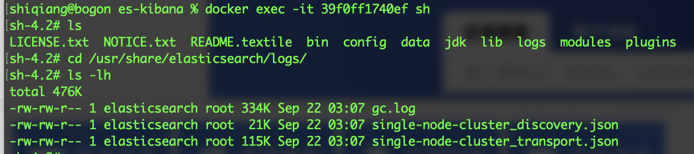
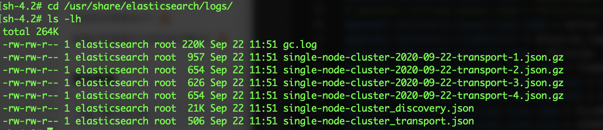
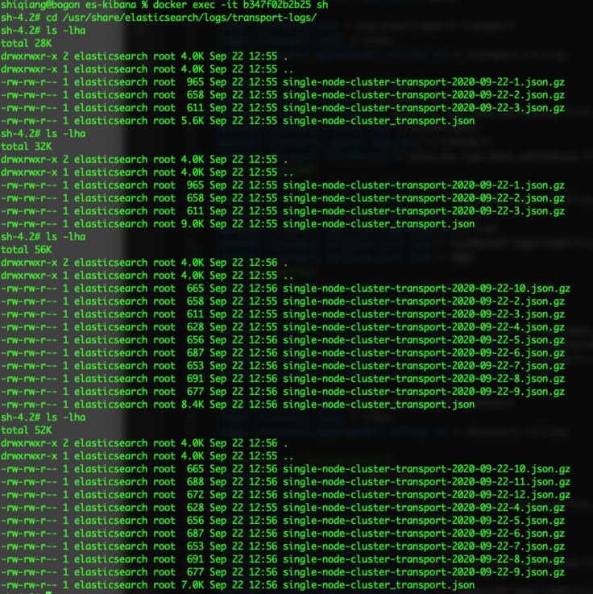

[TOC]

Elasticsearch 产品自发布以来，随着功能不断增强，其在各种互联网产品、企业级应用产品中的应用也越来越广泛。日常 Elasticsearch 集群运维过程中，我们需要了解集群都能够输出什么类型的日志、日志的存放位置以及日志配置修改的方式，阅读本文，我们能够了解以下知识点：

* Elasticsearch 日志输出方式
* Elasticsearch 日志配置方法
* Elasticsearch 日志按类型输出到不同的文件中
* Elasticsearch 慢查询日志配置方法

希望通过本文，让大家对 Elasticsearch 的日志有更深刻的认识，方便大家的运维开发工作。

<!-- more -->

> 本文所有代码与配置在 Elasticsearch 7.1.1 中运行和验证。

## Elasticsearch 日志输出方式

Elasticsearch 使用 [Log4j2](https://logging.apache.org/log4j/2.x/) 作为默认的日志组件，其日志输出的安装及运行方式相关，对于 Docker 方式运行的 Elasticsearch 实例，默认会输出到控制台中。对于 yum 或手工方式安装运行的 Elasticsearch 实例，日志默认以文件形式保存在 `$ES_HOME/logs` 目录下，我们可以通过修改 `elasticsearch.yml` 文件中的 `path.logs` 来指定日志保存的路径。

> Elasticsearch 的使用了 [Log4j2](https://logging.apache.org/log4j/2.x/) 来进行日志记录，如果不太熟悉 `Log4j2` 中的一些概念，可以通过 [浅谈Log4j2日志框架及使用](https://www.imooc.com/article/78966) 来进一步了解。

## Elasticsearch 的日志配置

Elasticsearch 为我们提供了丰富的日志配置选项，当我们运维的 Elasticsearch 集群规模越来越大、访问量越来越高时，正确的使用这些配置能够方便我们快速的定位和分析生产运行中产生的各类问题。

在日志配置这个小节，将介绍以下几个知识点：

* 如何配置日志输出到文件
* 如何配置日志的滚动策略
* 如何调整日志的级别
* 常见的 `无法加载插件` 错误

### 如何配置日志输出到文件

如果使用容器启动 Elasticsearch 服务，日志文件默认会输出的终端，如果希望将日志输出到文件中，首先通过修改 `elasticsearch.yml` 文件中的 `path.logs` 参数定义保存的位置，默认为 `/usr/share/elasticsearch/logs` 。然后再通过修改 `$ES_HOME/config/log4j2.properties` 文件来配置相关的日志文件名生成规则。

Elasticsearch 提供了三个属性，通过在日志配置文件中引用这三个属性来自定义日志的输出

* `${sys:es.logs.base_path}` 在配置文件中将被解析为日志目录
* `${sys:es.logs.cluster_name}` 在配置文件中将被解析为集群名称
* `${sys:es.logs.node_name}` 在配置文件中将被解析为节点名称
* `${sys:file.separator}` 将被解析为路径分隔符

如下配置演示了 `log4j2.properties` 中如何使用这三个变量来定义我们的日志文件名

```properties
appender.transport.fileName = ${sys:es.logs.base_path}${sys:file.separator}${sys:es.logs.cluster_name}_transport.json
appender.transport.filePattern = ${sys:es.logs.base_path}${sys:file.separator}${sys:es.logs.cluster_name}-%d{yyyy-MM-dd}-transport-%i.json.gz
```

下面可以看到日志文件已经按照配置的规则生成了，如果日志文件的大小不断增长怎么办呢，会不会把文件系统撑爆，要不要设置日志文件清理策略，别着急下个小节告诉我们如何配置日志的滚动策略。



### 如何配置日志的滚动策略

日志滚动在日常运维中是非常常见的一种日志管理手段，通过日志滚动策略既保留了必要的日志内容，同时又防止日志数量超过本地文件系统的容量，并且防止单个日志文件变得太大而难于打开。

日志滚动通常有两种策略，一种是根据时间，例如每天生成一个日志文件；另一种是根据文件大小，例如每100MB生成一个日志文件。在上一节中，我们通过 `filePattern` 参数决定了当日志文件发生滚动时，新文件的命名规则。

下面的配置根据文件大小和日期设置日志的滚动策略。

```properties
logger.transport.name = org.elasticsearch.transport
logger.transport.level = trace
logger.transport.appenderRef.rolling.ref = transport-rolling

appender.transport.type = RollingFile
appender.transport.name = transport-rolling
appender.transport.fileName = ${sys:es.logs.base_path}${sys:file.separator}${sys:es.logs.cluster_name}_transport.json
appender.transport.layout.type = ESJsonLayout
appender.transport.layout.type_name = transport
appender.transport.filePattern = ${sys:es.logs.base_path}${sys:file.separator}${sys:es.logs.cluster_name}-%d{yyyy-MM-dd}-transport-%i.json.gz
appender.transport.policies.type = Policies
appender.transport.policies.time.type = TimeBasedTriggeringPolicy
appender.transport.policies.time.interval = 1
appender.transport.policies.time.modulate = true 
appender.transport.policies.size.type = SizeBasedTriggeringPolicy
appender.transport.policies.size.size = 10KB
```

可以看到实际的效果



> 文件大小并不是严格的10KB，我理解是因为这个值设置的比较小，当多一行日志会导致大小超过阈值时，提前做了文件滚动。

我们还可以指定滚动日志文件的保留策略，默认是对策略以外的文件进行删除。

如下配置所示，日志保留策略监听 `basepath` 文件夹下的文件，当文件的数量超过 5 个时，对之前产生的文件进行删除。

```properties
logger.transport.name = org.elasticsearch.transport
logger.transport.level = trace
logger.transport.appenderRef.rolling.ref = transport-rolling

appender.transport.type = RollingFile
appender.transport.name = transport-rolling
appender.transport.fileName = ${sys:es.logs.base_path}${sys:file.separator}transport-logs${sys:file.separator}${sys:es.logs.cluster_name}_transport.json
appender.transport.layout.type = ESJsonLayout
appender.transport.layout.type_name = transport
appender.transport.filePattern = ${sys:es.logs.base_path}${sys:file.separator}transport-logs${sys:file.separator}${sys:es.logs.cluster_name}-transport-%d{yyyy-MM-dd}-%i.json.gz
# 决定日志的滚动策略
appender.transport.policies.type = Policies
appender.transport.policies.time.type = TimeBasedTriggeringPolicy
appender.transport.policies.time.interval = 1
appender.transport.policies.time.modulate = true 
appender.transport.policies.size.type = SizeBasedTriggeringPolicy
appender.transport.policies.size.size = 10KB
# 决定日志的删除策略
appender.transport.strategy.type = DefaultRolloverStrategy
appender.transport.strategy.fileIndex = nomax
appender.transport.strategy.action.type = Delete
appender.transport.strategy.action.basepath = ${sys:es.logs.base_path}${sys:file.separator}transport-logs
appender.transport.strategy.action.condition.type = IfAccumulatedFileCount
appender.transport.strategy.action.condition.glob = *-transport-*
appender.transport.strategy.action.condition.exceeds = 10
```

效果如下图，可以看到当文件夹中的文件数量超过10个时，旧的文件自动被删除了。



日常运维过程中，我们更常用的是根据文件夹文件大小或者按照固定日期周期确定文件的保留策略，对应的配置项为 `IfAccumulatedFileSize` 和 `IfLastModified` ，更详细的说明可以参考 [log4j2的官方文档](https://logging.apache.org/log4j/log4j-2.5/manual/appenders.html#DeleteIfFileName) 。

### 按类型输出到不同的文件中

Elasticsearch 软件由很多模块组成，通过日志配置，我们可以实现将不同模块的日志输出到不同的文件中，对于管理更精细的团队来说，可能有需要分门别类的查看各自模块的日志。

参考下面的配置，即可将 `transport` 、`discovery` 模块的日志输出到不同的文件中。

```properties
# 将日志输出到 Console 中
appender.rolling.type = Console
appender.rolling.name = rolling
appender.rolling.layout.type = ESJsonLayout
appender.rolling.layout.type_name = server

logger.transport.name = org.elasticsearch.transport
logger.transport.level = trace
logger.transport.appenderRef.rolling.ref = transport-rolling

appender.transport.type = RollingFile
appender.transport.name = transport-rolling
appender.transport.fileName = ${sys:es.logs.base_path}${sys:file.separator}transport-logs${sys:file.separator}${sys:es.logs.cluster_name}_transport.json
appender.transport.layout.type = ESJsonLayout
appender.transport.layout.type_name = transport
appender.transport.filePattern = ${sys:es.logs.base_path}${sys:file.separator}transport-logs${sys:file.separator}${sys:es.logs.cluster_name}-transport-%d{yyyy-MM-dd}-%i.json.gz
# 决定日志的滚动策略
appender.transport.policies.type = Policies
appender.transport.policies.time.type = TimeBasedTriggeringPolicy
appender.transport.policies.time.interval = 1
appender.transport.policies.time.modulate = true 
appender.transport.policies.size.type = SizeBasedTriggeringPolicy
appender.transport.policies.size.size = 10KB
# 决定日志的删除策略
appender.transport.strategy.type = DefaultRolloverStrategy
appender.transport.strategy.fileIndex = nomax
appender.transport.strategy.action.type = Delete
appender.transport.strategy.action.basepath = ${sys:es.logs.base_path}${sys:file.separator}transport-logs
appender.transport.strategy.action.condition.type = IfAccumulatedFileCount
appender.transport.strategy.action.condition.glob = *-transport-*
appender.transport.strategy.action.condition.exceeds = 10

logger.discovery.name = org.elasticsearch.discovery
logger.discovery.level = trace
logger.discovery.appenderRef.rolling.ref = discovery-rolling

# 仅将 discover 的日志输出到文件中
appender.discovery.type = RollingFile
appender.discovery.name = discovery-rolling
appender.discovery.fileName = ${sys:es.logs.base_path}${sys:file.separator}${sys:es.logs.cluster_name}_discovery.json
appender.discovery.layout.type = ESJsonLayout
# appender.rolling.layout.type = PatternLayout
appender.discovery.layout.type_name = server
appender.discovery.filePattern = ${sys:es.logs.base_path}${sys:file.separator}${sys:es.logs.cluster_name}-%d{yyyy-MM-dd}-%i-discovery.json.gz
appender.discovery.policies.type = Policies
appender.discovery.policies.time.type = TimeBasedTriggeringPolicy
appender.discovery.policies.time.interval = 1
appender.discovery.policies.time.modulate = true 
appender.discovery.policies.size.type = SizeBasedTriggeringPolicy
appender.discovery.policies.size.size = 256MB
appender.discovery.strategy.type = DefaultRolloverStrategy
appender.discovery.strategy.fileIndex = nomax
appender.discovery.strategy.action.type = Delete
appender.discovery.strategy.action.basepath = ${sys:es.logs.base_path}
appender.discovery.strategy.action.condition.type = IfFileName
appender.discovery.strategy.action.condition.glob = ${sys:es.logs.cluster_name}-*
appender.discovery.strategy.action.condition.nested_condition.type = IfAccumulatedFileSize
appender.discovery.strategy.action.condition.nested_condition.exceeds = 2GB
```


### 如何调整日志级别

`Elasticsearch` 默认的日志级别为 `INFO` ，除此之外还提供了 `TRACE` 、`DEBUG`、`INFO`、`WARN` 等几个日志级别，并且支持对不同的模块设置日志级别。针对不同模块设置日志策略的方法参考上面，通过 `logger.action.name = org.elasticsearch.transport` 即可指定。可以设置的模块简要列在下面，更详细的模块可以参考 [Elasticsearch 源码](https://github.com/elastic/elasticsearch/tree/master/server/src/main/java/org/elasticsearch)。

* `org.elasticsearch.discovery` 如果只关心这个包下面更细节的日志，也可以设置 `org.elasticsearch.discovery.zen`
* `org.elasticsearch.action`
* `org.elasticsearch.cluster` 
* `org.elasticsearch.env`
* `org.elasticsearch.indices`
* `org.elasticsearch.gateway`
* `org.elasticsearch.snapshots`
* `org.elasticsearch.http`
* `org.elasticsearch.transport`
* `org.elasticsearch.search`

`Elasticsearch` 提供了多种方式来调整日志的级别：

* 通过命令行启动参数配置，语法是：`-E <name of logging hierarchy>=<level>` (例如： `-E logger.org.elasticsearch.transport=trace`)，比较适用于在单个节点上临时调试问题的场景。

* 通过修改 `elasticsearch.yml` 配置文件，语法为：`elasticsearch.yml`: `<name of logging hierarchy>: <level>`（例如：logger.org.elasticsearch.transport: trace），适用场景是没有通过命令行启动，但是又想临时调试一个问题。

* 修改 `log4j2.properties` 配置文件，这种方式需要重启服务。通过 `rootLogger.level` 可以设定全局的日志级别，通过 `logger.transport.level` 设置单个模块的日志界别。适合需要更加细化的进行日志配置的场景。

* 通过API进行日志级别的动态修改。通过下面的命令可以动态调整全局的日志级别。

  ```sh
  PUT /_cluster/settings
  {"transient":{"logger._root":"DEBUG"}}
  ```


### 常见的 `无法加载插件` 错误

如果启动的时候发现下面的报错，无法加载各种插件，请检查配置文件相关的行尾是否有空格，我遇到这种错误就是因为配置文件的内容从网上拷贝的时候，行尾带了空格。

```sh
elasticsearch_1  | OpenJDK 64-Bit Server VM warning: Option UseConcMarkSweepGC was deprecated in version 9.0 and will likely be removed in a future release.
elasticsearch_1  | 2020-09-08 11:28:45,379 main ERROR Unable to locate plugin type for TimeBasedTriggeringPolicy 
elasticsearch_1  | 2020-09-08 11:28:45,381 main ERROR Unable to locate plugin type for SizeBasedTriggeringPolicy 
elasticsearch_1  | 2020-09-08 11:28:45,382 main ERROR Unable to locate plugin type for Delete 
elasticsearch_1  | 2020-09-08 11:28:45,473 main ERROR Unable to locate plugin for TimeBasedTriggeringPolicy
```

官方文档也给出了友情提示。

> Log4j’s configuration parsing gets confused by any extraneous whitespace; if you copy and paste any Log4j settings on this page, or enter any Log4j configuration in general, be sure to trim any leading and trailing whitespace.

## 写在最后

我编写了一套 [`docker-compose`](https://github.com/cocowool/sh-valley/tree/master/docker-conf/elasticstack/es-kibana) 的编排文件，支持一键式的创建一个单独的 `Elasticsearch` 实例和一个单独的 `Kibana` 实例，通过 docker 可以方便的按照文档中的示例进行反复的实验，关于 docker 及 docker-compose 的介绍，大家可以参考我之前的两篇文章：[Docker入门介绍](https://edulinks.cn/2018/06/20/20180620-docker-overview/) 和 [Docker Composer使用介绍](https://edulinks.cn/2020/04/15/20200415-docker-compose/)。

## 参考资料

1. [Elasticsearch调优篇-慢查询分析笔记](https://www.cnblogs.com/hyq0823/p/12165113.html)
2. [Elasticsearch 官方文档](https://www.elastic.co/guide/cn/elasticsearch/guide/current/logging.html)
3. [ES慢查询收集总结](http://www.fblinux.com/?p=1334)
4. [log4j.properties 配置详解](https://www.cnblogs.com/zhangguangxiang/p/12007924.html)
5. [Elasticsearch搭建和日志配置](https://www.jianshu.com/p/35ff16bb5ab1)
6. [Elasticsearch 集群优化-尽可能全面详细](https://www.cnblogs.com/passzhang/p/12666271.html)
7. [Elasticsearch 7.0 之日志配置](http://www.chaiguanxin.com/articles/2019/05/30/1559202725366.html)
8. [Elasticsearch document : Logging configuration](https://www.elastic.co/guide/en/elasticsearch/reference/master/logging.html)
9. [elasticsearch – 错误无法找到插件类型[用于RollingFile和TimeBasedTriggeringPolicy]](http://www.voidcn.com/article/p-kcgkkojf-byt.html)
10. [Elasticsearch Logging Secrets](https://www.elastic.co/cn/blog/elasticsearch-logging-secrets)
11. [浅谈Log4j2日志框架及使用](https://www.imooc.com/article/78966)
12. [log4j2 appender](https://logging.apache.org/log4j/log4j-2.5/manual/appenders.html#DeleteIfFileName)
13. [Elasitcsearch 7.0 之日志配置](http://www.chaiguanxin.com/articles/2019/05/30/1559202725366.html)

