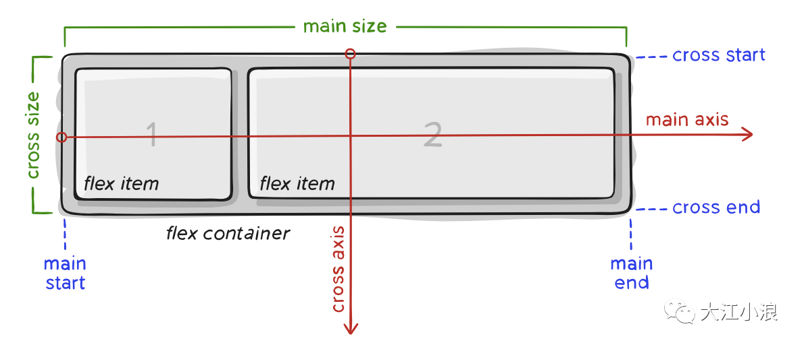
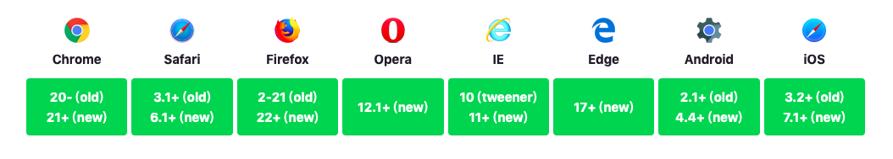

## 1. Flex布局介绍

CSS的传统布局解决方案，基于盒状模型，依赖`display`属性、`position`属性、`float`属性，对于一些特殊的布局，例如垂直居中，往往要想很多hack的方法来解决。

2009年，W3C提出了一种新的方案--Flex布局，可以简便、完整、响应式地实现各种页面布局。目前，它已经得到了所有浏览器的支持，这意味着，现在就能很安全地使用这项功能。Flex布局的主要思想是为容器赋予控制容器内元素的高度、宽度以及如何分割容器空间的能力。

Flex是Flexible Box的缩写，表示“弹性布局”的意思，能够为盒状模型提供最大的灵活性。任何一个容器都可以指定为flex布局，使用flex布局以后，子元素的`float`、`clear`和`vertical-align`元素都将失效。

```css
.box {
    display: flex;
}
```

行内元素也可以使用Flex布局。
```css
.box {
    display: inline-flex;
}
```

Webkit内核的浏览器，必须加上-webkit前缀。
```css
.box{
  display: -webkit-flex; /* Safari */
  display: flex;
}
```

## 2. 基本概念
采用Flex布局的元素，称为Flex容器（flex container），简称”容器”。它的所有子元素自动成为容器成员，称为Flex项目（flex item），简称”项目”。容器默认存在两根轴：`水平的主轴`（main axis）和`垂直的交叉轴`（cross axis）。主轴的开始位置（与边框的交叉点）叫做main start，结束位置叫做main end；交叉轴的开始位置叫做cross start，结束位置叫做cross end。项目默认沿主轴排列。单个项目占据的主轴空间叫做main size，占据的交叉轴空间叫做cross size。



下面对这几个概念作简要介绍：
* 主轴 main-axis，flex容器的主轴是容器内项目 flex item的排列方向。主轴方向并不一定是水平的，这个由`flex-direction`属性决定。
* main-start | main-end ，容器内项目的排列是从main-start到main-end。
* main-size
* 交叉轴 cross axis 与主轴垂直的交叉轴，它的方向由主轴的方向决定
* cross-start | cross-end 
* cross-size


## 3. Flex容器的属性
Flex容器具有以下六个属性。
> * display 该属性决定flex布局的容器，`display:flex;`
> * flex-direction 该属性决定主轴的方向（即项目的排列方向）
> * flex-wrap 该属性决定flex元素的换行方式，默认情况下容器内项目总是倾向于排列在一行内
> * flex-flow 该属性是`direction`和`wrap`的组合属性，默认值是`row nowrap`
> * justify-content 该属性定义容器中项目在主轴上的对齐方式
> * align-items
> * align-content

### 3.1 flex-direction
flex-direction属性决定主轴的方向（即容器元素的排列方向），有四个取值。
* row（默认值），主轴为水平方向，起点在左端。
* row-reverse，主轴为水平方向，起点在右端。
* column，主轴为垂直方向，起点在上沿。
* column-reverse，主轴为垂直方向，起点在下沿。

```css
.box {
  flex-direction: row | row-reverse | column | column-reverse;
}
```

### 3.2 flex-wrap
熟悉wrap的同学应该知道，这个属性是决定如何处理一行显示不下的情况，有三个属性：
* nowrap 不换行
* wrap 换行，第一行在上，往下折行
* wrap-reverse 换行，第一行在下，往上折行
```css
.box {
    flex-wrap: nowrap | wrap | wrap-reverse;
}
```

### 3.3 flex-flow
`flex-flow`是`flex-direction`和`flex-wrap`组合属性的简写，默认值为`row nowrap`。
```css
.box {
    flex-flow: <flex-direction> || <flex-wrap>;
}
```

### 3.4 justify-content
`justify-content`定义项目在主轴上的对齐方式，还能够帮助我们分配容器项目以外的剩余空间，即便是没有剩余空间。有以下属性：
* flex-start(默认值): 主轴的起点对齐
* flex-end: 主轴的终点对齐
* center: 沿主轴居中对齐
* space-between:  两端对齐，项目之间的间隔相等
* space-around: 每个项目两侧的间隔相等，所以项目之间的间隔比左右两边的间隔大一倍
* space-evenly: 每个项目的间隔以及两侧的间隔都相等
* start: 容器内的项目堆在书写方向`writing-mode`的开始
* end: 容器内的项目堆在书写方向`writing-mode`的结束
* lfet: 容器内的项目堆在容器的左边
* right: 容器内的项目堆在容器的右边
* safe:
* unsafe:

> 注意不同浏览器对这些属性的支持程度还不太一样，`space-between`从未在Edge浏览器上获得过支持，最安全的几个属性是`flex-start`，`flex-end`，`center`。


```css
.box {
    justify-content: flex-start | flex-end | center | space-between | space-around;
}
```

### 3.5 align-items
`align-items` 该属性决定项目在交叉轴上如何对齐，有以下属性：
* flex-start 交叉轴的起点对齐
* flex-end 交叉轴的终点对齐
* center 交叉轴的中间对齐
* start 书写方向的起点对齐
* end 书写方向的终点对齐
* baseline 项目的第一行文字的基线对齐
* stretch(默认值) 如果项目未设置高度或设为auto，项目将占满整个容器的高度，这样做两列布局再也不用发愁高度不一致了。

> 在flex布局中有主轴和侧轴的区分，和我们一般认为的横轴为主轴、纵轴为侧轴的固定认知不同，flex布局中主轴和侧轴会发生变化，这是由之前`flex-direction`属性决定的。当`flex-direction:row`的时候，主轴就是横轴，要调整元素在横轴的排列就需要使用`justify-content`属性。当`flex-direction:column`的时候，主轴就是纵轴，要调整元素在横轴的排列就需要使用`align-items`属性。

### 3.6 align-content
这个属性决定当容器在交叉轴方向还有剩余空间时，项目的排列方式。
> 这个属性在只有一行容器内项目时无效，在设置了`nowrap`时也无效。
* flex-start
* flex-end
* center
* space-between
* space-around
* space-evenly
* stretch
* baseline

## 4. 项目的属性
项目包括6个属性
* order 该属性定义项目的排列顺序。数值越小，排列越靠前，默认为0。通过css就能控制DOM元素的顺序，简直太方便了。
* flex-grow 该属性定义项目放大的比例，默认为0，也就是项目的大小不会发生缩放。
* flex-shrink
* flex-basis
* flex
* align-self 

### 4.1 order
`order` 属性定义项目的排列顺序。数值越小，排列越靠前，默认为0。通过css就能控制DOM元素的顺序，简直太方便了。

```css
.item {
    order: <integer>;
}
```

### 4.2 flex-grow
`flex-grow`属性定义项目相对于其他项目进行扩展的量，默认为0。注意：如果项目不是flex item，则 flex-grow 属性不起作用。如果所有的项目都设置为1，则每个项目分到的空间都一样。如果有一个设置为2，则它分到的空间要比其他项目多一倍。负数无效。
```css
.item {
    flex-grow: <number>;
```

### 4.3 flex-shrink
`flex-shrink` 属性定义项目相对于其他项目缩小的比例。负数无效。
```css
.item {
    flex-shrink: <number>
}
```

### 4.4 flex-basis
`flex-basis` 属性定义了在分配多余空间之前，项目占据的主轴空间（main size）。浏览器根据这个属性，计算主轴是否有多余空间。它的默认值为`auto`，即项目的本来大小。
```css
.item {
    flex-basis: <length> | auto;
}
```

### 4.5 flex
`flex`属性是`flex-grow`,`flex-shrink`,`flex-basis`组合，默认值为`0 1 auto`后两个属性可选。
```css
.item {
    flex: none | [ <'flex-grow'> <'flex-shrink'>? || <'flex-basis'> ]
}
```

### 4.6 align-self属性
`align-self`属性允许单个项目有与其他项目不一样的对齐方式，可覆盖`align-items`属性。默认值为`auto`，表示继承父元素的`align-items`属性，如果没有父元素，则等同于`stretch`。属性支持的值包括：
* auto
* flex-start
* flex-end
* center 
* baseline
* stretch

## 5. 浏览器支持
`flexbox`从出现到现在经历了多个版本，下图`new`的含义表示现在的语法`display:flex;`。`tweener`表示2011年后出现的一个非官方的写法`display:flexbox;`。`old`表示2009年出现后的旧语法`display:box;`。

