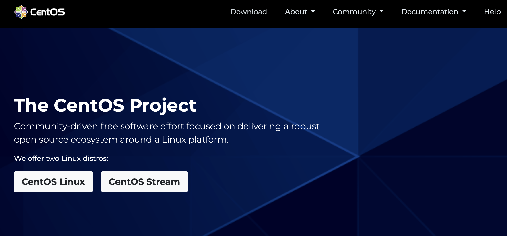

2020年12月晚上红帽官网发布了一条公告，宣布了几件事情：

* 将不会发行 CentOS Linux 9
* CentOS Linux 8 的更新支持持续到2021年12月31日
* CentOS Linux 7 的更新支持持续到**2024年6月30日**
* CentOS Linux 6 的更新支持已在2020年11月30日结束
* 作为RHEL 9开发的一部分，CentOS Stream 9计划在2021年第二季度发布
* 继续提供CentOS Stream 8的更新支持

CentOS Stream 是19年从CentOS 8开始出现的一个版本，是一个滚动发布的Linux发行版，介于Fedora Linux和RedHat Enterprise Linux之间，旨在提高RHEL开发过程的透明度和协作性。

CentOS Linux 是面向企业商用的Red Hat Enterprise Linux 的开源替代解决方，即我们常用的CentOS系统，因为其免费且稳定的特性，在互联网企业中被广泛使用。

从红帽的这篇公告中能看到，CentOS 7 的支持时间更长，加之现在CentOS 7 各种资料和支持比较完善，因此企业选择CentOS 7应该是更好的选择。当然，这里不包括需要商业支持的金融、券商等传统的企业客户，他们当然会选择Red Hat Enterprise Linux或者Oracle Linux了。而创新的互联网公司，如 **Facebook** 已将支持其庞大的全球社交网络的数百万台服务器迁移至他们从CentOS Stream派生的操作系统。

这篇公告之后今天红帽的官方公众号又推送了一篇文章《[问答：CentOS Stream更新](https://mp.weixin.qq.com/s/o_EBnAs-_eVy83X8_-b2kg)》来对相关问题作了解答。

## 红帽平台选择建议

- Fedora Linux：一个社区项目，面向那些想要构建操作系统，并集成所有相关开源项目的人。这正是红帽和广大社区快速进行操作系统创新工作的地方。这项工作由CentOS Stream承担，最终由RHEL承担。
- CentOS Stream：一个社区项目，面向生态系统开发人员，他们希望看到下一个版本的RHEL会有什么变化，并且引入让他们的硬件或软件生效的更改。它还提供了一个开发技术和工具的地方，以便为下一个版本的RHEL做好准备。
- Red Hat Universal Base Image：一款功能强大的容器应用开发工具，为创建容器化、云原生企业应用提供更安全、免费的可再发行容器基础映像。有了它，开发人员可以更轻松地在RHEL上和红帽的开放混合云产品组合（包括Red Hat OpenShift）中创建经认证的应用。它还支持与其他操作系统兼容的容器映像。
- RHEL开发者订阅：一个免费的，用于个人（很快将用于团队）的自助支持订阅，以便开发和测试红帽的商业、企业操作系统产品。它为应用的开发/测试环境提供了在RHEL稳定、安全和高性能基础上部署在生产中的应用。我们还建议您加入红帽开发者计划。对于合作伙伴，我们建议您加入红帽合作伙伴连接计划。
- Red Hat Enterprise Linux 是Red Hat 公司的Linux发行版，面向商业市场，通常简称RHEL。

## 参考资料

1. [CentOS Stream: Building an innovative future for enterprise Linux](https://access.redhat.com/announcements/5634831)
2. [如何看待滚动发行版 Centos Stream](https://www.zhihu.com/question/347766607)
3. [问答：CentOS Stream更新](https://mp.weixin.qq.com/s/o_EBnAs-_eVy83X8_-b2kg)

