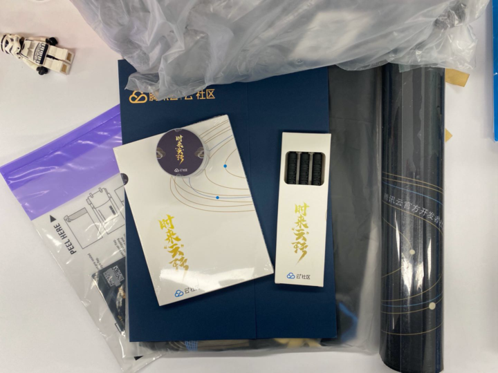

还有两周时间，2020年就要落下帷幕了。2020年的确是不平凡的一年，年初的疫情让全国所有人都体验到病毒带来的恐惧，随着疫情被逐步控制，也体会到能够自由流动之可贵，体会到国家对于疫情控制的卓然成效。经过3个月的居家办公返回工作岗位后，浪哥竟发现原来单位的环境如此的美好，能够心无旁骛的抠腚不是最好的状态吗。昨晚一杯浓咖啡让浪哥半夜都没睡好，却想出了可以总结今年的三个词：**变化、成长、合作**。

## 变化

十四五规划公报全文中提到，2020年我们处于**世界百年未有之大变局**的潮头。大到科技圈，苹果转投ARM发布了自研M1芯片的Mac系列、荣耀也从华为独立出来了。小到浪哥一个默默无名的公号作者，也有许许多多的变化。

* 佛系经营的公众号订阅用户从年初的161人增加到今天的261人，全年一共做了47次推送，感谢一直关注的各位老铁，打扰了。
* 用了几个月的时间，重新整理上线了自己的静态博客站点 [大江小浪](http://www.edulinks.cn)，目前一共有370篇文章，其中2020年发表了41篇文章。
* 整理了自己写作发表的流程，形成了固定的写作交付流程 [为自己构建写作的敏捷发布流程](http://www.edulinks.cn/2020/06/04/20200604-build-my-writing-devops/)，感觉写作的动力又有一点点回来了。

## 成长

当想到这个词的时候，浪哥还有些不好意思，做为职场老地青说**生长**还差不多，要说2020年的成长，那可真的是一个巴掌都能数的过来。为了多少树立一点好学上进的形象，可能也就下面这两个值得说一说。

* 9月份的时候，参加了腾讯云+社区组织的《技术创作101训练营》，写的文章 [Elasticsearch 日志配置详解](http://www.edulinks.cn/2020/09/22/20200922-elasticsearch-log-config/) 进入到了前 30 名。老师给的评语是：

  > 1）有实际操作，图文并茂，可操作性强
  >
  > 2）文章有条理，思路清晰
  >
  > 3）干货多多，可读性强
  >
  > 4）作者是带着自已对同类文章内容缺点的思考来写的，所以主题和内容的定位较准确。
  > 如果内容更丰富一些，就能更能匹配的上标题的“详解”这两个字了。

  拿到毕业证和大礼包的时候，还是有些小激动。

  

* 12月份，还有幸被社区助理邀请参加云+社区阅读清单的评委。腾讯云+社区的阅读清单是让大家能够专注的阅读一个领域相关知识点，构建系统的知识架构的绝佳产品，通过先进的算法凝练而成的清单，让大家享受到极致专一的阅读体验，让你在纷杂的世界中，在阅读中获得片刻的宁静。

  

这点小小的成长也给自己明年带来了大大的压力，如何让自己写的东西既能清晰流畅的表达、又能有点深度，如何构建一个系统的、系列的文章，容浪哥明年再成长一点点吧。

## 合作

想到这个词，是浪哥真的想感谢在云+社区集赞活动中为我点赞的各路朋友圈豪杰，以及闻讯过来助攻的“腾讯技术创作101训练营第一季”的各位大侠，是你们的神助攻让我收获了人生中获赞最多的一条朋友圈。“在家靠父母，在外靠朋友” 古人说的真对呀！

##  福利来了

为了感谢各位朋友对小浪的垂爱，我决定将本次集赞活动获得的奖品 **100个Q币** 拿出来送给大家，活动的规则非常简单，大家在公众号的后台回复 **1224** 即可参与，本次Q币的电子兑换码会在12月24日晚上20:00在参与活动的朋友中随机送出，本次抽奖采用了“抽奖小助手”并开启了助力功能，如果邀请朋友助力，将会增加中奖几率，祝大家好运～～

