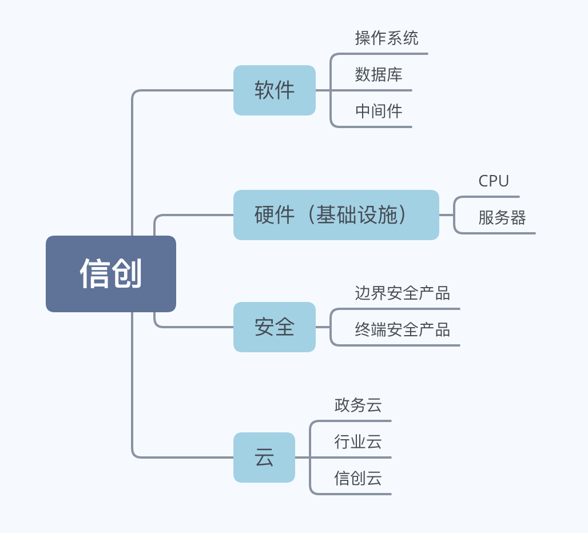

最近谈需求，频频听到 **信创** 这个词，什么 **信创**项目、**信创**云等等，还与自主可控纠缠在一起，有点不了解这个词的涵义，百度了一下，发现属于已经开始火起来的产业名词，作为技术行业从业人员，如果2021年还不知道这个词，可能就有点OUT了。

**信创** 的全称是信息技术应用创新，简称「信创」。

我想在网上找到这个说法的官方出处，始终没有满意的答案。也有网友在 **2020年5月19日** 在知乎上发表《[请问信创概念最早是谁提出的？在什么样的背景下提出？](https://www.zhihu.com/question/395895550) 》的提问但是至今仍是无人回答。虽然没有在公开发文或者新闻中找到准确来源，仍找到一条比较靠谱的解读。

> **信创** 二字来源于「信息技术应用创新工作委员会」。2016年3月4日工委会成立，是由24家从事软硬件关键技术研究、应用和服务的单位发起建立的非营利性社会组织。
>
> 工委会的宗旨在于发挥产业组织和行业自律（市场规范运作、有序竞争）方面的作用，为应用推广工作提供技术、标准、人才等方面的支撑服务；促进企业间按市场规则开展合作，实现优势互补、资源共享、协同推进，共同营造产业做大做强需要的良好生态环境，带动产业链协同发展。
>
> 工委会的业务工作范围有：
>
> 一、开展我国技术发展领域的战略及策略研究，支撑形成软硬件发展的顶层设计；
>
> 二、开展关键技术、标准制定、发展路线等相关研究；
>
> 三、组织开展领域的人才培育、认证等相关工作；
>
> 四、组织建立领域的联合实验室，开展技术、产品、方案和安全等方面的技术研究工作，推进产品适配验证，系统优化改进；
>
> 五、组织协调领域的产学研用共同营造健康的生态环境。
>
> 未来结合产业发展进展，依据工委会工作守则，积极发展领域的企事业单位加入。

由委员会的宗旨和工作范围可知，主要是要促进国内**关键技术**、**标准**的研究与市场发展，那提到**关键技术**可能很多人就不会陌生，刚刚过去魔幻的2020年发生了多次国内企业在**关键技术**上被美国卡脖子的新闻。

我根据网上搜索的资料整理了一份**关键技术**的脑图

要实现这些领域**关键技术**的应用创新，事实上最终目标就是要实现**自主可控**，结合2006年国务院发布的《国家中长期科学和技术发展规划纲要(2006-2020年)》（简称**核高基**）在2020年进入收尾阶段的背景，信创产业便呼之欲出了，结合2020年伊朗安全事件、中美贸易摩擦，以及十四五规划的出台，**信创**更是被提到了一个全新的高度。

在2020年年底的中央经济工作会议上，提出要**强化国家战略科技力量**，要要抓紧制定实施基础研究十年行动方案，由此推断在未来的几年中，信创产业，特别是芯片设计制造、基础软件、安全可信云领域，国内企业的技术力量和市场份额势必将大幅增长。而我们科技从业人员，也应当保持紧迫感，抓住机会和时光为自己补课充电。