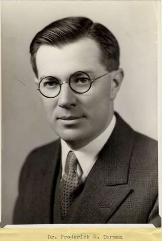
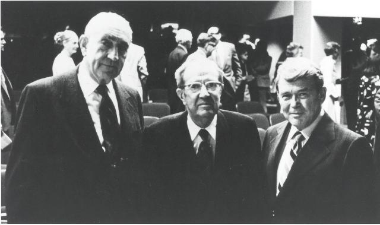

### 弗雷德·特曼

弗雷德·特曼（Frederick Emmons Terman ），硅谷创业的元老人物，被誉为「硅谷之父」、「电子革命之父」。

1900年6月7日特曼出生于美国印第安纳，他的父亲是著名的美国心理学家刘易斯·特曼（Lewis Madison Terman）。特曼小时候随着父亲一起来到斯坦福大学并在这里长大。特曼在斯坦福大学获得了化学本科学位以及化学工程的研究生学位，1924年又在麻省理工学院获得了电子工程学博士学位（其指导教师是[范内瓦·布什](http://www.edulinks.cn/2021/02/27/20210228-vannevar-bush/)）。

1925年到1941年间，他在斯坦福大学教授电子学课程，同时还专注于真空管、电路方面的研究。

在第二次世界大战期间，应范内瓦·布什的邀请，特曼在哈佛大学组织指挥了850多名人员从事无线电研究实验室的工作。这个实验室主要研究用于阻挡地方雷达的干扰机，其研究成果大大降低了雷达制导防空火力的有效性，并因这一阶段的工作荣获了1948年Presidential Medal of Merit。

二战之后他被提名为斯坦福大学工程系主任，1955年到1965年他担任了斯坦福大学的校长，在此期间他努力使斯坦福大学成为加州新兴技术发展的核心，并最终发展成为硅谷。

特曼的其他科学贡献包括长距离电传输和共振传输线的研究，他在1932年出版的《无线电工程》一直是该领域的领军之作。

 1982年12月19日，特曼在硅谷逝世。

## 硅谷之父

硅谷，长30英里、宽10英里，属于圣塔克莱拉县(Santa Clara)，刚好夹在旧金山和圣何塞两个城市之间。它原是成片的果园，素有「美国梅脯之都」的美称。起先提到它，用的是非常拗口的名字：西海岸的电子工业、帕洛阿尔托或圣克拉拉谷。直到1971年，才由《微电子新闻》的唐·C·霍夫勒给它起了个正式名字「硅谷」。

1939年，在特曼的指导和支持下，戴维·帕卡德（David Packard）和比尔·休利特（William Hewlett）创办公司开始生产电子仪器，后来成为了著名的惠普（Hewlett-Packard）公司。

二战后回到斯坦福校园，特曼开始将斯坦福的重点转向个人计算机领域，他利用斯坦福的土地建立了高新技术产业园区，在他的推动下 惠普公司（Hewlett-Packard）、通用公司（General Electric）和柯达（Kodak）相继入驻，并使得斯坦福的高新技术产业园区成为世界上最成功的园区之一，因此特曼被视为「硅谷之父」。

### 参考资料

1. [Frederick Terman](https://ethw.org/Frederick_Terman)

