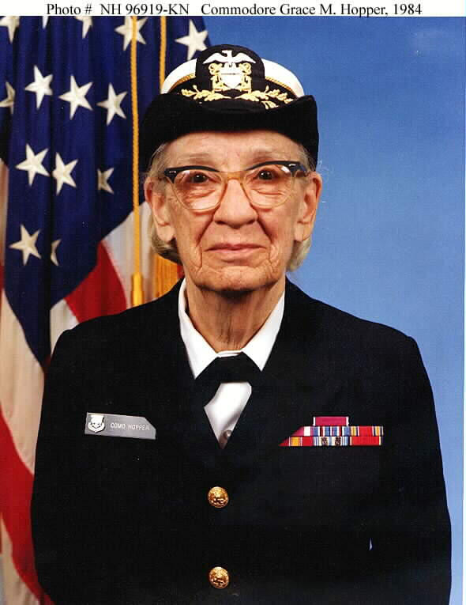

## 格蕾丝·赫柏

格蕾丝·赫柏（Grace Murray Hopper 1906年12月9日 - 1992年1月1日），计算机科学家，同时也是美国海军将军。

格蕾丝·赫柏生于纽约，她的父亲经营了一家保险公司。1928年她从瓦萨学院 Vassar College 获得数学与物理本科学位，后续进入耶鲁大学，于1930年及1934年分别获得数学硕士和博士学位。在博士学习期间，格蕾丝·赫柏还在纽约大学著名数学家 库朗 Richard Courant 名下学习了一年数学。

珍珠港事件爆发后美国参加第二次世界大战，格蕾丝·赫柏决定参军，起初曾因为年龄和身材矮小而被拒绝，但在她的坚持下，最终加入了美国海军预备役。1943年，格蕾丝·赫柏被分配到哈佛大学的船舶局计算项目（Bureau of Ships Computation Project），她所在的团队使用 Mark I（美国第一台电子计算机）在 [霍华德·艾肯](http://www.edulinks.cn/2021/01/23/20210124-howard-aiken/) 的指导下进行与战争相关的绝密计算工作。格蕾丝·赫柏是最早的三位程序员之一，她还为Mark I 编写了561页的用户手册。战后，格蕾丝·赫柏继续在海军从事 Mark II 和 Mark III相关的计算工作。

1949年，格蕾丝·赫柏加入费城的Eckert Mauchly（参加[约翰·莫奇利](http://www.edulinks.cn/2021/03/21/20210321-john-mauchly/)）计算机公司，担任高级数学科学家。这家公司很快被雷明顿兰德和斯佩里兰德收购，并根据陆军合同制造了第一台电子计算机（ENIAC）。20世纪50年代初，埃克特·莫奇利正在开发通用自动计算机（UNIVAC），这是第一台商用电子计算机。在研究UNIVAC Ⅰ和Ⅱ时，格蕾丝·赫柏率先提出了自动编程的思想，并探索了使用计算机编码的新方法。1952年，她开发了第一个名为A-0的编译器，将数学代码翻译成机器可读代码，这是创建现代编程语言的重要一步。

1953年，格蕾丝·赫柏提出了用文字而不是符号来编写程序的想法，虽然不被公司看好，她还是继续致力于开发一种英语语言编译器，1956年她的团队开始运行FLOW-MATIC，这是第一种使用自然语言命令的编程语言。与使用数学符号的FORTRAN或MATH-MATIC不同，FLOW-MATIC使用的是常规英语单词，设计用于数据处理。她还演示了如何用英语以外的基于单词的语言编写程序。该语言编译器在1958年初公开，并于1959年基本完成。

1959年，格蕾丝·赫柏参加了数据系统语言会议（CODASYL），会议的目标是开发一种可跨行业和部门使用的通用商务语言。最终的产品是COBOL，即“面向业务的通用语言”的缩写。尽管许多人对此做出了贡献，但格蕾丝·赫柏因其设计COBOL、为COBOL开发编译器以及鼓励COBOL的广泛采用而广受认可。到了20世纪70年代，COBOL成为世界上「使用最广泛的计算机语言」。

## bug 来源

1945年9月9日，格蕾丝使用的 Mark Ⅱ 出现故障，导致工作无法进行。经过了近一天的检查，格蕾丝找到了故障的原因：继电器中有一只死掉的蛾子。蛾子被夹了出来后故障就修复了。后来，「bug」 (小虫) 和「debug」 (除虫) 这两个本来普普通通的词汇成了计算机领域中特指莫明其妙的「错误」和「排除错误」的专用词汇而流传至今，而格蕾丝·赫柏也因此成了第一个发现「bug」的人。

