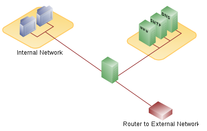
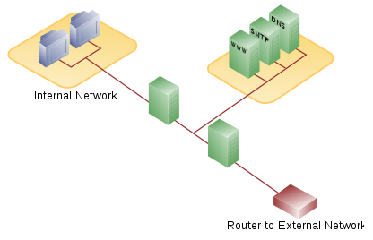
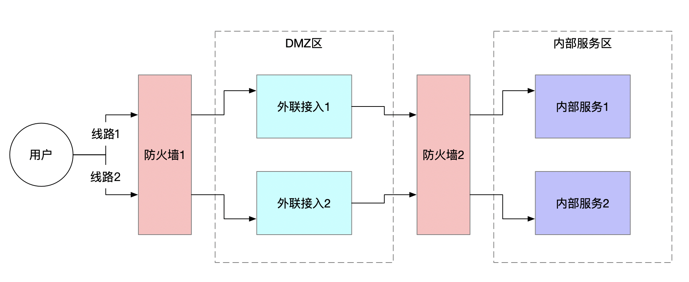

在刚开始工作的时候，领导安排了一项任务，我们内部的一个系统要与第三方单位的一个系统做交互对接。在准备网络访问关系的时候犯了难，网络的同事告诉我要与外部系统通信，必须经过 **DMZ区**，那什么是DMZ区呢？

DMZ是英文「Demilitarized Zone」的缩写，中文名称为「隔离区」，也称「非军事化区」。它是为了解决安装防火墙后外部网络不能访问内部网络服务器的问题，而设立的一个非安全系统与安全系统之间的缓冲区，这个缓冲区位于企业内部网络和外部网络之间的小网络区域内，在这个小网络区域内可以放置一些必须公开的服务器设施，如企业Web服务器、FTP服务器和论坛等。另一方面，通过这样一个DMZ区域，更加有效地保护了内部网络，因为这种网络部署，比起一般的防火墙方案，对攻击者来说又多了一道关卡。

DMZ区的实现方式有两种，简单介绍如下。

## 单防火墙

由一个具有三个网络端口的防火墙实现，三个端口分别接入内部网络，DMZ和外部网络。防火墙按照以上访问策略实现过滤不同网络间的通信。防火墙是这个网络结构的关键节点，其必须能保护内部网络和DMZ的通信安全。

## 双防火墙

由两个具有两个网络端口的防火墙实现，第一层防火墙分别连接外部网络和DMZ，为外部防火墙，只负责DMZ的访问控制；第二层防火墙分别连接内部防火墙和DMZ,为内部防火墙，负责DMZ和内部网络的访问控制。 这是个比较常用的架构布置，因为外部网络要经过两层防火墙才能进入内部网络，即使外部防火墙被攻破，内部防火墙仍能发挥防护作用，能提供相对较高的防护效果，当然，该架构的成本也比较高。

## 总结

实际的网络访问可能如上图所示，面向外部用户的防火墙可能接入多条线路，接入的IP是公网IP或者专线IP，通过防火墙接入DMZ区后，在DMZ区进行一些简单的业务处理，再把请求通过第二道防火墙转发给内部安全的网络区域。