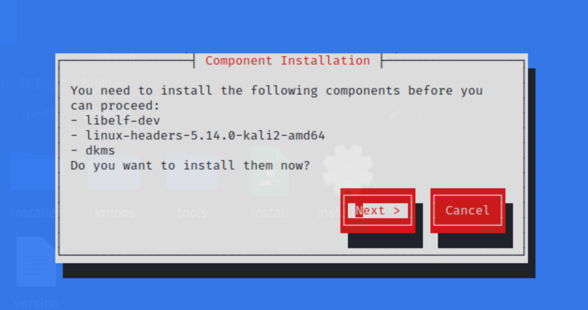
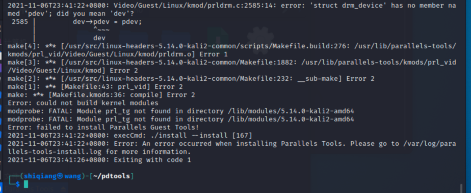

> 最近两天又参加了公司一年一度的网络安全劳动竞赛，之前用过的一个 Kali 忘记密码进不去了 -_- 。重新安装了 Kali 2021.3a 之后发现 Parallels Tools 安装失败，记录了一下排错的过程。

## 环境介绍

本文使用的环境如下

* Parallels Dekstop 17.0.1
* kali-linux-2021.3a-installer-amd64.iso
* macOS Catalina 10.15.7

## 安装 Kali Linux

Kali Linux 的过程比较简单，反正是在虚拟机中使用，基本上都是按照推荐设置一路Next下来就可以。

系统安装成功后，先做下必要的系统更新，因为我用的是普通用户，所以命令前都要加 `sudo`。

```sh
$ sudo apt-get update
$ sudo apt-get upgrade -y
$ sudo apt-get dist-upgrade -y
```

更新过程中觉得速度特别慢，更换到了国内的源。编辑 `/etc/apt/sources.list` 添加国内的源。

```sh
deb http://mirrors.tuna.tsinghua.edu.cn/kali kali-rolling main contrib non-free
deb-src https://mirrors.tuna.tsinghua.edu.cn/kali kali-rolling main contrib non-free
```

## 安装 Paralles Tools

系统更新完成后，点击虚拟机右上角黄色叹号，提示将 Parallles Tools 光盘挂载到操作性上。在 Kali 虚拟机中，右键点击光盘选择 「挂载」，然后再次右键选择「在新窗口打开」，在新窗口中右键选择「在这里打开终端」。

```sh
# 创建新的文件夹，并把 pdtools 内容拷贝过来
$ mkdir ~/pdtools 
$ cp -rvf /media/cdrom0/* ~/pdtools
$ sudo chmod -R 777 ~/pdtools
$ cd ~/pdtools
$ sudo ./install
```

安装过程到最后，会遇到下面这个错误提示。



然后按照提示安装相关的组件。

```sh
$ sudo apt-get install libelf-dev
$ sudo apt-get install dkms
```

安装完成后重新尝试安装 Parallels Tools，最后仍然失败报错。



这里报错网上很多资料，多数是需要修改几个文件，尝试几次之后没有成功。

这时想到了更新 Paralles Desktop 试试，点击「检查更新」发现有一个 17.1.0 版本，果断更新。

更新后，将原来拷贝的 pdtools 文件删除，重新点击黄色叹号安装，最后就成功了。


## xfce 切换到 GNOME

如果不习惯 xfce 的桌面，可以切换到 GNOME 桌面。

```sh
$ sudo apt-get install kali-desktop-gnome
```

安装完成后重启操作系统，就能够在登录的时候选择想要的桌面了。

## 参考资料

1. [Kali 2021.1 安装 Parallel Tools 疑难解答](https://www.sqlsec.com/2021/04/pdtools.html)
2. [Kali Linux 2020.4安装Parallels Tools](https://zhuanlan.zhihu.com/p/340544345)
3. [kali linux 2021.1安装parallels tools踩坑记录](https://blog.csdn.net/qq_39563369/article/details/115960130)

