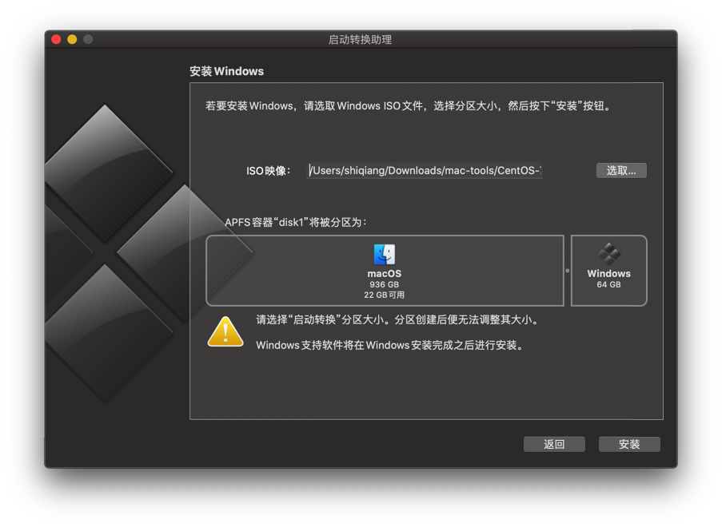

手里有一台 MacBook Air 2013，一直安装的原装的操作系统，一路升级到 Catalina。

之前一直使用 Parallels Desktop 安装 Windows 虚拟机使用，相安无事到最近单位开始要求不能运行虚拟机。

不得以考虑安装双系统。

## 需要的材料

* Windows 10 安装介质 iso
* 一个大于8G的空白U盘

## 步骤

准备就绪后，使用 Spotlight 搜索 Boot Camp / 启动转换助理。

App 打开后，点击「继续」。

勾选「创建Windows 10或更高版本的安装盘」以及「移除Windows 10 或更高版本」，点击「继续」。

接下来选择磁盘上的 Windows 10 镜像文件，通过下方的小点调整你希望分配给 Windows 系统的磁盘空间。

完成之后点击「安装」，之后就是漫长的等待时间。看过程中的提示文字，大概分为将ISO拷贝到U盘、下载驱动文件等几个步骤。

所有这些步骤完成后，系统会自动重启开始 Windows 的安装。Windows 安装的整个过程也比较慢，耐心等待。

Windows 的安装配置过程就不再多说了，总体来讲 Boot Camp 给我们带来了非常方便的转换到 Windows 操作系统的工具。

## 参考资料

1. [Install Windows 10 on your Mac with Boot Camp Assistant](https://support.apple.com/en-us/HT201468)
2. [如果在使用“启动转换助理”后“启动转换”安装器无法打开](https://support.apple.com/zh-cn/HT208495)
