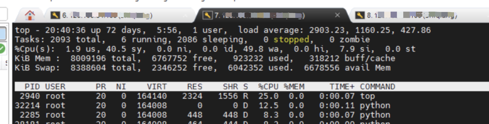

> 本文测试环境信息如下：
>
> OS: MacOS Monterey 12.2.1
>
> Python: 3.9.6
>
> Locust: 2.7.3

## 场景需求

想要测试一台服务器链接数很多的情况下（如超过1万、10万），其他的网络操作（诸如 Ping）是否会发生异常。

使用 Python 来构建服务端和客户端。

服务端代码：tcpserver.py

```python
#codeing: utf-8
from __future__ import print_function
from gevent.server import StreamServer
import signal
import gevent
from gevent.signal import signal
# import signal

# sleeptime = 60

def handle(socket, address):
    # print(address)
    # data = socket.recv(1024)
    # print(data)
    socket.sendall( bytes('Welcome to the echo server! Type quit to exit.\r\n', 'utf-8') )
    fileobj = socket.makefile()
    while True:
        # line = fileobj.readline()
        # if line.strip().lower() == 'quit':
        #     print ("client quit")
        #     break
        # fileobj.write(line)
        # fileobj.flush()
        # print ("echoed %r" % line)

        gevent.sleep(sleeptime)
        try:
            socket.send( bytes("ok\n",'utf-8') )
        # except KeyboardInterrupt:
        #     print("Server Close")
        # except socket.error:
        #     print("Server Close")
        except Exception as e:
            print(e)

if __name__ == "__main__":
    import sys
    port = 80
    if len(sys.argv) > 2:
        port = int(sys.argv[1])
        sleeptime = int(sys.argv[2])
    else:
        print("Tow parameters needed!")
        sys.exit(1)
    # default backlog is 256

    server = StreamServer(('0.0.0.0', port), handle, backlog=4096)
    
    # gevent.signal_handler(signal.SIGTERM, server.close)
    # gevent.signal(signal.SIGQUIT, server.close)

    server.serve_forever()
```

客户端代码： tcpclient.py

```python
#coding: utf-8
import time
from gevent import socket
# from locust import Locust, TaskSet, events, task

# 尝试直接连接服务器
class manual_connect():
    print('Manual connect tcp server.')
    # 目标地址
    host = "127.0.0.1"
    # 目标端口
    port = 8081
    skt = socket.socket(socket.AF_INET, socket.SOCK_STREAM)
    skt.setsockopt(socket.SOL_SOCKET, socket.SO_KEEPALIVE, 1)
    skt.connect( (host, port) )
    while True:
        msg = skt.recv(1024)
        print(msg)
        # client.send('hello world\r\n'.encode())
        # print('send data')
        time.sleep(1)
```

## 测试情况

服务端启动服务后，第一次尝试直接在一台客户端上启动 10000 个连接。

```sh
$ for i in {1..10000};do nohup python3 -u tcpclient.py > out$i.log 2>&1 &; done;
```

很快终端就报出了内存不足的信息，同时观察网络连接数量，也上升到 130 左右就不再继续上涨。

同时观察到系统负载很高。




## 系统参数

### 客户端参数配置

系统文件 `/etc/sysctl`

```conf
# 系统级别最大打开文件
fs.file-max = 100000

# 单用户进程最大文件打开数
fs.nr_open = 100000

# 是否重用, 快速回收time-wait状态的tcp连接
net.ipv4.tcp_tw_reuse = 1
net.ipv4.tcp_tw_recycle = 1

# 单个tcp连接最大缓存byte单位
net.core.optmem_max = 8192

# 可处理最多孤儿socket数量，超过则警告，每个孤儿socket占用64KB空间
net.ipv4.tcp_max_orphans = 10240

# 最多允许time-wait数量
net.ipv4.tcp_max_tw_buckets = 10240

# 从客户端发起的端口范围,默认是32768 61000，则只能发起2w多连接，改为一下值，可一个IP可发起差不多6.4w连接。
net.ipv4.ip_local_port_range = 1024 65535
```

系统文件 `/etc/security/limits.conf`

```conf
# 最大不能超过fs.nr_open值, 分别为单用户进程最大文件打开数，soft指软性限制,hard指硬性限制
* soft nofile 100000
* hard nofile 100000
root soft nofile 100000
root hard nofile 100000
```

### 服务端参数配置

系统文件 `/etc/sysctl.conf`

```conf
# 系统最大文件打开数
fs.file-max = 20000000

# 单个用户进程最大文件打开数
fs.nr_open = 20000000

# 全连接队列长度,默认128
net.core.somaxconn = 10240

# 半连接队列长度，当使用sysncookies无效，默认128
net.ipv4.tcp_max_syn_backlog = 16384
net.ipv4.tcp_syncookies = 0

# 网卡数据包队列长度
net.core.netdev_max_backlog = 41960

# time-wait 最大队列长度
net.ipv4.tcp_max_tw_buckets = 300000

# time-wait 是否重新用于新链接以及快速回收
net.ipv4.tcp_tw_reuse = 1
net.ipv4.tcp_tw_recycle = 1

# tcp报文探测时间间隔, 单位s
net.ipv4.tcp_keepalive_intvl = 30

# tcp连接多少秒后没有数据报文时启动探测报文
net.ipv4.tcp_keepalive_time = 900

# 探测次数
net.ipv4.tcp_keepalive_probes = 3

# 保持fin-wait-2 状态多少秒
net.ipv4.tcp_fin_timeout = 15

# 最大孤儿socket数量,一个孤儿socket占用64KB,当socket主动close掉,处于fin-wait1, last-ack
net.ipv4.tcp_max_orphans = 131072

# 每个套接字所允许得最大缓存区大小
net.core.optmem_max = 819200

# 默认tcp数据接受窗口大小
net.core.rmem_default = 262144
net.core.wmem_default = 262144
net.core.rmem_max = 16777216
net.core.wmem_max = 16777216

# tcp栈内存使用第一个值内存下限, 第二个值缓存区应用压力上限, 第三个值内存上限, 单位为page,通常为4kb
net.ipv4.tcp_mem = 786432 4194304 8388608

# 读, 第一个值为socket缓存区分配最小字节, 第二个，第三个分别被rmem_default, rmem_max覆盖
net.ipv4.tcp_rmem = 4096 4096 4206592

# 写, 第一个值为socket缓存区分配最小字节, 第二个，第三个分别被wmem_default, wmem_max覆盖
net.ipv4.tcp_wmem = 4096 4096 4206592
```

系统文件，`/etc/security/limits.conf`

```conf
# End of file
root soft nofile 2100000
root hard nofile 2100000
* soft nofile 2100000
* hard nofile 2100000
```


## 统计语句

```sh
# 统计操作系统的链接数
$ netstat na | grep ESTABLISHED | wc -l
```

* 1个 Socket 长连接占用内存约为 8kb

> pdsh 全称是 parallel distributed shell ，与 pssh 类似，具有批量在远程目标主机操作的能力。

## 参考资料

1. [Linux Netstat 统计连接数](https://www.cnblogs.com/kabi/p/7018434.html)
1. [如何模拟单机百万TCP连接](https://blog.51cto.com/u_15060546/2641200)
1. [locust - An open source load testing tool](https://locust.io)
1. [Load Testing with Python: Locust](https://steelkiwi.com/blog/load-testing-python-locust-testing-and-bokeh-vis/)
1. [Achieving 100k connections per second with Elixir](https://stressgrid.com/blog/100k_cps_with_elixir/)
1. [The elixir programming language](https://elixir-lang.org)
1. [Python百万级并发测试指南](https://zhuanlan.zhihu.com/p/134603634)
1. [pdsh 使用](https://blog.csdn.net/qq_37865420/article/details/117263959)
1. [Python server.StreamServer方法代码示例](https://vimsky.com/examples/detail/python-method-gevent.server.StreamServer.html)
2. [python-grpc 流式服务初探](https://zhuanlan.zhihu.com/p/441572357)
2. [gevent StreamServer.start（）似乎没有达到我的期望](https://www.pythonheidong.com/blog/article/148759/735b9f7c132cc0e8109a/)
2. [Github portforwarder.py](https://github.com/gevent/gevent/blob/master/examples/portforwarder.py)
2. [How to create a custom socket client in locust](https://stackoverflow.com/questions/63764339/how-to-create-a-custom-socket-client-in-locust)
2. [linux 下后台运行python脚本](https://www.cnblogs.com/master-pokemon/p/5790783.html)