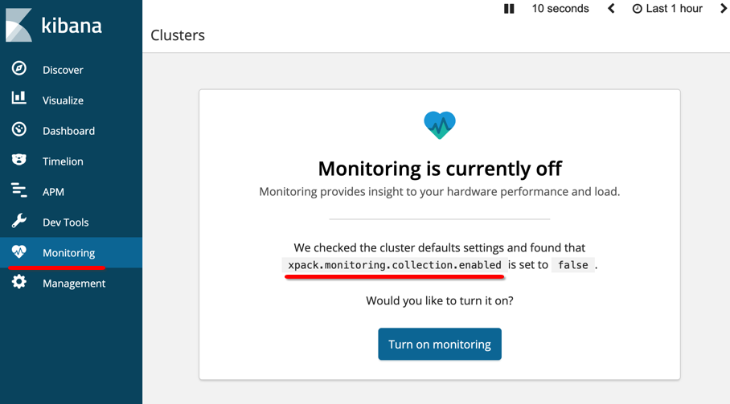
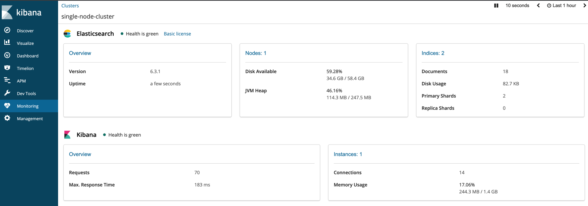
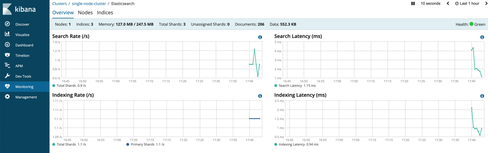
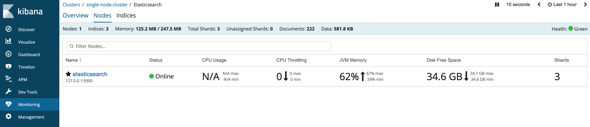
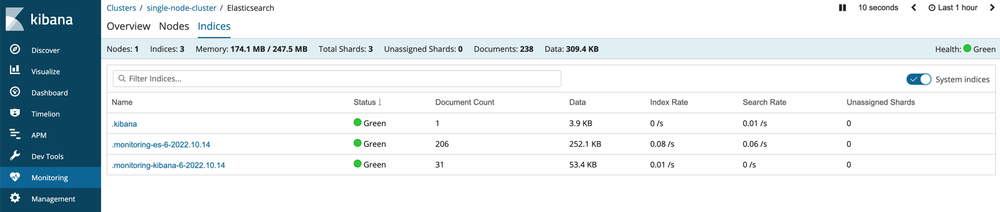

在 [Elasticsearch监控指南](http://edulinks.cn/2020/03/15/20200315-es-monitoring-guide/) 和 [Elasticsearch几项关键告警指标](http://edulinks.cn/2020/03/14/20200314-es-monitoring-metric/) 中讨论过一些基础的 elasticsearch 集群概念、监控指标和监控方法，其实 elastic 官方提供了一个非常方便的监控工具，在 elasticsearch 2.4 版本之前是做为 Marvel 插件提供，从 elasticsearch 2.4 之后做为了 X-Pack 模块的一部分，其中监控功能是免费功能，本文简要介绍利用 x-pack 监控 ES 集群的常用方法。

> 本文基于容器环境运行 elasticsearch 6.3.1 版本和 8.4.0 版本进行了测试，在我的 [Github/code-space/docker-conf](https://github.com/cocowool/code-space) 中提供了基于 docker-compose 的配置文件，可以快速的运行起一个 ES + Kibana 的实例，也可以运行起三个 ES 实例加一个 Kibana 实例，大家可以参考。

在 Elasticsearch 6.3.1 版本中，默认没有开启监控功能。可以通过修改 elasticsearch.yml 文件中`xpack.monitoring.collection.enabled` 参数来开启这个功能，也可以在 Kibana 的监控菜单中在线开启这个功能。本文使用了 docker-compose 来快速构建一个 ES + Kibana 的服务，具体的配置文件在 [es-kibana]() 中可以找到。将代码克隆到本地后，执行 `docker-compose up` 然后就可以通过 http://localhost:5601 访问 Kibana 页面。

开启监控的功能后，在 Kibana 中点击监控菜单，能看到监控信息总览的情况。

在总览页面点击 Overview 后，可以进入到集群性能监测的页面，能够实时显示集群的搜索请求数量、搜索延时、索引（写入）数量、索引（写入）的延时情况。并且还提供了 Node 和 Index 两个维度的监控页面，足以满足日常生产运维监控管理的需要。

查看索引列表，因为是一个新的节点，只有几个 Kibana 和 Xpack 创建的索引。

> 我尝试了使用 docker-compose 直接启动一组 es + kibana，后来发现 8.4 版本的 Kibana 在配置的时候增加了一些输入验证码的环节，因为时间原因，暂时没有深入研究静默安装的方法，本文就不再以 8.4 版本举例。

## 参考资料

1. [elastic document](https://www.elastic.co/guide/en/elasticsearch/reference/6.3/watcher-getting-started.html)
1. [阿里云ES监控指标](https://help.aliyun.com/document_detail/171545.htm?spm=a2c4g.11186623.0.0.31207ef4NxxIFh#task-2539910)
