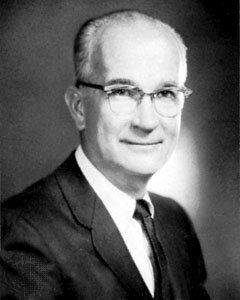
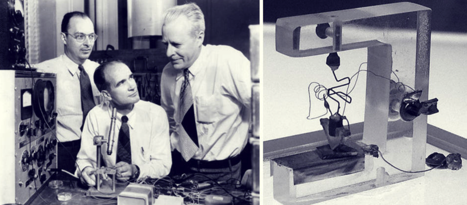

威廉·肖克利（William Shockley，1910年2月13日 - 1989年8月12日）是晶体管的发明人，和另外两位同事（约翰·巴丁 John Bardeen 和 沃尔特·豪泽·布拉顿 Walter Houser Brattain）获得1956年度「诺贝尔」物理学奖，他率先引导「硅谷」走向电子产业新时代，我们之前介绍过的 [戈登·摩尔](http://www.edulinks.cn/2021/01/29/20210131-gordon-moore/) 曾在他的公司工作，而后者正是摩尔定律的提出者。

肖克利在加州理工学院（[California Institute of Technology](https://www.caltech.edu)）获得物理学学士学位，1936年在麻省理工学院（Massachusetts Institute of Technology）获得博士学位，他的博士论文题目为「氯化钠晶体中电子波函数计算」。博士毕业后进入贝尔实验室开始半导体的研究。第二次世界大战期间，曾参加美国海军反潜挺研究组的相关工作，主要任务是研制深水潜艇炸弹。

战争结束后，肖克利返回贝尔实验室继续他的半导体研究，他和另外同事尝试使用半导体做为电子信号的放大器和控制器。他们在1947年发明了点接晶体管，随后在1948年发明了更高效的接面晶体管。这种晶体管迅速成为20世纪50年代至60年代的主导产品，第一台袖珍晶体管收音机也使用了接面晶体管。

半导体是一类掺了杂质的晶体材料，这类掺杂后的晶体材料会有整流作用，即只能让电子或空穴一种电流通过，而不像导体，无论是电子电流还是空穴电流都能通过。贝尔实验室之前就对半导体材料进行过研究，发现掺杂的半导体整流效果比电子管好。肖克利的团队经过不断的实验，终于在1947年发明了晶体管，最初采用的半导体材料是锗。晶体管的英文单词 transistor 也是后来由传递 transfer 和电阻 resistor 两个词合成的。几年之后，人们发现硅更适合生产晶体管，由此北加州也被称为「硅谷」（Silicon Valley）

肖克利时代的电脑体积巨大，像之前在[霍华德·艾肯](http://www.edulinks.cn/2021/01/23/20210124-howard-aiken/) 中介绍的世界上第一台大型自动数字计算机马克1号，以及在[约翰·莫奇利](http://www.edulinks.cn/2021/03/21/20210321-john-mauchly/) 中介绍的世界上第一台电子计算机 「ENIAC」都占用了很大的空间并且启动成本昂贵。以ENIAC为例，它重达三十吨，有一万八千只真空管。因为真空管的发光发热问题，导致一些飞蛾或小昆虫进入计算机内部后会造成短路。1949年有杂志这样预言未来的电脑：「未来的电脑可能只需要一千只真空管，半吨重」。

往往，人们对于长期的预测赶不上实际的发展，并且，颠覆性的创新常常来自外部。晶体管因为产生的热量小、效率高，为计算机的微型化奠定了基础，进一步引发了电信和计算机等各方面的革命。

## 题外话

据传肖克利在大学期间，因为身体高挑、肌肉匀称，被当地一家健身器材公司找到专门拍了一辑广告册。为了保持体形，肖克利一生都没中断过。他还喜欢健身、攀岩、航海等多项运动。

不得不说，运动是最值得投入，也是永远能够忠实的给予我们汇报的项目。最近我也通过坚持跑步和跳绳，不仅获得了体重上的减轻，感觉工作的精力也比以前旺盛多了。

## 参考资料

1. [百度百科-威廉·肖克利](https://baike.baidu.com/item/威廉·肖克利/10940765?fromtitle=William%20Shockley&fromid=11319354&fr=aladdin)
1. [Britannica - William B. Shockley](https://www.britannica.com/biography/William-Shockley)
1. [他的发明让电脑变了个样，半导体教父肖克利的晶体管人生](https://www.sohu.com/a/292603919_505803)
1. [硅谷诞生前夜-肖克利的机器人梦](https://new.qq.com/rain/a/20210819A058KL00)
