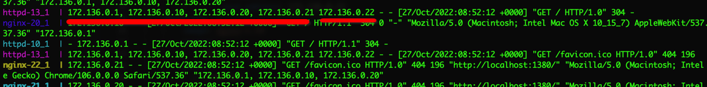
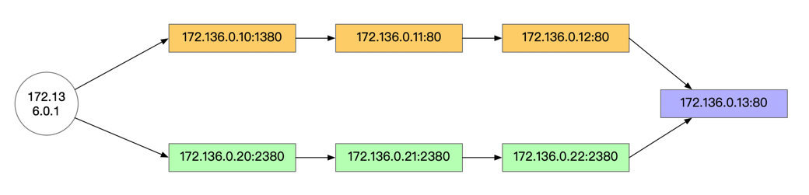

现代的Web服务器都提供了访问日志记录的功能，能够记录发起请求的客户端IP，如果客户端通过代理访问我们的站点，也可以通过 `X-Forwarded-For` 字段来记录用户的真实IP（这需要代理服务器提供添加这个头的支持）。

在 Apache 中，通过下面的命令来定义访问日志的格式，其中 %h 表示发起请求的客户端地址，%{X-FORWARDED-FOR} 表示代理的地址。

```conf
LogFormat "%{X-FORWARDED-FOR}i %h %l %u %t \"%r\" %>s %b \"%{Referer}i\" \"%{User-Agent}i\"" combined
```

如下图所示，这一段 access 日志中第一段标红的地址串表示访问所经过的代理的列表，标红的第二段表示最近一次发起请求的客户端地址，为了说明这种日志产生的原因，本文基于 Docker 构建了一个有多层代理的架构，具体的编排代码可以在 [sh-valley](https://github.com/cocowool/sh-valley/tree/master/docker-conf/multi-layer-proxy) 中找到。



下面的架构图解释了整个设计，我在 13 地址的服务器上修改了日志记录配置，记录了客户端IP和代理的IP，黄色的方块表示用 Apache 做为反向代理服务，绿色的方块表示用 Nginx 做为反向代理服务，用户分别访问 1380 端口和 2380 端口，效果都是看到 13 上的默认页面，我们观察 13 上访问日志记录的情况。



```sh
# 使用 docker-compose up 命令可以启动实验环境
# 然后使用浏览器访问 http://localhost:1380 观察终端的日志输出
httpd-11_1  | - 172.136.0.1 - - [27/Oct/2022:09:06:55 +0000] "GET / HTTP/1.1" 304 -
httpd-13_1  | 172.136.0.1 172.136.0.12 - - [27/Oct/2022:09:06:55 +0000] "GET / HTTP/1.1" 304 -
httpd-12_1  | - 172.136.0.1 - - [27/Oct/2022:09:06:55 +0000] "GET / HTTP/1.1" 304 -
httpd-10_1  | - 172.136.0.1 - - [27/Oct/2022:09:06:55 +0000] "GET / HTTP/1.1" 304 -

# 可以看到 13 服务器输出的访问者IP为它的上一跳代理服务器地址 172.136.0.12 ，而代理服务器地址展示了真实的用户IP 172.136.0.1
# 然后使用浏览器访问 http://localhost:2380 观察终端的日志输出

nginx-20_1  | 172.136.0.1 - - [27/Oct/2022:09:10:43 +0000] "GET / HTTP/1.1" 200 29 "-" "Mozilla/5.0 (Macintosh; Intel Mac OS X 10_15_7) AppleWebKit/537.36 (KHTML, like Gecko) Chrome/106.0.0.0 Safari/537.36" "-"
nginx-21_1  | 172.136.0.20 - - [27/Oct/2022:09:10:43 +0000] "GET / HTTP/1.0" 200 29 "-" "Mozilla/5.0 (Macintosh; Intel Mac OS X 10_15_7) AppleWebKit/537.36 (KHTML, like Gecko) Chrome/106.0.0.0 Safari/537.36" "172.136.0.1"
nginx-22_1  | 172.136.0.21 - - [27/Oct/2022:09:10:43 +0000] "GET / HTTP/1.0" 200 29 "-" "Mozilla/5.0 (Macintosh; Intel Mac OS X 10_15_7) AppleWebKit/537.36 (KHTML, like Gecko) Chrome/106.0.0.0 Safari/537.36" "172.136.0.1, 172.136.0.20"
httpd-13_1  | 172.136.0.1, 172.136.0.20, 172.136.0.21 172.136.0.22 - - [27/Oct/2022:09:10:43 +0000] "GET / HTTP/1.0" 200 29

# 可以看到 13 服务器输出的访问者IP为它的上一跳代理服务器地址 172.136.0.22 ，而代理服务器地址展示了一连串的IP，而第一个IP就是真实的用户IP 172.136.0.1
```

从上面的实验结果看，Apache做为反向代理的时候，不会把之前的IP追加到 X-FORWARDED-FOR 信息中，而 Nginx 做为反向代理时，会把之前的IP都追加到 X-FORWARDED-FOR 信息中。据我所知，一些负载均衡产品，例如F5等，也具备追加代理IP信息的功能。因此，当看到访问日志中有一连串的地址时，不要慌张，细细分辨就能找到真实的用户IP。

## 参考资料

1. [Why do Apache access logs sometimes have two host ip addresses?](https://serverfault.com/questions/593913/why-do-apache-access-logs-sometimes-have-two-host-ip-addresses)
1. [apache如何开启反向代理？这篇完整教你如何配置](https://baijiahao.baidu.com/s?id=1732054818637750127&wfr=spider&for=pc)
1. [Apache and X-Forwarded-For Header (XFF)](https://www.loadbalancer.org/blog/apache-and-x-forwarded-for-headers/)
1. [Nginx 反向代理详解](https://blog.csdn.net/weixin_52622200/article/details/120979966)
1. [Pound](https://www.apsis.ch/pound.html)
