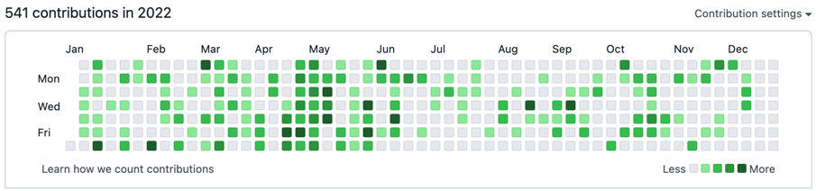
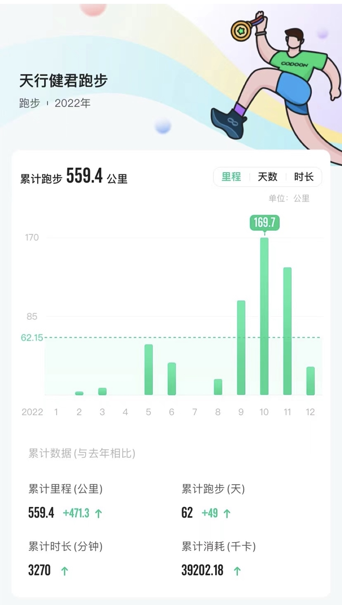
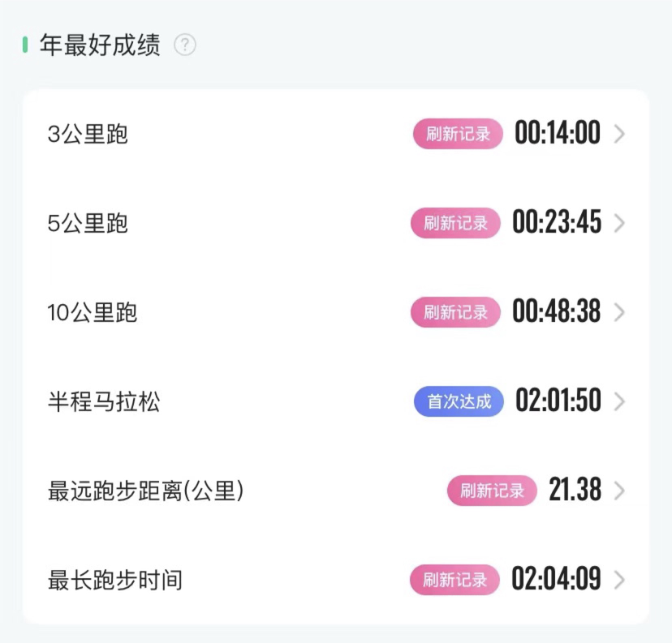

看了一下2021年的总结，然后着手回顾总结2022年。2021年底的时候，网络上还在到处调侃马云内部讲话中提到的「福报」，2022年的年底，想要在公司完成996强度的办公，可能对大多数人来讲都有些困难。

是的，因为疫情影响，这一年可能是近三年来在家办公最长的一年，在单位办公最少的一年。上半年差不多有2个月在家办公，11月份之后，又要差不多有2个月，而最近的这一次居家办公，对大多数人来说绝对是终生难忘。一方面可能要顶着奥密克戎的猛烈攻击，一方面还要完成单位的工作，还要时时刻刻关注家里一家老小的身体状况，一个字「难」。

千难万难，生活还要继续，每个人首先应该做自己健康的责任人，防护好自己、照顾好家人，才能取得未来持续努力的精力。

## 撸的代码

2022年结束还有两周，这一年基本上实现了年初期望每周都有提交的希望，不管是博客内容的写作，还是小工具的开发完善。忙的时候提交可能少一些，闲暇时间多的时候提交就多一些，要明白这些都是工作8小时以外的成绩。

未来一年，希望能够在一些小而有趣的项目，能够帮助到更多有同样需求的人。同时希望自己能在效率和质量方面都能有所提升。

## 读的书

* 江青传
* Python 金融大数据风控建模实战
* 白鹿原
* 经典刀剑鉴赏指南
* 建国方略-孙中山
* 彭德怀自述
* 中国通史-傅乐成
* 公众号运营实战手册
* 科技报国-白春礼
* Docker 技术入门与实践
* Think in Java 第四版

2022年读完了11本书，相比2021年少了不少。值得一提的是终于啃完了大部头的《Think in Java》，看到后面越发觉得里面的翻译有很多问题，随着 Java 大版本不断飞跃，可能需要出现一本新的经典了。

希望自己在2023年能够更有效利用边角时间，不去刷一些无谓的的社交媒体，专注于有深度的阅读。

## 跑过的路

这一年跑步的里程比原来计划的多了很多，因为加入了单位的跑团，从9月份之后里程开始狂涨。看着自己的BMI不断下降，洗澡的时候摸着瘪瘪的肚子还是非常开心的。

特别是今年的成绩不断刷新，突破了自从使用咕咚开始记录成绩以来的各项记录，可以说是跑步状态最好的一年。我觉得每个人都应该找到一项自己喜欢的运动并坚持下去，跑步是一项成本非常低的运动，同时整体效果又非常好。2023年，继续坚持下去！ 

