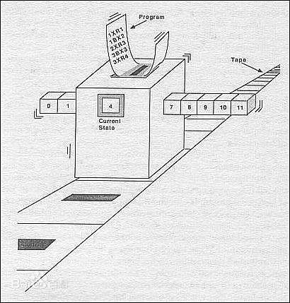

斯蒂芬·科尔·克莱尼（Stephen Cole Kleene，1909年1月5日 - 1994年1月25日），美国数学家、罗辑学家，主要从事可计算函数的研究。克莱尼也是博物学家，曾发现蝴蝶的新品种，并且喜欢旅行和登山。

今天介绍的克莱尼，他的递归论有助于奠定计算机科学的基础，他为数学直觉主义的基础做了重要贡献。1930年，他在阿默斯特学院（Amherst College）获得学士学位，1934年在普林斯顿大学（Princeton University）获得数学博士学位，他的导师是 Alonso Chruch，毕业论文的题目是《A Theory of Positive Integers in Formal Logic》。

在普林斯顿进行短暂的教学后，他在1935年加入了威斯康星大学（University of Wisconsin at Madison），1937年被提升为副教授。二战期间，克莱尼曾在 Naval Research Laboratory 工作。二战结束后，1946年返回威斯康星大学，1948年成为正教授，1979年退休。

数学家[图灵](http://www.edulinks.cn/2021/01/09/20210109-turing/)曾提出一种抽象计算模型 - 图灵机，可以说是计算机的起源。他在1936年提出一种抽象的计算模型，即将人们使用纸笔进行数学运算的过程进行抽象，由一个虚拟的机器代替人们进行数学运算。这个机器有一条无限长的纸带，纸带分成了一个一个的小方格，每个方格有不同的颜色。有一个机器头在纸带上移来移去。机器头有一组内部状态，还有一些固定的程序。在每个时刻，机器头都要从当前纸带上读入一个放个信息，然后结合自己的内部状态查找程序表，根据程序输出信息到纸带方格上，并转换自己的内部状态，然后进行移动。

图灵机模型引入了读写、算法与程序语言的概念，极大的突破了过去的计算机器的设计理念。在图灵机中，一类重要的函数是数论函数，之所以这么称呼是因为它的输入和输出仅限于自然数。克莱尼对图灵的数论函数持怀疑态度，他认为图灵的方法对部分函数不适用，这些函数只对自然数的部分子集成立。

> 「虽然我很向往图灵所构想的机器的非凡能力，但我依然对他用如此简单的方法将此应用到数论函数的计算中表示怀疑。」
>
> --- 克莱尼

1941年开春，克莱尼在威斯康星的一个数据基础研讨班上开始寻求一种不同的解决方法，他重新改进的图灵机在1952年出版的经典图书《元数学引论》（英文名为《Introduction to Metamathematics》）的第8节中占据了重要的位置。

克莱尼在1983年获得美国数学学会颁发的勒鲁瓦斯梯尔奖（Leroy P Steele Prize），1990年还获得了布什总统亲自颁发的国家科学奖章（National Medal of Science）。

## 参考资料

1. [百度百科](https://baike.baidu.com/item/斯蒂芬·科尔·克莱尼/2094842?fr=aladdin)
1. [几个关于算法方面问题的思考](https://zhuanlan.zhihu.com/p/587711340)
1. [图灵机的改进者-克莱尼](https://www.sohu.com/a/214850899_223014)
1. [Stephen Cole Kleene](https://mathshistory.st-andrews.ac.uk/Biographies/Kleene/)
1. [lambda创世纪](https://www.cnblogs.com/quitboy/p/5060366.html)
1. [经典回顾：有效过程与自然法则](https://www.sohu.com/a/475232100_121124373)
