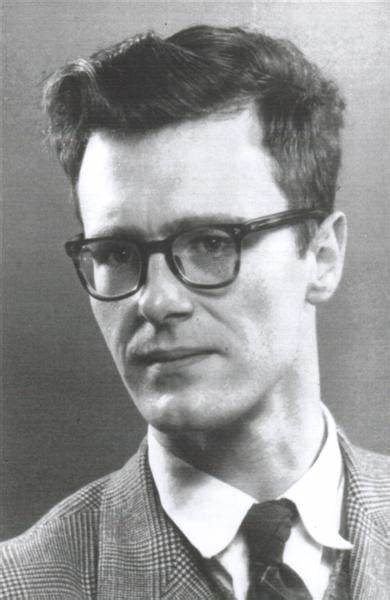
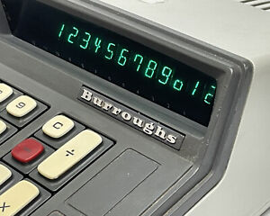
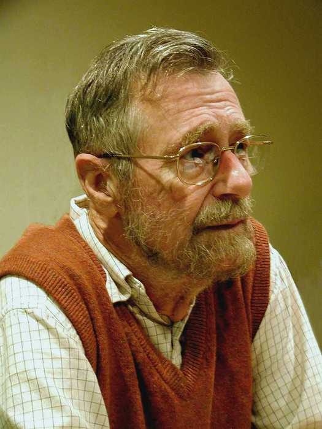

艾兹格·迪科斯彻（Edsger Wybe Dijkstra，1930年5月11日 - 2002年8月6日），荷兰计算机科学家，荣获1972年图灵奖。他的很多成就和我们现在的工作密切相关，例如提出了信号量和PV原语，解决了「哲学家就餐」问题等等。

## 生平

迪科斯彻1930年出生在荷兰第二大城市鹿特丹（Rotterdam）。1952年至1962年他在 「Amsterdam’s Mathematical Center」工作，工作期间他取得了两项重要成就，一项是1956年提出了「Dijkstra 算法」来解决最短路径问题，另一项是1959年获得阿姆斯特丹大学博士学位。

1963年到1973年，迪科斯彻在荷兰埃因霍芬理工大学（Technical University of Eindhoven）任教。埃因霍芬是荷兰第四大工业城市，也是欧洲四大高科技聚集地之一。

> 埃因霍芬是灯泡的生产地，一直是飞利浦电子研究和发展的基地。光刻机制造公司ASML也坐落在埃因霍芬。

1973年到1984年，他在美国 Burroughs Corporation 任研究员。

> Burroughs 公司成立于1886年，在1950年左右成长为美国最大的计算器生产企业。

1984年到2000年，迪科斯彻在美国得克萨斯大学担任计算机科学教授。

## 成就

## 参考资料

1. [Edsger Dijkstra](https://www.britannica.com/biography/Edsger-Dijkstra)
2. [深入解析Dijkstra's Algorithm —— 高效解决有向图中的单点出发最短路径问题](https://www.dandelioncloud.cn/article/details/1530016957860691969)
3. [关于光刻机的一点思考 国产光刻机的前景](https://xueqiu.com/7161714286/236172276)
4. [Edsger W. Dijkstra -- 巨人的肩膀](https://blog.csdn.net/weixin_43914593/article/details/114755499)
