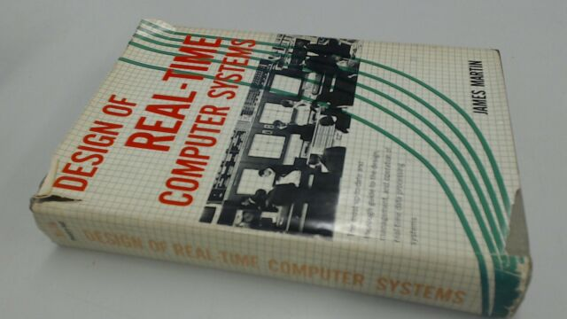
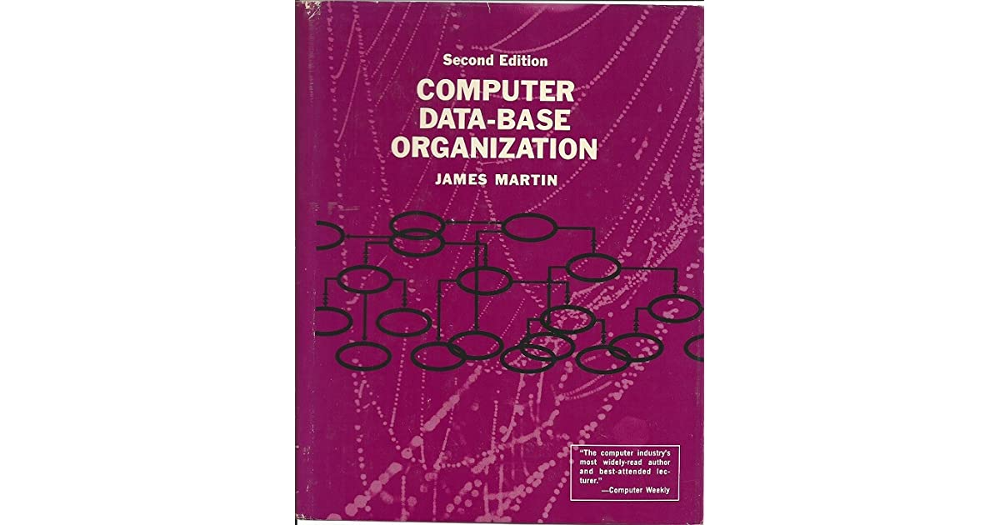

詹姆斯·马丁（James Martin，1933年10月19日 - 2013年1月24日），在很多英文资料中被誉为IT先驱和未来预言家。

> James Martin has been described as “the man who predicted the future.” 

这位先生的资料不太好找，因为重名的实在太多。百度百科上对于他的介绍仅有寥寥几段。

## 生平

出生在英国莱斯特郡的阿什比德拉祖赫（Ashby-de-la-Zouch, Leicestershire）。1950年在英国牛津凯布尔学院（Keble College，Oxford）学习物理学，并获得奖学金。毕业后他在军中服役，被任命为工程军官（Engineering Officer），这段经历带给了他不少领导的经验和技巧。

1959年，马丁加入IBM公司担任数据分析师（data processing analyst）。这一时期，IBM在实时处理计算机方面处于世界领先地位，马丁被派往美国参加IBM与全美航空公司的「Sabre airline reservations」项目。项目完成后马丁回到英国进行系统的推广工作，并成功完成英国海外航空公司（The British Overseas Airways Corporation，BOAC）预定系统的总体设计。

20世纪60年代中期，马丁进入IBM系统研究所，这是一所位于纽约的内部大学。马丁成为IBM在实时计算方面的专家。

1965年，马丁应邀编写了「Programming Real-Time Computer Systems」这本教材并获得了畅销，在随后20年的时间里，马丁编写了60多本教材。他的写作风格轻松易懂，并穿插了大量的照片和插图。

随后，马丁的兴趣转向了技术预测，1970年他编写了「The Computerized Society」，1977年编写了「The Wired Society」，这些书面向普通读者，并且精确的预测了到 2000 年，世界将被每个人使用的全球信息网络所包围。这本书是国际畅销书，并获得普利策奖提名。

「The Wired Society」成功后，马丁离开了IBM，成为一名自由撰稿人和讲师。他搬到了百慕大，并撰写了更多的书，他最终出版了100多本图书，包括中国读者熟悉的「[2012来临，我们如何自救](http://product.dangdang.com/11367386828.html)」。

詹姆斯·马丁在2005年捐赠了1.5亿美元，在牛津大学建立了「the Oxford Martin School」，用于研究人类面临的未来挑战。

马丁在百慕大买下了占地四英亩的阿加岛，并建造了一座殖民地风格的大房子。

2013年1月24号，马丁被发现死于百慕大的家中。

## 参考资料

1. [Multi-millionaire computer scientist found dead in waters off Bermuda](https://www.telegraph.co.uk/news/uknews/10142904/Multi-millionaire-computer-scientist-found-dead-in-waters-off-Bermuda.html)
1. [詹姆斯·马丁](https://baike.baidu.com/item/詹姆斯·马丁/18782397?fr=aladdin)
