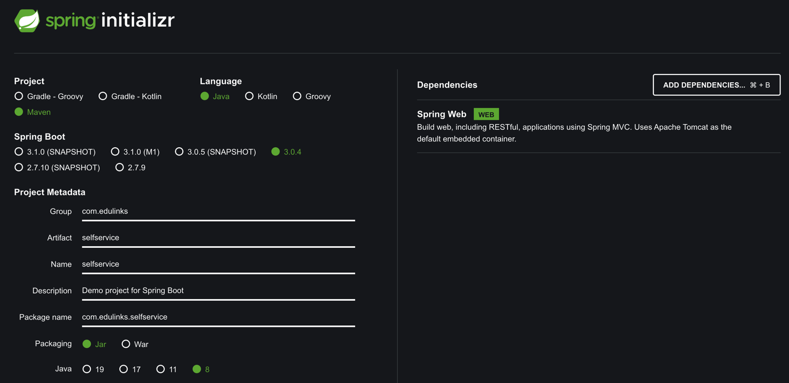

Springboot 是 Pivotal 公司提供的开发框架，继承了 Spring 框架原有的优秀特性，并通过简化配置提高了 Spring 应用的构建和开发过程。Spring 则是一个强大的生态，就我所了解的 Java 企业项目开发，感觉 Spring 几乎垄断了所有的场景。Spring 的核心功能是控制反转（Inversion of Control，IoC）和面向切面编程（Aspect Oriented Programming，AOP）。

关于 Spring 的内容不多花费笔墨，本文着重先学学如何上手体验下 Springboot 工程。

## 使用 mvn 创建

本文介绍了三种方式创建 springboot 工程，其实最核心的方式就是依赖 mvn 命令，因此实际上只要掌握了 mvn 命令行的创建方式，其他两种方式背后的运行逻辑就很容易弄清楚了。

```sh
$ mvn archetype:generate -DgroupId=com.edulinks.testproject -DartifactId=testproject -DinteractiveMode=false
$ cd testproject
$ testproject tree . 
.
├── pom.xml
└── src
    ├── main
    │   └── java
    │       └── com
    │           └── edulinks
    │               └── testproject
    │                   └── App.java
    └── test
        └── java
            └── com
                └── edulinks
                    └── testproject
                        └── AppTest.java

11 directories, 3 files
```

命令执行后，进入到 testproject 目录，编辑 pom.xml 文件。

```xml
<project xmlns="http://maven.apache.org/POM/4.0.0" xmlns:xsi="http://www.w3.org/2001/XMLSchema-instance"
  xsi:schemaLocation="http://maven.apache.org/POM/4.0.0 http://maven.apache.org/maven-v4_0_0.xsd">
  <modelVersion>4.0.0</modelVersion>
  <groupId>com.edulinks.testproject</groupId>
  <artifactId>testproject</artifactId>
  <packaging>jar</packaging>
  <version>1.0-SNAPSHOT</version>
  <name>testproject</name>
  <url>http://maven.apache.org</url>
  <!--spring-boot-starter-parent是spring boot 的父级依赖，它是一个特殊的starter>，用以提供相关的maven默认依赖-->
  <parent>
          <groupId>org.springframework.boot</groupId>
          <artifactId>spring-boot-starter-parent</artifactId>
          <version>2.2.5.RELEASE</version>
  </parent>
  <dependencies>
    <dependency>
      <groupId>junit</groupId>
      <artifactId>junit</artifactId>
      <version>3.8.1</version>
      <scope>test</scope>
    </dependency>
    <!--Spring Boot WEB依赖-->
    <!--项目导入web的启动依赖,SpringBoot就会集成SpringMVC，就可以进行Controller的开发-->
    <dependency>
        <groupId>org.springframework.boot</groupId>
        <artifactId>spring-boot-starter-web</artifactId>
    </dependency>

  </dependencies>

  <!--把项目打包成一个可执行的超级JAR（uber-JAR）,包括把应用程序的所有依赖打入JAR文件内，并为JAR添加一个描述文件，其中的内容能让你用java -jar来运行应用程序。-->
	<build>
		<plugins>
			<plugin>
				<groupId>org.springframework.boot</groupId>
				<artifactId>spring-boot-maven-plugin</artifactId>
			</plugin>
		</plugins>
	</build>
</project>
```

修改启动入口文件 App.java

```java
package com.edulinks.testproject;

import org.springframework.boot.SpringApplication;
import org.springframework.boot.autoconfigure.SpringBootApplication;

/**
 * Hello world!
 *
 */
@SpringBootApplication
public class App 
{
    public static void main( String[] args )
    {

        System.out.println( "Hello World!" );
        SpringApplication.run(App.class,args);
    }
}
```

添加一个简单的控制类 `./testproject/src/main/java/com/edulinks/testproject/controller/MyFirstSpringBootController.java`

```sh
package com.edulinks.testproject.controller;

import org.springframework.web.bind.annotation.GetMapping;
import org.springframework.web.bind.annotation.RequestMapping;
import org.springframework.web.bind.annotation.RestController;

@RestController
@RequestMapping("demo")
public class MyFirstSpringBootController {
    @GetMapping("hello")
    public String hello(){
        return "Hello my first springboot application.";
    }
}
```

打包并运行

```sh
$ mvn package 
# 下面这个打包语句可以跳过测试类命令
$ mvn package -Dmaven.test.skip=true
$ java -jar target/testproject-1.0-SNAPSHOT.jar
```

通过浏览器访问 http://localhost:8080/demo/hello 就可以看到返回的信息。

## 在线创建



填写好后，点击 Generate 就可以生成一个 zip 文件。解压后通过 mvn 进行构建。

```sh
$ mvn package
# 执行完成后会生成 target 文件夹
$ ls
HELP.md  mvnw     mvnw.cmd pom.xml  src      target
➜  selfservice java -jar target/selfservice-0.0.1-SNAPSHOT.jar

  .   ____          _            __ _ _
 /\\ / ___'_ __ _ _(_)_ __  __ _ \ \ \ \
( ( )\___ | '_ | '_| | '_ \/ _` | \ \ \ \
 \\/  ___)| |_)| | | | | || (_| |  ) ) ) )
  '  |____| .__|_| |_|_| |_\__, | / / / /
 =========|_|==============|___/=/_/_/_/
 :: Spring Boot ::                (v2.7.9)

2023-03-23 10:27:21.893  INFO 21573 --- [           main] c.e.selfservice.SelfserviceApplication   : Starting SelfserviceApplication v0.0.1-SNAPSHOT using Java 1.8.0_341 on bogon with PID 21573 (/Users/shiqiang/Downloads/selfservice/target/selfservice-0.0.1-SNAPSHOT.jar started by shiqiang in /Users/shiqiang/Downloads/selfservice)
2023-03-23 10:27:21.895  INFO 21573 --- [           main] c.e.selfservice.SelfserviceApplication   : No active profile set, falling back to 1 default profile: "default"
2023-03-23 10:27:22.716  INFO 21573 --- [           main] o.s.b.w.embedded.tomcat.TomcatWebServer  : Tomcat initialized with port(s): 8080 (http)
2023-03-23 10:27:22.729  INFO 21573 --- [           main] o.apache.catalina.core.StandardService   : Starting service [Tomcat]
2023-03-23 10:27:22.729  INFO 21573 --- [           main] org.apache.catalina.core.StandardEngine  : Starting Servlet engine: [Apache Tomcat/9.0.71]
2023-03-23 10:27:22.851  INFO 21573 --- [           main] o.a.c.c.C.[Tomcat].[localhost].[/]       : Initializing Spring embedded WebApplicationContext
2023-03-23 10:27:22.851  INFO 21573 --- [           main] w.s.c.ServletWebServerApplicationContext : Root WebApplicationContext: initialization completed in 908 ms
2023-03-23 10:27:23.162  INFO 21573 --- [           main] o.s.b.w.embedded.tomcat.TomcatWebServer  : Tomcat started on port(s): 8080 (http) with context path ''
2023-03-23 10:27:23.170  INFO 21573 --- [           main] c.e.selfservice.SelfserviceApplication   : Started SelfserviceApplication in 1.654 seconds (JVM running for 2.209)
```

> 测试发现页面中选择的 Java 版本为 8，但是生成的 pom.xml 文件中还是 17。根据打包报的错误信息进行修改。

确定 mvn 可以打包后，需要创建一个简单的类文件，目录结构如下：

```sh
$ tree src                                     
src
├── main
│   ├── java
│   │   └── com
│   │       └── edulinks
│   │           └── selfservice
│   │               ├── SelfserviceApplication.java
│   │               └── controller
│   │                   └── MyFirstSpringBootController.java
│   └── resources
│       ├── application.properties
│       ├── static
│       └── templates
└── test
    └── java
        └── com
            └── edulinks
                └── selfservice
                    └── SelfserviceApplicationTests.java
```

代码如下

```java
package com.edulinks.selfservice.controller;

import org.springframework.web.bind.annotation.GetMapping;
import org.springframework.web.bind.annotation.RequestMapping;
import org.springframework.web.bind.annotation.RestController;

@RestController
@RequestMapping("demo")
public class MyFirstSpringBootController {
    @GetMapping("hello")
    public String hello(){
        return "Hello my first springboot application.";
    }
}
```

然后打包运行

```sh
$ mvn package
$ java -jar target/selfservice-0.0.1-SNAPSHOT.jar

  .   ____          _            __ _ _
 /\\ / ___'_ __ _ _(_)_ __  __ _ \ \ \ \
( ( )\___ | '_ | '_| | '_ \/ _` | \ \ \ \
 \\/  ___)| |_)| | | | | || (_| |  ) ) ) )
  '  |____| .__|_| |_|_| |_\__, | / / / /
 =========|_|==============|___/=/_/_/_/
 :: Spring Boot ::                (v2.7.9)

2023-03-23 18:28:09.831  INFO 28730 --- [           main] c.e.selfservice.SelfserviceApplication   : Starting SelfserviceApplication v0.0.1-SNAPSHOT using Java 1.8.0_341 on bogon with PID 28730 (/Users/shiqiang/Downloads/selfservice/target/selfservice-0.0.1-SNAPSHOT.jar started by shiqiang in /Users/shiqiang/Downloads/selfservice)
2023-03-23 18:28:09.834  INFO 28730 --- [           main] c.e.selfservice.SelfserviceApplication   : No active profile set, falling back to 1 default profile: "default"
2023-03-23 18:28:10.562  INFO 28730 --- [           main] o.s.b.w.embedded.tomcat.TomcatWebServer  : Tomcat initialized with port(s): 8080 (http)
2023-03-23 18:28:10.572  INFO 28730 --- [           main] o.apache.catalina.core.StandardService   : Starting service [Tomcat]
2023-03-23 18:28:10.572  INFO 28730 --- [           main] org.apache.catalina.core.StandardEngine  : Starting Servlet engine: [Apache Tomcat/9.0.71]
2023-03-23 18:28:10.658  INFO 28730 --- [           main] o.a.c.c.C.[Tomcat].[localhost].[/]       : Initializing Spring embedded WebApplicationContext
2023-03-23 18:28:10.658  INFO 28730 --- [           main] w.s.c.ServletWebServerApplicationContext : Root WebApplicationContext: initialization completed in 784 ms
2023-03-23 18:28:10.965  INFO 28730 --- [           main] o.s.b.w.embedded.tomcat.TomcatWebServer  : Tomcat started on port(s): 8080 (http) with context path ''
2023-03-23 18:28:10.975  INFO 28730 --- [           main] c.e.selfservice.SelfserviceApplication   : Started SelfserviceApplication in 1.43 seconds (JVM running for 1.765)
```

通过浏览器访问 http://localhost:8080/demo/hello 就可以看到返回的信息。

## 使用 IDEA 创建

在网上看了一圈文章，大部分都是教我们使用 IDEA 终极版中的 Spring Initializr 来创建 Spring 工程，但是这是个收费版本。

我想基于 IDEA Community 2022.3.3 看看有没有能够支持的方式，曾经有几篇文章推荐 Spring Boot Assistant 插件，但我实验后都不能正常使用，如果能够使用的朋友，希望能够教教我。


## 参考资料

1. [spring starter](https://start.spring.io/)
1. [**使用maven命令行方式创建springBoot工程**](https://blog.51cto.com/u_11070617/5539754)
