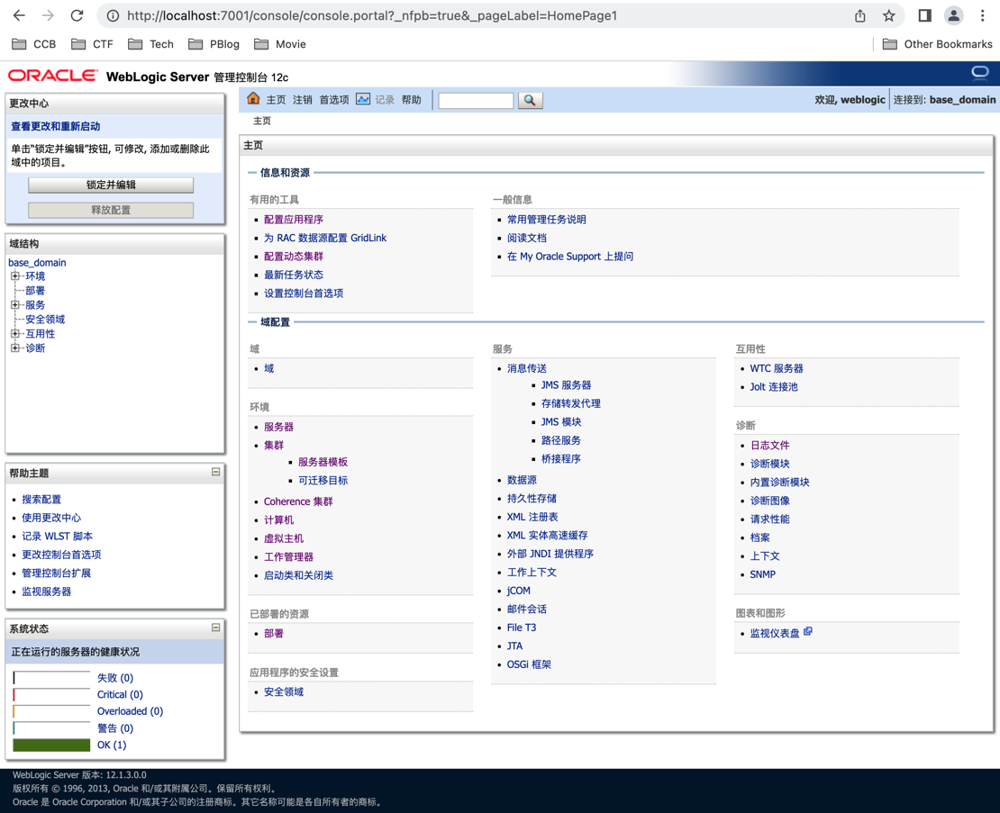
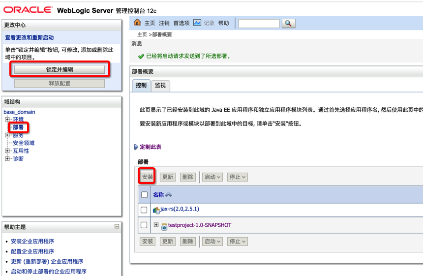

> 本文首发于 我的博客站点 [大江小浪](http://www.edulinks.cn) -[Weblogic Server 入门介绍](http://edulinks.cn/2023/04/04/20230404-weblogic-intro/) ，欢迎大家访问原文查看。
>
> 本文的操作系统环境为：macOS Monterey Version 12.2.1 
>
> 本文的 Docker 版本为：Docker version 20.10.8, build 3967b7d

## 简介

Weblogic Server 是 Oracle 公司开发的一款商业中间件，用于集成、部署和管理大型 Web 应用、网络应用或数据库应用的 Java 应用服务器。本文第一次发布时，官方看到 2020年3月30日，Weblogic Server 14.1.1 发布，企业中普遍使用较多的版本应该还以 11g、12c为主。

其他比较有名的几款商业中间件还包括 IBM 公司的 Websphere，Sun 公司（已被 Oracle 收购）的 Glassfish、Resin等。Apache Tomcat 是最流行的开源中间件。

国内厂商有东方通 TongWeb。

> Webloigc 最早由 Weblogic 公司开发，后并入 BEA 公司，最终被 Oracle 公司收购。

## 使用容器体验

利用容器和已经构建好的镜像，我们可以快速熟悉 Weblogic 的管理界面和相关操作。如果更加的深入了解，还是建议用传统的方式搭建、部署并调整参数。

```sh
# 这个镜像的 console 用户口令为 weblogic / welcome1
$ docker pull ismaleiva90/weblogic12
# -p 是映射容器端口到本地 7001, --rm 是结束后删除，避免遗留过多的实例
$ docker run -it -p 7001:7001 --rm ismaleiva90/weblogic12
```

启动后，可以通过 http://localhost:7001/console 访问控制台页面。



## 将 springboot 工程部署到 Weblogic

在 [Springboot 工程创建入门](http://edulinks.cn/2023/03/19/20230319-spring-boot-starter/) 中介绍了创建一个简单的 Springboot 工程的步骤，现在介绍如何将这个工程部署在 Weblogic 上。

> Weblogic 使用上一节介绍的容器镜像，版本为 12.1.3
>
> Maven 版本为 3.8.6

将 pom.xml 修改为以下内容。

```xml
<project xmlns="http://maven.apache.org/POM/4.0.0" xmlns:xsi="http://www.w3.org/2001/XMLSchema-instance"
  xsi:schemaLocation="http://maven.apache.org/POM/4.0.0 http://maven.apache.org/maven-v4_0_0.xsd">
  <modelVersion>4.0.0</modelVersion>
  <groupId>com.edulinks.testproject</groupId>
  <artifactId>testproject</artifactId>
  <packaging>war</packaging>
  <version>1.0-SNAPSHOT</version>
  <name>testproject</name>
  <url>http://maven.apache.org</url>
  <parent>
    <groupId>org.springframework.boot</groupId>
    <artifactId>spring-boot-starter-parent</artifactId>
    <version>2.3.4.RELEASE</version>
  </parent>
  <dependencies>
    <!-- <dependency>
      <groupId>junit</groupId>
      <artifactId>junit</artifactId>
      <version>3.8.1</version>
      <scope>test</scope>
    </dependency> -->

    <dependency>
      <groupId>org.springframework.boot</groupId>
      <artifactId>spring-boot-starter-web</artifactId>
      <exclusions>
        <exclusion>
          <groupId>org.springframework.boot</groupId>
          <artifactId>spring-boot-starter-tomcat</artifactId>
        </exclusion>
      </exclusions>
    </dependency>
    <dependency>
      <groupId>org.springframework.boot</groupId>
      <artifactId>spring-boot-starter-tomcat</artifactId>
      <scope>provided</scope>
    </dependency>
    <dependency>
      <groupId>org.springframework.boot</groupId>
      <artifactId>spring-boot-starter-test</artifactId>
      <scope>test</scope>
    </dependency>
    <dependency> 
      <groupId>org.springframework.boot</groupId> 
      <artifactId>spring-boot-legacy</artifactId> 
      <version>2.1.0.RELEASE</version>
     </dependency>

  </dependencies>
</project>
```

在 src/main 目录下创建 webapp/WEB-INF 目录，并添加 web.xml 文件。

```xml
<?xml version="1.0" encoding="UTF-8"?>
<!DOCTYPE web-app PUBLIC "-//Sun Microsystems, Inc.//DTD Web Application 2.3//EN" "http://java.sun.com/dtd/web-app_2_3.dtd">
<web-app>
    <context-param>
        <param-name>contextConfigLocation</param-name>
        <param-value>com.edulinks.testproject.App</param-value>
    </context-param>

    <listener>
        <listener-class>org.springframework.boot.legacy.context.web.SpringBootContextLoaderListener</listener-class>
    </listener>

    <servlet>
        <servlet-name>appServlet</servlet-name>
        <servlet-class>org.springframework.web.servlet.DispatcherServlet</servlet-class>
        <init-param>
            <param-name>contextAttribute</param-name>
            <param-value>org.springframework.web.context.WebApplicationContext.ROOT</param-value>
        </init-param>
        <load-on-startup>1</load-on-startup>
    </servlet>

    <servlet-mapping>
        <servlet-name>appServlet</servlet-name>
        <url-pattern>/</url-pattern>
    </servlet-mapping>

</web-app>
```

在相同目录下增加 weblogic.xml

```xml
<?xml version='1.0' encoding='UTF-8'?>
<weblogic-web-app xmlns="http://xmlns.oracle.com/weblogic/weblogic-web-app"
                  xmlns:xsi="http://www.w3.org/2001/XMLSchema-instance"
                  xsi:schemaLocation="http://xmlns.oracle.com/weblogic/weblogic-web-app http://xmlns.oracle.com/weblogic/weblogic-web-app/1.3/weblogic-web-app.xsd">

    <container-descriptor>

        <prefer-application-packages>
            <package-name>org.slf4j</package-name>
            <package-name>javax.validation.*</package-name>
            <package-name>org.hibernate.*</package-name>
            <package-name>javax.el.*</package-name>
            <package-name>org.springframework.*</package-name>
        </prefer-application-packages>
    </container-descriptor>
    <context-root>/</context-root>
</weblogic-web-app>
```

准备就绪后的目录结构为

```sh
$ testproject tree .                                                                                                               
.
├── pom.xml
├── src
│   ├── main
│   │   ├── java
│   │   │   └── com
│   │   │       └── edulinks
│   │   │           └── testproject
│   │   │               ├── App.java
│   │   │               └── controller
│   │   │                   └── MyFirstSpringBootController.java
│   │   └── webapp
│   │       └── WEB-INF
│   │           ├── web.xml
│   │           └── weblogic.xml
│   └── test
│       └── java
│           └── com
│               └── edulinks
│                   └── testproject
│                       └── AppTest.java
```

代码可以参考开头提到的文章，然后就是编译打包 `mvn clean package` 。

通过页面部署需要先点击「锁定并编辑」，然后点击「部署」，选择「安装」，出现安装界面后，选择上传 war 文件，然后根据提示一直下一步，全部完成后点击激活更改。最后观察到应用已经就绪状态，然后选择应用后点击启动，启动完成后就可以通过浏览器测试了。



可以通过 http://localhost:7001/demo/hello 访问到输出的信息。

## 参考资料

1. [Oracle Weblogic Server](https://www.oracle.com/cn/java/weblogic/)
2. [东方通](https://tongtech.com/dft/pctype/25.html)
3. [Weblogic使用、注意事项和实战](https://zhuanlan.zhihu.com/p/411959879)
4. [使用Docker搭建Weblogic服务](https://blog.csdn.net/m0_67391907/article/details/126553673)
5. [Building WebLogic Server Images on Docker](https://docs.oracle.com/middleware/12211/wls/DOCKR/configuration.htm)
6. [Deploying a WAR to WebLogic](https://docs.spring.io/spring-boot/docs/2.1.x/reference/html/howto-traditional-deployment.html#howto-weblogic)
7. [Github oukele - SpringBoot-Weblogic-Demo](https://github.com/oukele/SpringBoot-WebLogic-Demo)
