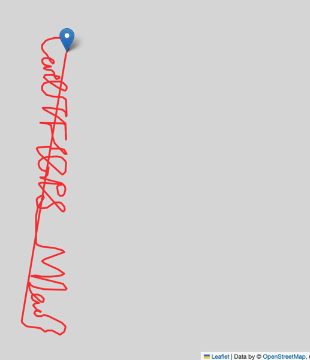

我在刷攻防世界 [CatchCat](https://adworld.xctf.org.cn/challenges/list?rwNmOdr=1681299809758) 这道题目时，看到附件是一些GPS数据，猜测需要绘制GPS轨迹，因此想到使用 Python 来绘制。 

> GPS数据有一定的格式规范，常见的有 GPRMC、GPGGA等，本文介绍的是利用 python 的 pynmea2、folium 两个库对 GPGGA 格式的解析和图形绘制。
>
> Python 版本 Python 3.10.9
>
> pynmea2 版本 1.19.0
>
> folium 版本 0.14.0

参考了网上的文章，这里直接把代码贴出来：

```python
import pynmea2
import folium
import os

# 绘制路径的函数，解题仅需要传入一组数据就行
def draw_gps(location1, location2, color1, color2):

    m1 = folium.Map(location1[0], zoom_start=15, attr='default')
    m2 = folium.Map(location2[0], zoom_start=15, attr='default')

    folium.PolyLine(
        location1,
        weight=3,
        color=color1,
        opacity=0.8
    ).add_to(m1)

    folium.PolyLine(
        location2,
        weight=3,
        color=color1,
        opacity=0.8
    ).add_to(m2)

    folium.Marker(location1[0], popup='<b>Starting Point</b>').add_to(m1)
    folium.Marker(location2[-1], popup='<b>End Point</b>').add_to(m2)

    m1.save(os.path.join('13.HTML'))
    m2.save(os.path.join('21.HTML'))

locations = []
# 读取 gps 文件
gps_file = "CatchCat.txt"
f = open(gps_file, encoding='utf-8')
text = f.readline()

while text:
    msg = pynmea2.parse(text)
    print(msg.latitude)
    print(msg.longitude)
    locations.append([msg.latitude,msg.longitude])
    text = f.readline()
 
f.close()
```

> 如果本地没有 pynmea3、folium 库，请通过 pip3 安装

执行代码后可以看到本地有个 13.html ，使用浏览器打开。默认生成的文件中使用了 jsdelivr 的CDN地址，因为现在国内已经不能使用了，可以改成下面的地址

```html
    <script src="https://unpkg.com/leaflet@1.9.0/dist/leaflet.js"></script>
    <script src="https://code.jquery.com/jquery-1.12.4.min.js"></script>
    <script src="https://unpkg.com/bootstrap@5.2.2/dist/js/bootstrap.bundle.min.js"></script>
    <script src="https://cdnjs.cloudflare.com/ajax/libs/Leaflet.awesome-markers/2.0.2/leaflet.awesome-markers.js"></script>
    <link rel="stylesheet" href="https://unpkg.com/leaflet@1.9.0/dist/leaflet.css"/>
    <link rel="stylesheet" href="https://unpkg.com/bootstrap@5.2.2/dist/css/bootstrap.min.css"/>
    <link rel="stylesheet" href="https://netdna.bootstrapcdn.com/bootstrap/3.0.0/css/bootstrap.min.css"/>
    <link rel="stylesheet" href="https://unpkg.com/@fortawesome/fontawesome-free@6.2.0/css/all.min.css"/>
    <link rel="stylesheet" href="https://cdnjs.cloudflare.com/ajax/libs/Leaflet.awesome-markers/2.0.2/leaflet.awesome-markers.css"/>
    <link rel="stylesheet" href="https://unpkg.com/gh/python-visualization/folium/folium/templates/leaflet.awesome.rotate.min.css"/>
```

最后还是有一个 css 没能正常加载，但是对于 ctf 题目来说不重要，因为并不需要知道地图是在什么位置。




## 参考资料

1. [folium 实用功能进阶](https://blog.csdn.net/qq_15028721/article/details/128408627)
2. [leafletjs](http://leafletjs.com)
3. [GPS数据Python解析及地图可视化](https://www.jianshu.com/p/f164c433baa1)
