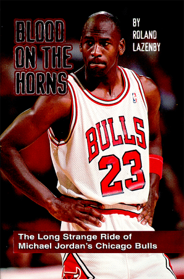

我开始打篮球是从小学五六年级开始，那个年代乡下的运动设施还非常简陋，我们学校就是这样。虽然校舍是全村人集资建起来的崭新三层楼，但是学校运动场还是布满石子的土路面，最早的篮球启蒙就是在这样的环境下开始的。到五六年级的体育课开始开设篮球项目，全班只能从老师办公室领一个或两个篮球，整个课程时间非常自由，没有那么多的热身环节、基础训练，就是一群人围着一个篮球抢来抢去，抢到的投到篮筐里，掉下来被其他人抢到后继续往上投。刚接触篮球的时候，好像也没有什么分组和对抗的意识，当时印象最深刻的莫过于抢球容易戳到手指，为此我们小伙伴之间还在不断的探讨如何才能避免戳到手指，以及如何能够快速的恢复。

升到初中以后，体育课开始稍微系统的介绍篮球运动，在课上学习了拍球、运球、传球、三步上篮等基础动作。除了课上的学习，同村的小伙伴也开始在周末和暑假自发的组织一些比赛。初中期间，暑假最快乐的事就是每天午睡后醒来去打篮球，大概从五六点钟一直打到天黑。那时候为了提高自己的篮球水平，非常想要一个自己的篮球，纯皮的篮球非常贵可能得一百多块，只好买一些橡胶做的篮球。这种篮球比较轻、球感比较差，但是用来练习拍球和投球姿势是足够了。暑假时如果天气太热又醒的比较早，会用这种篮球在家里不断的练习，可能是因为没有各类电子设备的引诱，拍球练习并不觉得枯燥，一遍又一遍，拍球、拨球、扰球，翻来覆去的练习，这大概是青春初期最单纯的快乐了。

那个时候的篮球谈不上什么水平，运球可能随时掉球，投篮进不进也主要靠运气。当时也开始知道在美国有一个专门组织篮球比赛的联盟，也知道了如日中天的芝加哥公牛队。学校里偶尔能看到一两个公牛队服，当时农村地区还没有普及有线电视，因此也无法收看NBA的比赛直播，这些经典的比赛，都是上大学后通过电脑看的回放。

进入高中之后，学习的压力陡然增加了不少，但是因为住校，打篮球的时间反而变得更多起来，而且学校里有了水泥地面的篮球场，虽然水泥地面打得多了会变的和溜冰场一样滑，但是至少不能担心运球的时候碰到地上的小石子呀。

## 参考资料

1. 
